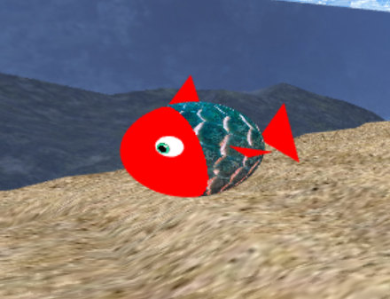
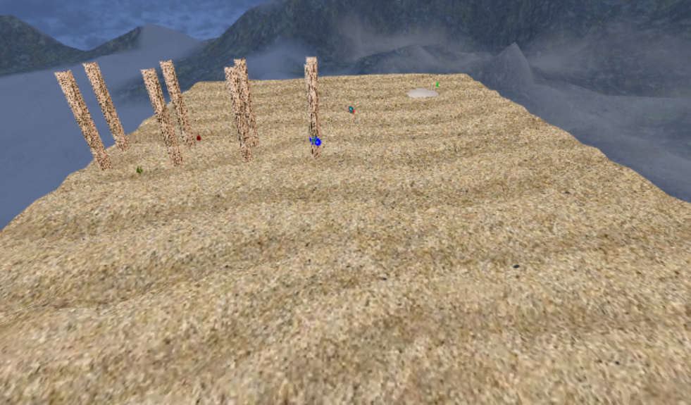
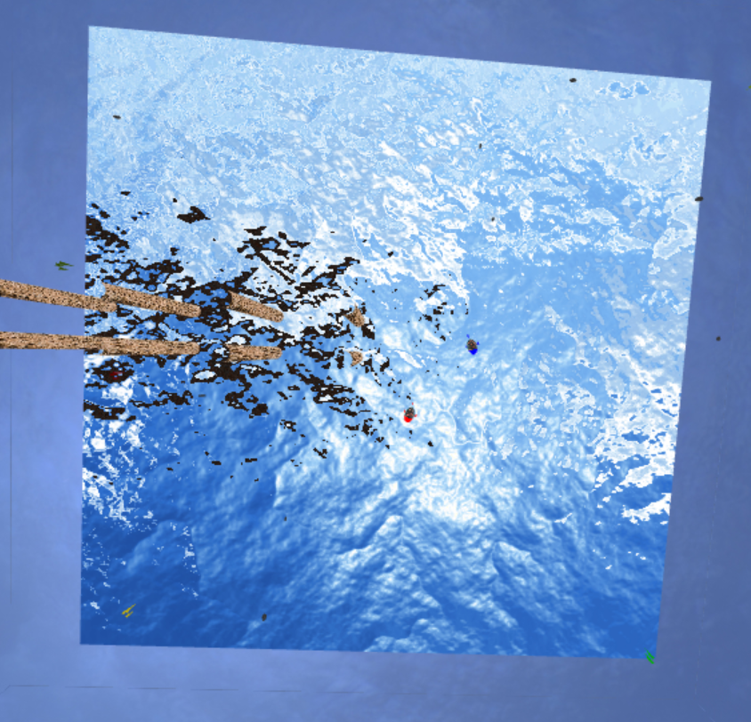
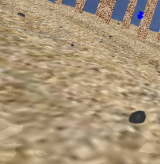
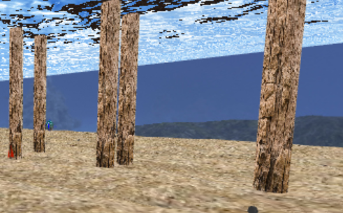
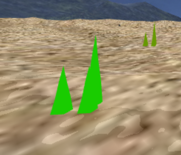
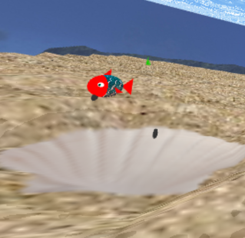
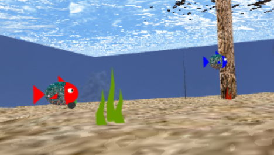

# CGRA 2020/2021

## Group T6xG07

| Name             | Number    | E-Mail             |
| ---------------- | --------- | ------------------ |
| Rui Moreira      | 201906355 | up201906355@fe.up.pt       |
| José Silva       | 201904775 | up209104775@fe.up.pt           |

----

## Project Notes

-Toda a parte A do projeto foi feita sem quaisquer dificuldades.

-No ponto 4 para fazermos o peixe utilizamos as seguintes texturas:

**eye : https://www.deviantart.com/jaysonjeanchannel/art/Offical-Sonic-the-Hedgehog-Eye-Texture-FIXED-597089603

**fish scale : https://www.shutterstock.com/pt/image-photo/fish-scale-texture-background-colorful-concept-413967031

-No ponto 5 tivemos algumas dificuldades com os shaders mas depois de tirar algumas duvidas com o professor conseguimos fazer tudo o que era pedido. Para fazer o ninho e os pilares utilizamos as seguintes texturas:

**ninho : https://www.gratispng.com/png-8hthur/

**pilar : https://www.123rf.com/photo_81701100_old-bark-tree-texture-background-brown-tree-trunk-close-up.html

-O ponto 6 foi feito sem dificuldades.

-No ponto 7 optamos por fazer o ponto 7.2(ondulação das algas) e o ponto 7.5(animação de outros peixes).

## ScreenShots

