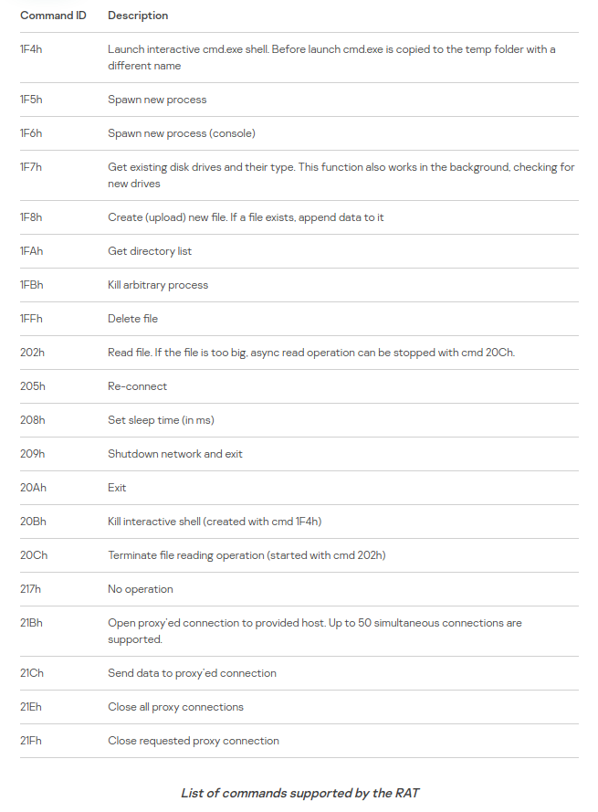

# Teorical Pratical Class 1 **FSI**


### Tasks to perform during class #2

```markdown
1. Group Formation (**LEIC0901**)
  -Rui Moreira up201906355
  -Marcelo Couto up201906086
  -José Silva up201904775

2. Choose a CVE to work on [CVE-2021-40449](https://msrc.microsoft.com/update-guide/vulnerability/CVE-2021-40449)
```

### Tasks to perform during class #3


```markdown
1. Specification of the chosen CVE [CVE-2021-40449](https://msrc.microsoft.com/update-guide/vulnerability/CVE-2021-40449)
  - **Identificação**: descrição geral da vulnerabilidade, incluindo aplicações/sistemas
  operativos relevantes (max 4 itens com 20 palavras cada)

  - **Catalogação**: o que se sabe sobre o seu reporting, quem, quando, como, bug-bounty,
  nível de gravidade, etc. (max 4 itens com 20 palavras cada)

  - **Exploit**: descrever que tipo de exploit é conhecido e que tipo de automação existe,
  e.g., no Metasploit (max 4 itens com 20 palavras cada)

  - **Ataques**: descrever relatos de utilização desta vulnerabilidade para ataques bem
  sucedidos e/ou potencial para causar danos (max 4 itens com 20 palavras cada)

2. Discussion of the chosen CVE [CVE-2021-40449](https://msrc.microsoft.com/update-guide/vulnerability/CVE-2021-40449)

3. Update this markdown to git.fe.up.pt personal Repository


```


#### CVE Research

* (https://nvd.nist.gov/vuln/detail/CVE-2021-40449#match-7025675)
* https://www.helpnetsecurity.com/2021/10/12/patch-tuesday-cve-2021-40449/
* https://securelist.com/mysterysnail-attacks-with-windows-zero-day/104509/
* https://msrc.microsoft.com/update-guide/vulnerability/CVE-2021-40449
* https://www.kaspersky.com/about/press-releases/2021_mysterysnail-kaspersky-finds-zero-day-exploit-for-windows-os
* https://www.kaspersky.com/blog/mysterysnail-cve-2021-40449/42448/
* https://twitter.com/oct0xor
* https://redmondmag.com/articles/2021/10/13/espionage-attackers-were-using-windows-zero-day-vulnerability.aspx
* https://www.forbes.com/sites/daveywinder/2021/10/16/weaponized-mysterysnail-windows-attacks-confirmed-update-7-8-10-and-server-now/?sh=5bdc36422482
* https://fuentitech.com/microsoft-warns-about-mystery-snail-in-tuesdays-october-patch/291728/
* https://github.com/ly4k/CallbackHell
* [Exploit video](https://github.com/KaLendsi/CVE-2021-40449-Exploit)


#### **Task 1 class #3**

1. **Identification**:
   - [Use-after-free vulnerability](https://encyclopedia.kaspersky.com/glossary/use-after-free/) (Incorrect use of dynamic memory during program operation)
   - **Privilege escalation vulnerability** affecting the ***NtGdiResetDC*** function in **win32k kernel driver**. This exploits are used to **deliver remote access Trojans (RATs)**.
   -  Affected systems:
     - Windows Vista
     - Windows 7
     - Windows 8
     - Windows 8.1
     - Windows Server 2008
     - Windows Server 2008 R2
     - Microsoft Windows Server 2012
     - Microsoft Windows Server 2012 R2,
     - Microsoft Windows 10 (build 14393)
     - Microsoft Windows Server 2016 (build 14393)
     - Microsoft Windows 10 (build 17763)
     - Microsoft Windows Server 2019 (build 17763)
     - The exploit was only tested in **Microsoft Windows 10 (build 14393)** and **Microsoft Windows 10 (build 17763)**

   - The exploit had numerous debug strings from an older exploit [CVE-2016-3309](https://github.com/siberas/CVE-2016-3309_Reloaded/)


2. **Vulnerability Listing**
    - **Zero-day vulnerability**, exploitation detected.
    - Microsoft Acknowledge [Boris Larin](https://twitter.com/oct0xor) on the 12<sup>th</sup> of October 2021, for reporting the vulnerability, currently working for ***Kaspersky GReAT***.
    - According to [NVD](https://nvd.nist.gov/vuln/detail/CVE-2021-40449#match-7025675) <span style="color:red"> 7.8 </span>

3. **Exploit**
    - **MysterySnail** remote shell-type Trojan, can collect and steal system   information from compromised hosts and also provides a gateway to other attacks such as ransomware.
    - Before receiving any commands can gather and send information such as:
        - Computer name
        - Current OEM code-page/default identifier
        - Windows Product name
        - Local IP address
        - Logged-in user name
        - Campaign name

    - List of **commands** that this RAT can perform!
    

    - The vulnerability can lead to leakage of kernel module addresses in the computers memory,
       typically associated with UAF vulnerability.

    - The Trojan, a [RAT](https://encyclopedia.kaspersky.com/glossary/rat-remote-access-tools/),
       is used to gain access remotely to another device connected to the Internet or local network.

    - Can launch the **cmd.exe** interactive shell (by copying the **cmd.exe** file to a temp folder under a different name).

    - [Exploit available in github](https://github.com/ly4k/CallbackHell)

4. **Attacks**
    - Kaspersky technologies detected a series of attacks using an elevation of privilege exploit on multiple Microsoft Windows servers

    - This exploit had many debug strings from an older, publicly known exploit for vulnerability **CVE-2016-3309**, but closer analysis revealed a new zero-day.

    - Attack has been **linked** with the infamous **IronHusky group** a Chinese-speaking APT
    
    - Variants of this malware were being used in widespread espionage campaigns **targeting** IT companies, military, defense contractors and diplomatic entities.  
