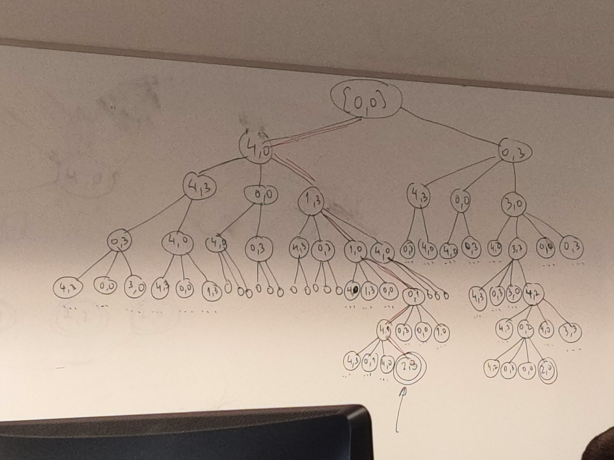

# **Class 1 Artificial Inteligence**

## **Two Bucket Problem**

**State Representation** -> [X,Y] X - Water in bucket 1 Y - Water in bucket 2

**Initial State** -> [0,0]

**Final State** -> [2, ?]
 
**Possible final states**
* [2,1]; 
* [2,2]; 
* [2,3]; 
* [2,0].

**Operations**
* Fill the bucket; 
* Empty a bucket;
* Pour one bucket into the other until the second one is full or until the bucket is empty;

**States** -> Maximum 20 states, some unreachable

| **Operations** | **Pre Conditions** | **Effects** | **Transition(Calculate Combinations)** |
| :---------:| :------------: | :-----: | :--------: |
| **Fill B1** | X < 4 | X = 4 | 16 |
| **Fill B2** | Y < 3 | Y = 3 | 15 | 
| **Empty B1** | X > 0 | X = 0 | 16 | 
| **Empty B2** | Y > 0 | Y = 0 | 15 |
| **Pour B1 to B2 Fill B2** | X + Y >= 3 && Y < 3 | Y = 3 && X = X - (3-Y) | ? |
| **Pour B1 to B2 Empty B1** | X + Y < 3 && X > 0 | Y = Y + X && X = 0 | ? |
| **Pour B2 to B1 Fill B1** | X + Y >= 4 && X < 4 | X = 4 && Y = Y - (4-Y) | ? |
| **Pour B2 to B1 Empty B2** | X + Y < 4 && Y > 0 | Y = 0 && X = X + Y | ? |

**BFS** vs **DFS** -> Dfs can't overcome cycles in the tree

*Minimized tree with solution*

**Solution** -> Minimun 6 steps in the tree. [0,0] -> [4,0] -> [1,3] -> [1,0] -> [0,1] -> [4,1] -> **[2,3]**