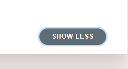

# PA: Product and Presentation

## A9: Product
'The Last Chapter' is an online bookshop where we can effectively and easily purchase all kinds of books. It is a user-friendly website where we find a variety of books and all different genres. An Online Shop that becomes your ‘street corner’ bookshop only a click away!

This artifact includes:

* Instructions for installation and use
* Access credentials.
* The type of assistance supported by the web application (context-sensitive help, help pages, etc.)
* Input validation
* Accessibility and usability checklists
* HTML and CSS validation
* Description and brief justification of the revisions introduced to the initially defined requirements and architecture and identification of the development status of each of the requirements (user Stories) initially set in A2.

### 1. Installation

Product Release (PA-release Tag) -> [Here](https://git.fe.up.pt/lbaw/lbaw2122/lbaw2193/-/tree/PA-release) 

To run our docker image available at our Repository Container Registry:

```
docker run -it -p 8000:80 -e DB_DATABASE=lbaw2193 -e DB_USERNAME=lbaw2193 -e DB_PASSWORD=EDupBHSN lbaw2193/lbaw2193
```

### 2. Usage

Product Url - [Here](http://lbaw2193.lbaw.fe.up.pt)

#### 2.1. Administration Credentials

- The URL to access the Admin/Managment Area: http://lbaw2193.lbaw.fe.up.pt/admin  (Only accessable with the Admin Account Logged in)

- An alternative for typing the url is to click on the name of the admin profile in the right side of the navbar, when logged in with this credentials.

| Username | Email | Password |
| -------- | -------- | ------ |
| lbaw2193 | lbaw2193@gmail.com | lbaw2193_! | 

#### 2.2. User Credentials

| Type          | Username  | Email | Password |
| ------------- | --------- | ----- | -------- |
| reviewer, basic account | johndoe   | johndoe@up.pt | lbaw_test |
| banned user | hackunet | h_rodri23@gmail.com | hckrodri_? | 


### 3. Application Help


_Figure 1: We show the user the requirements for the register form_


_Figure 2: Error messages to help the user correct the form_


_Figure 3: When we add a book to the wishlist, the button "Add to Wishlist" is changed to "In Wishlist" to indicate that the book is already in the wishlist_


_Figure 4: Color changes when hovering indicating a button_




_Figure 5: Color changes indicating that the button was clicked_


_Figures 6,7,8: To improve the user experience we also have a 'FAQ' and a 'Contact Us' page:_


  


### 4. Input Validation

Inputs are validated on the client side and further validated on the server side as is shown in the example below:

#### Client Side (HTML Validation)
```html
    <input id="email" class="form-control" style="background-color: white;" type="email" name="email" value="{{ old('email') }}" required>
              @if ($errors->has('email'))
                <span class="error" style="font-weight: bold; color: #ff3333;">
                    {{ $errors->first('email') }}
                </span>
              @endif
```

#### Server Side (PHP validation)
```php
    protected function validator(array $data)
    {
        return Validator::make($data, [
            'name' => 'required|string|max:255',
            'email' => 'required|string|email|max:255|unique:user',
            'password' => 'required|string|min:6|confirmed',
            'username' => 'required|string|max:50|unique:user',
            'birth_date' => 'required|date|before:-18 years', 
            'id_image',
        ]);
    }

```


 

### 5. Check Accessibility and Usability

 The results of the usability test are in the following link: 
* [Usability Test](Files/usabilityTest.pdf) (25/28)
* [Acessability Test](Files/accessability.pdf) (16/18)


### 6. HTML & CSS Validation

The results of the validation of the HTML and CSS code are provided in the following files:

(As you may able to observe many of the errors are related to php code inside the html)

#### HTML Validation

[HTML Homepage Validation](Files/HTML_Home.pdf)


[HTML Navbar Validation](Files/HTML_NavBar.pdf)


[HTML Footer Validation](Files/HTML_Footer.pdf)


[HTML Login Page Validation](Files/HTML_Login.pdf)


[HTML Register Page Validation](Files/HTML_Register.pdf)


[HTML SearchPage Validation](Files/HTML_Search.pdf)


[HTML Product Page Validation](Files/HTML_Product.pdf)


[HTML Wishlist Page Validation](Files/HTML_Wishlist.pdf)


[HTML Cart Page Validation](Files/HTML_Cart.pdf)


[HTML Cart Item Validation](Files/HTML_CartItem.pdf)


[HTML Review Partial Validation](Files/HTML_Review.pdf)


[HTML About Us Page Validation](Files/HTML_About.pdf)


[HTML FAQ Page Validation](Files/HTML_FAQ.pdf)


[HTML Contact Us Page Validation](Files/HTML_Contact.pdf)


[HTML Admin Page Validation](Files/HTML_Admin.pdf)


[HTML Banned User Page Validation](Files/HTML_BannedUser.pdf)

#### CSS Validation
[CSS App Validation](Files/CSS_App.pdf)


[CSS About Validation](Files/CSS_About.pdf)


[CSS Cart Validation](Files/CSS_Cart.pdf)


[CSS Contact Validation](Files/CSS_Contact.pdf)


[CSS FAQ Validation](Files/CSS_FAQ.pdf)


[CSS Product Validation](Files/CSS_Product.pdf)


[CSS Search Validation](Files/CSS_Search.pdf)

### 7. Revisions to the Project

The project was very well planned and, as a team, we stuck to the plan since the beginning. The only changes made were related to UI/UX of the website.

### 8. Implementation Details

#### 8.1. Libraries Used

We used the following libraries and frameworks:

* Bootstrap and BootstrapIcons: an open source toolkit for developing with HTML, CSS, and JS.
* Laravel: a PHP Framework For Web Artisans.


#### 8.2 User Stories

| US Identifier | Name | Module | Priority | Team Members | State |
| -----------|-------------|---------|-------|-------|-------|
| US01 | Homepage | --- | High | **Ana Matilde Barra** | 100% |
| US02 | Preview Product | M03 | High | **Rui Moreira** | 100% |
| US03 | View Specific Product | M03 | High |**Rui Moreira** | 100% |
| US04 | View Product Reviews | M03 | High | **Rui Moreira** | 100% |
| US05 | View Products by tags or categories | M04 | High | **Rui Moreira** | 50% |
| US07 | FAQ Page | M06 | High | **Rui Moreira** | 100% | 
| US08 | Search Products by name on the Search Bar | M04 | High | **Rui Moreira** | 100% |
| US10 | Add item to Shopping Cart | M05 | High | **Rui Moreira** | 100% |
| US11 | View Shopping Cart | M05 | High | **Ana Matilde Barra, Rui Moreira** | 100% |
| US12 | Remove Item from Shopping Cart | M05 | High | **Rui Moreira** | 100% |
| US17 | Sign/Log out | M01 | High | **Ana Matilde Barra**| 100% |
| US18 | Block User Account | M02 | High | **José Silva, Rui Moreira** | 100% |
| US19 | Unblock User Account | M02 | High | **José Silva** | 100% |
| US20 | Administer User Accounts (search, view, edit, create, delete) | M02 | High |**José Silva** | 100% |
| US21 | Add Product | M02 | High | **José Silva** | 100% |
| US22 | Edit Product Information | M02 | High | **José Silva** | 100% | 
| US23 | Edit Product Stock | M02 | High | **José Silva** | 100% | 
| US33 | Sign In | M01 | High | **Ana Matilde Barra** | 100%|
| US34 | Sign up | M01 | High | **Ana Matilde Barra**  | 100% |
| US36 | View Profile | M01 | High | **Renato Dangel** | 20% |
| US37 | Edit Profile | M01 | High | **Renato Dangel** | 40% |
| US39 | Checkout Shopping Cart Items | M05 | High | **Renato Dangel** | 0%|
| US40 | View Wishlist | M03 | High | **Ana Matilde Barra, Rui Moreira**| 100%|
| US41 | Add Items to Wishlist | M03 | High | **Ana Matilde Barra** | 100% |
| US42 | Delete Item from Wishlist | M03 | High | **Ana Matilde Barra** | 100%|
| US43 | Sign Out | M01 | High | **Ana Matilde Barra**| 100%|
| US46 | Item Review | M03 | High | **Rui Moreira**| 100%|
| US47 | Edit Review | M03 | High | **Rui Moreira**| 100%|
| US48 | Delete Review | M03 | High | **Rui Moreira**| 100%|
| US50 | Ban User through the review | M02 | High | **Rui Moreira** | 100% |
| US24 | Manage Product Categories | M02 | Medium | **José Silva** | 50% |
| US26 | Manage Order Status | M02 | Medium | **José Silva** | 20%|
| US44 | Item Recommendation | M04| Medium | **Ana Matilde Barra** |100%|
| US27 | Add FAQ | M02| Low | **José Silva**| 100%|
| US28 | Edit FAQ | M02| Low | **José Silva**| 100%|
| US31 | Manage Product Discounts | M02| Low |**José Silva** |100%| 
| US13 | About Us Page | M06| Low | **Rui Moreira**| 100%| 
| US16 | Contact Us | M06| Low | **Rui Moreira**| 100%|

---


## A10: Presentation
 
This artefact includes the promotion, a presentation, and the demonstration of the product and a discussion of the developed features. The promotion also includes a short video of 2 minutes showcasing the main features implemented on the final product.

### 1. Product presentation

The purpose of the project developed was to build a functional web application for an online store, more specifically a book store, named 'The Last Chapter'. The web application, gives the users the opportunity to buy books from the confort of their houses, given them a desirable shopping experience. The web app, provides a review system, where the users can share their reading experiences, following the community guidelines.

The site is based on HTML5, CSS, JavaScript and PHP. BootStrap5 was used for the frontend and the PHP framework Laravel was used for the backend.

The platform has an intuitive design  In order to provide a reliable service, each product has a review section, which allows users to share their opinions about the books. Besides, users have the ability to add their favourite products to the wishlist, for future shopping.


[Slides displayed in PA](Ap_A10.pptx)
[Product URL](http://lbaw2193.lbaw.fe.up.pt/)

### 2. Video presentation


[Video Link](https://drive.google.com/file/d/1IELLcuGkRVBgsQjVc6hZoeK37QueSUYN/view?usp=sharing)


---

## **Change Log**:


* Week 9th of January to 15th of January - Started the user stories table, to define what to implement until the project final presentation.
* Week 23rd of January to 29th of January - Development of this artifact, added video recording, input validation, entered accesability and usability .pdf's, and finished table with the user stories implemented and it's percentages.

---

## **GROUP2193, 29/01/2022**

### Authors :

* Ana Matilde Guedes Perez da Silva Barra up201904795
* José Pedro Abreu Silva up201904775
* Renato Dangel Fortes Leite up201908633
* Rui Pedro Mendes Moreira up201906355

---

### **Editor** :

* José Pedro Abreu Silva up201904775