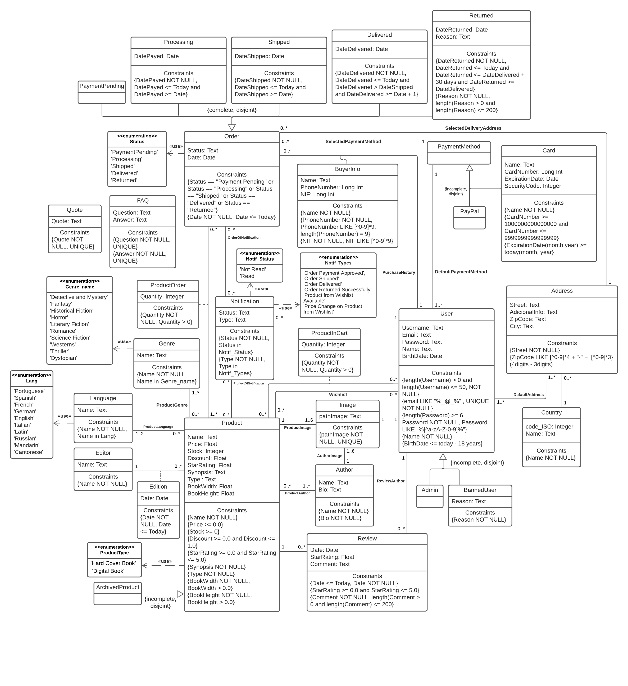

# **EBD: Database Specification Component**

An Online Shop that becomes your ‘street corner’ bookshop only a click away!

# **A4 Conceptual Data Model**

The Conceptual Domain Model identifies all the groups of entities of the domain and the relationships between them in UML class diagram.

The class diagram below represents all the important entities for **'The Last Chapter'** website, the relationships between them with multiplicity associated and also all the relevant attributes with their respective SQL Types.

## A4.1. Class Diagram



_Figure 1: UML Class Diagram_

## A4.2. Additional Business Rules

* **Account Deletion** - In case an account is deleted (by its owner or by an administrator), all the shared user data is kept but made anonymous so that all the relevant information regarding reviews and purchases is maintained (i.e. for statistics).
* **Administrators** - Administrator accounts cannot buy products, as they are the ones that manage them.
* **Write Review** - Only buyers that have bought a product can write a review for that specific product.
* **Edit and Delete Review** - Only the author of a review can edit and/or delete that specific review.
* **Admin Delete Review** - Admins have permission to delete any review.
* **Stock Available** - A registered user can only purchase a product if it is available in stock.
* **Stock Update** - After every purchase, the stocks of the products affected must be updated (decreasing accordingly).
* **Cancel order** - A buyer can only cancel its order if it hasn't already been shipped. (i.e. on the day of the purchase only, not after, not before).
* **Logout** - The logout should only be possible if the user is currently logged in.

# **A5 Relational Schema, validation and schema refinement**

This artifact contains the Relational Schema obtained by mapping from the Conceptual Data Model presented before. The Relational Schema includes each relation schema, attributes, domains, primary keys, foreign keys and other integrity rules: **UNIQUE**, **DEFAULT**, **NOT NULL**, **LIKE** and **CHECK**.

## **A5.1 Relational Schema**
| **Relation reference** | **Relation Compact Notation** |
|------------------------|-------------------------------|
| **R01** | **user**(<ins>id</ins>, username **NN UK CK** 0<length(username)<=50, email **NN UK CK** email **LIKE** “%_@_%”, password **NN CK** length(password) >= 6 and password **LIKE** “%\[^a-zA-Z-0-9\]”, name **NN**, birth_date **NN CK** today - birthdate >= 18, id_image→image) |
| **R02** | **admin**(<ins>id_user</ins>→user) |
| **R03** | **banned_user**(<ins>id_user</ins>→user) |
| **R04** | **image**(<ins>id</ins>, path_image **NN UK**) |
| **R05** | **product_image**(<ins>id_image</ins>→image, <ins>id_product</ins>→ product) |
| **R06** | **author_image**(<ins>id_image</ins>→image, <ins>id_author</ins>→ author) |
| **R07** | **author**(<ins>id</ins>, name **NN**, bio **NN**) |
| **R08** | **review**(<ins>id</ins>, date **NN CK** date <= Today, star_rating **NN DF** 0.0 **CK** 0.0 <= star_rating <= 5.0, comment **NN CK** 0<length(comment)<=200, id_user→user, id_product→product) |
| **R09** | **buyer_info**(<ins>id_order</ins>→order, id_user→user, name **NN**, phone_number **NN CK** phone_number **LIKE** \[^0-9\]\*9, nif **NN CK** length(nif) == 9 and nif **LIKE** \[^0-9\]) |
| **R10** | **processing**(<ins>order_id</ins>→order,datepayed **NN** **CK** datepayed <= today) |
| **R11** | **shipped**(<ins>order_id</ins>→order,dateshipped **NN** **CK** dateshipped <= today) |
| **R12** | **delivered**(<ins>order_id</ins>→order,datedelivered **NN** **CK** datedelivered <= today) |
| **R13** | **returned**(<ins>order_id</ins>→order,datereturned **NN** **CK** datereturned <= today, reason **NN** **CK** 0<length(reason)<= 200) |
| **R14** | **payment_pending**(<ins>order_id</ins>→order) |
| **R15** | **order**(<ins>id</ins> , status **NN** **CK status in status**, date **NN** **CK date <= today**, address_id→address ) |
| **R16** | **product**(<ins>id</ins>, name **NN**, price **CK price >= 0**, stock **CK stock >= 0**, discount **CK discount >= 0 && discount <= 1.0**, star_rating **CK star_rating >= 0.0 && star_rating <= 5.0**, synopsis **NN**, book_width **NN** **CK book_width > 0.0**, book_height **NN** **CK book_height > 0.0**, type **NN** **CK type in product_type**, language_id→language, editor_id→editor) |
| **R17** | **genre**(<ins>id</ins>, name **NN** **CK name in genre**) |
| **R18** | **product_genre**(<ins>product_id</ins>→product, <ins>genre_id</ins>→genre) |
| **R19** | **language**(<ins>id</ins>, name **NN** **CK name in lang**) |
| **R20** | **editor**(<ins>id</ins>,name **NN**) |
| **R21** | **edition**(<ins>product_id</ins>→product, <ins>editor_id</ins>→editor,name **NN**, date **NN** **CK date <= today**) |
| **R22** | **archieved_product**(<ins>product-id</ins>→product) |
| **R23** | **product_author**(<ins>product_id</ins>->product, <ins>author_id</ins>→author) |
| **R24** | **wishlist**(<ins>user_id</ins>→user, <ins>product_id</ins>→product) |
| **R25** | **address**(<ins>id</ins>, street **NN**, adicional_info, code_id->country, zip_code \*\*CK LIKE \[^0-9\]_4 + "-" + \[^0-9\]3_, city) |
| **R26** | **country**(<ins>code_id</ins>, name **NN**) |
| **R27** | **default_address**(<ins>id_user</ins>→user, <ins>id_address</ins>→address) |
| **R28** | **selected_payment_method**(<ins>id_order</ins>→order, <ins>id_payment</ins>→payment_method) |
| **R29** | **default_payment_method**(<ins>id_payment</ins>→payment_method) |
| **R30** | **payment_method**(<ins>id</ins>) |
| **R31** | **paypal**(<ins>id_payment</ins>→payment_method) |
| **R32** | **card**(<ins>id_payment</ins>→payment_method, <ins>card_number</ins> **CK card_number>=1000000000000000 AND card_number<=9999999999999999**, name **NN**, security_code, expiration_date **CK expiration_date >= today**) |
| **R33** | **faq**(<ins>id</ins>, question **UK** **NN**, answer **UK** **NN**) |
| **R34** | **quote**(<ins>id</ins>, quote **UK** **NN** ) |
| **R35** | **notification**(<ins>id</ins>, status **NN CK status in notif_status** , type **NN CK type in notif_types**, id_user->user) |
| **R36** | **order_notification**(<ins>id_order</ins>->order, <ins>id_notification</ins>->notification) |
| **R37** | **product_notification**(<ins>id_product</ins>->product, <ins>id_notification</ins>->notification) |
| **R38** | **product_in_cart**(<ins>id_product</ins>->product, <ins>id_user</ins>->user, quantity **NN CK** quantity > 0) |
| **R39** | **product_order**(<ins>id_product</ins>->product, <ins>id_order</ins>->user, quantity **NN CK** quantity > 0) |

## **A5.2 Domains**
| **Domain Name** | **Domain Specification** |
|-----------------|--------------------------|
| **today** | DATE DEFAULT CURRENT_DATE |
| **notif_status** | **ENUM**('Not Read','Read') |
| **notif_types** | **ENUM**('Order Payment Approved', 'Order Shipped, 'Order Delivered', 'Order Returned Successfully', 'Product from Wishlist Available', 'Price Change on Product from Wishlist') |
| **genre** | **ENUM**('Detective and Mystery', 'Fantasy', 'Historical Fiction', 'Horror', 'Literary Fiction', 'Romance', 'Science Fiction', 'Westerns','Thriller', 'Dystopian') |
| **product_type** | **ENUM**('Hard Cover Book', 'Digital Book') |
| **lang** | **ENUM**('Portuguese','Spanish','French','German','English','Italian','Latin','Russian','Mandarin','Cantonese') |
| **status** | **ENUM**(‘Payment Pending’, ‘Processing’, ‘Shipped’,’Delivered’,’Returned’) |

## **A5.3 Schema Validation**

In order to validate the Relational Schema obtained from the Conceptual Data Model, all functional dependencies were identified in the following tables.

All the relations obtained are in the _Boyce-Codd Normal Form_ (**BCNF**), so the same applies to our Relational Schema as a whole. Because of that, there was no need to proceed to the normalization of any relation.
| **Table R01** | **User** |
|---------------|----------|
| **Keys** | {id}, {username}, {email} |
| **Functional Dependencies** |  |
| **FD0101** | id → {username, email, password, name, birth_date, id_image} |
| **FD0102** | username → {id, email, password, name, birth_date, id_image} |
| **FD0103** | email → {id, username, password, name, birth_date, id_image} |
| **Normal Form** | **BCNF** |

| **Table R02** | **Admin** |
|---------------|-----------|
| **Keys** | {id_user} |
| **Functional Dependencies** |  |
| none |  |
| **Normal Form** | **BCNF** |

| **Table R03** | **Banned_user** |
|---------------|-----------------|
| **Keys** | {id_user} |
| **Functional Dependencies** |  |
| none |  |
| **Normal Form** | **BCNF** |

| **Table R04** | **Image** |
|---------------|-----------|
| **Keys** | {id}, {path_image} |
| **Functional Dependencies** |  |
| **FD0401** | id → {path_image} |
| **FD0402** | path_image → {id} |
| **Normal Form** | **BCNF** |

| **Table R05** | **Product_image** |
|---------------|-------------------|
| **Keys** | {id_image, id_product} |
| **Functional Dependencies** |  |
| none |  |
| **Normal Form** | **BCNF** |

| **Table R06** | **Author_Image** |
|---------------|------------------|
| **Keys** | {id_image, id_author} |
| **Functional Dependencies** |  |
| none |  |
| **Normal Form** | **BCNF** |

| **Table R07** | **Author** |
|---------------|------------|
| **Keys** | {id} |
| **Functional Dependencies** |  |
| **FD0701** | {id} → {name, bio} |
| **Normal Form** | **BCNF** |

| **Table R08** | **Review** |
|---------------|------------|
| **Keys** | {id}, {id_user, id_product} |
| **Functional Dependencies** |  |
| **FD0801** | {id} → {date, star_rating, comment, id_user, id_product} |
| **FD0802** | {id_user, id_product} → {id, date, star_rating, comment} |
| **Normal Form** | **BCNF** |

| **Table R09** | **Buyer_info** |
|---------------|----------------|
| **Keys** | {id_order} |
| **Functional Dependencies** |  |
| **FD0901** | {id_order} -> {id_user, name, phone_number, nif} |
| **Normal Form** | **BCNF** |

| **Table R10** | **Processing** |
|---------------|----------------|
| **Keys:** | {order_id} |
| **Functional Dependencies** |  |
| **FD1001** | {order_id} → {datepayed} |
| **Normal Form** | **BCNF** |

| **Table R11** | **Shipped** |
|---------------|-------------|
| **Keys:** | {order_id} |
| **Functional Dependencies** |  |
| **FD1101** | {order_id} → {dateshipped} |
| **Normal Form** | **BCNF** |

| **Table R12** | **Delivered** |
|---------------|---------------|
| **Keys:** | {order_id} |
| **Functional Dependencies** |  |
| **FD1201** | {order_id} → {datedelivered} |
| **Normal Form** | **BCNF** |

| **Table R13** | **Returned** |
|---------------|--------------|
| **Keys:** | {order_id} |
| **Functional Dependencies** |  |
| **FD1301** | {order_id} → {datereturned, reason} |
| **Normal Form** | **BCNF** |

| **Table R14** | **Payment_pending** |
|---------------|---------------------|
| **Keys** | {order_id} |
| **Functional Dependencies** |  |
| none |  |
| **Normal Form** | **BCNF** |

| **Table R15** | **Order** |
|---------------|-----------|
| **Keys:** | {id} |
| **Functional Dependencies** |  |
| **FD1401** | {id} → {status,date,address_id} |
| **Normal Form** | **BCNF** |

| **Table R16** | **Product** |
|---------------|-------------|
| **Keys** | {id} |
| **Functional Dependencies** |  |
| **FD1601** | id → {name, price, stoock, discount, starRating, Synopsis, BookWidth, type, language_id, editor_id} |
| **Normal Form** | **BCNF** |

| **Table R17** | **Genre** |
|---------------|-----------|
| **Keys** | {id} |
| **Functional Dependencies** |  |
| **FD1701** | id → {name} |
| **Normal Form** | **BCNF** |

| **Table R18** | **Product_genre** |
|---------------|-------------------|
| **Keys** | {product_id, genre_id} |
| **Functional Dependencies** |  |
| none |  |
| **Normal Form** | **BCNF** |

| **Table R19** | **Language** |
|---------------|--------------|
| **Keys** | {id} |
| **Functional Dependencies** |  |
| **FD1901** | id → {name} |
| **Normal Form** | **BCNF** |

| **Table R20** | **Editor** |
|---------------|------------|
| **Keys** | {id} |
| **Functional Dependencies** |  |
| **FD2001** | id → {name} |
| **Normal Form** | **BCNF** |

| **Table R21** | **Edition** |
|---------------|-------------|
| **Keys** | {product_id, editor_id} |
| **Functional Dependencies** |  |
| **FD2101** | {product_id, editor_id} → {name,date} |
| **Normal Form** | **BCNF** |

| **Table R22** | **Archieved_product** |
|---------------|-----------------------|
| **Keys** | {product_id} |
| **Functional Dependencies** |  |
| none |  |
| **Normal Form** | **BCNF** |

| **Table R23** | **Product_author** |
|---------------|--------------------|
| **Keys** | {product_id, author_id} |
| **Functional Dependencies** |  |
| none |  |
| **Normal Form** | **BCNF** |

| **Table R24** | **WishList** |
|---------------|--------------|
| **Keys** | {code_id} |
| **Functional Dependencies** |  |
| none |  |
| **Normal Form** | **BCNF** |

| **Table R25** | **Address** |
|---------------|-------------|
| **Keys** | {id} |
| **Functional Dependencies** |  |
| **FD2501** | id → {street, adicional_info, code_id, zip_code} |
| **Normal Form** | **BCNF** |

| **Table R26** | **Country** |
|---------------|-------------|
| **Keys** | {code_id} |
| **Functional Dependencies** |  |
| **FD2501** | code_id → {name} |
| **Normal Form** | **BCNF** |

| **Table R27** | **Default_address** |
|---------------|---------------------|
| **Keys** | {id_user, id_address} |
| **Functional Dependencies** |  |
| none |  |
| **Normal Form** | **BCNF** |

| **Table R28** | **Selected_payment_method** |
|---------------|-----------------------------|
| **Keys** | {id_order, id_payment} |
| **Functional Dependencies** |  |
| none |  |
| **Normal Form** | **BCNF** |

| **Table R29** | **Default_payment_method** |
|---------------|----------------------------|
| **Keys** | {id_payment} |
| **Functional Dependencies** |  |
| none |  |
| **Normal Form** | **BCNF** |

| **Table R30** | **Payment_method** |
|---------------|--------------------|
| **Keys** | {id} |
| **Functional Dependencies** |  |
| none |  |
| **Normal Form** | **BCNF** |

| **Table R31** | **Paypal** |
|---------------|------------|
| **Keys** | {id_payment} |
| **Functional Dependencies** |  |
| none |  |
| **Normal Form** | **BCNF** |

| **Table R32** | **Card** |
|---------------|----------|
| **Keys** | {id_payment, card_number} |
| **Functional Dependencies** |  |
| **FD2901** | {id_payment, card_number} → {name, security_code, expiration_date} |
| **Normal Form** | **BCNF** |

| **Table R33** | **FAQ** |
|---------------|---------|
| **Keys** | {id} |
| **Functional Dependencies** |  |
| **FD3001** | id → {question, answer} |
| **Normal Form** | **BCNF** |

| **Table R34** | **Quote** |
|---------------|-----------|
| **Keys** | {id} |
| **Functional Dependencies** |  |
| **FD3101** | id → {quote} |
| **Normal Form** | **BCNF** |

| **Table R35** | **Notification** |
|---------------|------------------|
| **Keys** | {id} |
| **Functional Dependencies** |  |
| **FD03501** | id → {status, type} |
| **Normal Form** | **BCNF** |

| **Table R36** | **Order_notification** |
|---------------|------------------------|
| **Keys** | {id_order, id_notification} |
| **Functional Dependencies** |  |
| none |  |
| **Normal Form** | **BCNF** |

| **Table R37** | **Product_notification** |
|---------------|--------------------------|
| **Keys** | {id_product, id_notification} |
| **Functional Dependencies** |  |
| none |  |
| **Normal Form** | **BCNF** |

| **Table R38** | **product_in_cart** |
|---------------|---------------------|
| **Keys** | {id_product, id_user} |
| **Functional Dependencies** |  |
| FD3801 | {id_product, id_user} -> {quantity} |
| **Normal Form** | **BCNF** |

| **Table R39** | **product_order** |
|---------------|-------------------|
| **Keys** | {id_product, id_order} |
| **Functional Dependencies** |  |
| FD3901 | {id_product, id_order} -> {quantity} |
| **Normal Form** | **BCNF** |

All relations are in the Boyce–Codd Normal Form (BCNF), because for every one of its dependencies X → Y, at least one of the following conditions hold:

X → Y is a trivial functional dependency (Y ⊆ X), X is a superkey for schema R.

Thus, the relational schema is also in the BCNF and therefore there is no need for it to be refined using normalisation.

# **A6 Indexes, triggers, transactions and database population**

This artefact contains the physical schema of the database, the identification and characterisation of the indexes, the support of data integrity rules with triggers and the definition of the database user-defined functions. This artefact also contains the database's workload as well as the complete database creation script, including all SQL necessary to define all integrity constraints, indexes and triggers. It is also included a separate script with **_INSERT_** statements that can be used to populate the database.

## **A6.1 Database Workload**
| **Relation** | **Relation Name** | **Order of magnitude** | **Estimated growth** |
|--------------|-------------------|------------------------|----------------------|
| **R01** | user | 10 k (tens of thousands) | 10 (tens) / day |
| **R02** | admin | 10 (dozens) | 1 (units) / year |
| **R03** | banned_user | 1 k (thousands) | 1 / day |
| **R04** | image | 100 k (hundreds of thousands) | 10 / day |
| **R05** | product_image | 100 k | 10 / day |
| **R06** | author_image | 10k | 1 / month |
| **R07** | author | 1 k | 1 / month |
| **R08** | review | 10 k | 10 / day |
| **R09** | buyer_info | 100 k | 100 (hundreds) / day |
| **R10** | processing | 10 k | 10 / day |
| **R11** | shipped | 10 k | 10 / day |
| **R12** | delivered | 10 k | 10 / day |
| **R13** | returned | 1 k | 1 / day |
| **R14** | payment_pending | 10 k | 100 / day |
| **R15** | order | 100 k | 100 / day |
| **R16** | product | 10 k | 10 / day |
| **R17** | genre | 10 | 1 / year |
| **R18** | product_genre | 100 k | 10 / day |
| **R19** | language | 10 | 1 / year |
| **R20** | editor | 100 | 1 / year |
| **R21** | edition | 100 k | 10 / month |
| **R22** | archived_product | 1 k | 1 / month |
| **R23** | product_author | 10 k | 10 / day |
| **R24** | wishlist | 100 k | 10 / day |
| **R25** | address | 10 k | 1 / month |
| **R26** | country | 10 | 1 / year |
| **R27** | default_address | 10 k | 10 / month |
| **R28** | selected_payment_method | 100 k | 100 / day |
| **R29** | default_payment_method | 10 k | 10 / month |
| **R30** | payment_method | 100 k | 10 / month |
| **R31** | paypal | 10 k | 1 / month |
| **R32** | card | 10 k | 1 / month |
| **R33** | faq | 10 | 1 / year |
| **R34** | quote | 10 | 1 / year |
| **R35** | notification | 100 k | 10 / day |
| **R36** | order_notification | 10 k | 1 / day |
| **R37** | product_notification | 10 k | 1 / day |
| **R38** | product_in_cart | 100 k | 100 / day |
| **R39** | product_order | 100 k | 100 / day |

## **A6.2 Proposed Indexes**

### **A6.2.1 Performance Indexes**
| **Index** | **IDX01** |
|-----------|-----------|
| **Index relation** | "user" |
| **Index attribute** | username |
| **Index type** | Hash |
| **Cardinality** | High |
| **Clustering** | No |
| **Justification** | User information is accessed, and executed several times, therefore getting the user information should be a fast operation. Doesn't need range query support. Cardinality is considered high because the username is a unique key, thus not a good candidate for clustering. Given that we only want exact matches, we use _hash type_ because it is faster by a factor of $O(\log N)$ |
```sql
 CREATE INDEX users_by_username ON "user" USING HASH (username);
```
| **Index** | **IDX02** |
|-----------|-----------|
| **Index relation** | review |
| **Index attribute** | id_product |
| **Index type** | Hash |
| **Cardinality** | Medium |
| **Clustering** | Yes |
| **Justification** | The table 'review' is frequently accessed to obtain a products' reviews. Every time a product page is accessed all reviews must be available in the fastest way possible. The filtering of reviews is done by exact match with id_product, therefore an _hash type_ index is the best solution. The frequency of update is quite high, so we propose clustering for this index. Given that we only want exact matches, we use _hash type_ because it is faster by a factor of $O(\log N)$ |
```sql
CREATE INDEX product_reviews ON review USING HASH (id_product);
```
| **Index** | **IDX03** |
|-----------|-----------|
| **Index relation** | product |
| **Index attribute** | price |
| **Index type** | B-Tree |
| **Cardinality** | High |
| **Clustering** | Yes |
| **Justification** | Allow searching or filtering products within a price range, defined by the user. It's B-Tree and clustered to allow quick range queries. |
```sql
 CREATE INDEX product_pricing ON products USING BTREE (price);
```

### **A6.2.2 Full-text Searche Indices**

| **Index** | **IDX04** |
|-----------|-----------|
| **Index relation** | product |
| **Index attribute**| product_name |
| **Index type** | GiST |
| **Clustering** | No |
| **Justification** | Query support index, to improve the performance of the search, using GiST type, indicated for dynamic data. |
```sql
 CREATE INDEX search_idx ON products USING GIST(search);
```

## **A6.3 Triggers**

| **Trigger** | **TRIGGER01** |
|-------------|---------------|
| **Description** | A user can only review products that he bought|
```sql
    CREATE FUNCTION review_product() 
    RETURNS TRIGGER AS
    $BODY$
    BEGIN
        IF NOT EXISTS (SELECT Product.id_product
                        FROM buyer_info AS Buyer, product_order AS Product
                        WHERE Buyer.id_order == Product.id_order AND New.id_user == Buyer.id_user AND New.id_product == Product.id_product )
        THEN RAISE EXCEPTION 'You can not review a product you have not bougth.';

        END IF;
        RETURN NEW;
    END
    $BODY$
    LANGUAGE plpgsql;

    CREATE TRIGGER add_product_review
    BEFORE INSERT OR UPDATE ON review
    FOR EACH ROW 
    EXECUTE PROCEDURE review_product();
```

| **Trigger** | **TRIGGER02** |
|-------------|---------------|
| **Description** | User can only buy the available stock at the time |
```sql
    CREATE FUNCTION check_stock() 
    RETURNS TRIGGER AS
    $BODY$
    BEGIN
        IF EXISTS (SELECT *
                    FROM  product
                    WHERE New.quantity > product.stock)
        THEN RAISE EXCEPTION 'You can only buy % units which is the available stock at the time of product %', New.quantity, New.id_product;

        END IF;
        RETURN NEW;
    END
    $BODY$
    LANGUAGE plpgsql;

    CREATE TRIGGER buy_product
    BEFORE INSERT ON product_order
    EXECUTE PROCEDURE check_stock();
```

| **Trigger** | **TRIGGER03** |
|-------------|---------------|
| **Description** | When an item from wishlist is added to the cart it is removed from the wishlist. |

```sql
    CREATE FUNCTION remove_prod_from_wishlist()
    RETURNS TRIGGER AS
    $BODY$
    BEGIN
        DELETE FROM wishlist
        WHERE id_user = New.id_user AND id_product = New.id_product;
    END
    $BODY$
    LANGUAGE plpgsql;

    CREATE TRIGGER add_wishlist_prod_to_cart 
    AFTER INSERT ON product_in_cart
    EXECUTE PROCEDURE remove_prod_from_wishlist();
```

| **Trigger** | **TRIGGER04** |
|-------------|---------------|
| **Description** | When a product is archieved, it should get removed from the cart |
```sql
    CREATE FUNCTION archieve_product()
    RETURNS TRIGGER AS
    $BODY$
    BEGIN 
        DELETE FROM product_in_cart
        WHERE product_id = New.id;
    END
    $BODY$
    LANGUAGE plpgsql;

    CREATE TRIGGER archieve_product 
    AFTER INSERT ON archieved_product
    FOR EACH ROW
    EXECUTE PROCEDURE archieve_product();
```

| **Trigger** | **TRIGGER05** |
|-------------|---------------|
| **Description** | When buying a product, it should get removed from the cart |
```sql
    CREATE FUNCTION remove_from_cart() 
    RETURNS TRIGGER AS
    $BODY$
    BEGIN   
        DELETE FROM product_in_cart
        WHERE id_product = New.id_product AND id_user = (SELECT id_user FROM buyer_info WHERE buyer_info.id_order = New.id_order);
    END
    $BODY$
    LANGUAGE plpgsql;

    CREATE TRIGGER remove_from_cart AFTER INSERT 
    ON product_order
    EXECUTE PROCEDURE remove_from_cart();
```

| **Trigger** | **TRIGGER06** |
|-------------|---------------|
| **Description** | When a new review is added, the product rating is recalculated. |
```sql
    CREATE FUNCTION update_prod_rating()
    RETURNS TRIGGER AS
    $BODY$
    BEGIN
        UPDATE product
        SET 
            star_rating = (SELECT AVG(star_rating)
                    FROM review 
                    WHERE id_product = New.id_product)
        WHERE id = New.id_product;
    END
    $BODY$
    LANGUAGE plpgsql;


    CREATE TRIGGER prod_rating_review_updt
    AFTER INSERT ON review
    EXECUTE PROCEDURE update_prod_rating();
```
| **Trigger** | **TRIGGER07** |
|-------------|---------------|
| **Description** | When user tries to add products to cart, check if the product being added is out of stock |
```sql
    CREATE FUNCTION check_in_stock()
    RETURNS TRIGGER AS
    $BODY$
    BEGIN
        IF 
            EXISTS ( SELECT * FROM products WHERE id = New.id_product AND stock = 0 )
        THEN
            RAISE EXCEPTION 'Stock not available for the required product';
        END IF;
        RETURN NEW;
    END
    $BODY$
    LANGUAGE plpgsql;

    CREATE TRIGGER check_stock 
    BEFORE INSERT ON product_in_cart
    FOR EACH ROW
    EXECUTE PROCEDURE check_in_stock();
``` 

| **Trigger** | **TRIGGER08** |
|-------------|---------------|
| **Description** | When a product price is updated and it is on wishlist, a new notification is sent. |
```sql
    CREATE FUNCTION send_notif_price_change()
    RETURNS TRIGGER AS
    $BODY$
    BEGIN
        INSERT INTO notification (status, type, id_user)
        VALUES ('Not Read', 'Price Change on Product from Wishlist',
            (SELECT id_user from wishlist where id_product = New.id));

        INSERT INTO product_notification(id_notification, id_product)
        VALUES ((SELECT notification.id from notification, wishlist 
                where wishlist.id_user = notification.id_user and id_product = New.id and notification.status = 'Not Read'), New.id);

        RETURN NEW;
    END
    $BODY$
    LANGUAGE plpgsql;

    CREATE TRIGGER product_price_change_notif
    AFTER UPDATE OF price ON product
    FOR EACH ROW 
    EXECUTE PROCEDURE send_notif_price_change();
```
| **Trigger** | **TRIGGER09** |
|-------------|---------------|
| **Description** | When an order is made, the product stock is updated |
```sql
    CREATE FUNCTION update_product_stock() RETURNS TRIGGER AS
    $BODY$
    BEGIN
    UPDATE product
    SET stock = stock - New.quantity
    WHERE id = New.product_id;
    END
    $BODY$
    LANGUAGE plpgsql;

    CREATE TRIGGER update_stock AFTER INSERT
    ON product_order
    EXECUTE PROCEDURE update_product_stock();
```
| **Trigger** | **TRIGGER10** |
|-------------|---------------|
| **Description** | Check if payment date is valid |
```sql
    CREATE FUNCTION check_payment_date() RETURNS TRIGGER AS
    $BODY$
    BEGIN
    IF 
            NOT EXISTS 
                (SELECT date FROM "order" 
                WHERE id = New.order_id 
                AND date <= New.date_payed) 
        THEN
            RAISE EXCEPTION 'Payment must be done after order';
        END IF;
        RETURN NEW;
    END
    $BODY$
    LANGUAGE plpgsql;

    CREATE TRIGGER check_payment BEFORE INSERT
    ON "processing"
    EXECUTE PROCEDURE check_payment_date();
```

| **Trigger** | **TRIGGER11** |
|-------------|---------------|
| **Description** | Check if shipment date is valid |
```sql
    CREATE FUNCTION check_shipment_date() RETURNS TRIGGER AS
    $BODY$
    BEGIN
    IF 
            NOT EXISTS 
                (SELECT date FROM "order" 
                WHERE id = New.order_id 
                AND date <= New.date_shipped) 
        THEN
            RAISE EXCEPTION 'Shipment must be done after order';
        END IF;
        RETURN NEW;
    END
    $BODY$
    LANGUAGE plpgsql;

    CREATE TRIGGER check_shipment BEFORE INSERT
    ON "shipped"
    EXECUTE PROCEDURE check_shipment_date();
```

| **Trigger** | **TRIGGER12** |
|-------------|---------------|
| **Description** | Check if return date is valid |
```sql
    CREATE FUNCTION check_return_date() RETURNS TRIGGER AS
    $BODY$
    BEGIN
    IF 
            NOT EXISTS 
                (SELECT date FROM "order" 
                WHERE id = New.order_id 
                AND date <= New.date_returned) 
        THEN
            RAISE EXCEPTION 'The return must be after the order';
        END IF;
        RETURN NEW;
    END
    $BODY$
    LANGUAGE plpgsql;

    CREATE TRIGGER check_return BEFORE INSERT
    ON "returned"
    EXECUTE PROCEDURE check_return_date();
```

| **Trigger** | **TRIGGER13** |
|-------------|---------------|
| **Description** | Check if delivery date is valid |
```sql
    CREATE FUNCTION check_delivery_date() RETURNS TRIGGER AS
    $BODY$
    BEGIN
    IF 
            NOT EXISTS 
                (SELECT date FROM "order" 
                WHERE id = New.order_id 
                AND date <= New.date_delivered) 
        THEN
            RAISE EXCEPTION 'Delivery must be done after order';
        END IF;
        RETURN NEW;
    END
    $BODY$
    LANGUAGE plpgsql;

    CREATE TRIGGER check_delivery BEFORE INSERT
    ON "delivered"
    EXECUTE PROCEDURE check_delivery_date();
```

| **Trigger** | **TRIGGER14** |
|-------------|---------------|
| **Description** | Keeps TSVECTOR in sync |
```sql
    CREATE FUNCTION update_text_search()
    RETURNS TRIGGER AS
    $BODY$
    BEGIN   
            IF TG_OP = 'INSERT' THEN
                        New.search = setweigth(to_tsvector ('english', New.product_name), A) ||
                                    setweigth(to_tsvector ('english', New.synopsis), B) ||
                                    setweigth(to_tsvector ('english', New.prod_type), C);
            END IF;
            IF TG_OP = 'UPDATE' THEN
                        IF New.product_name <> Old.product_name THEN
                            New.search = setweigth(to_tsvector ('english', New.product_name), A) ||
                                        setweigth(to_tsvector ('english', New.synopsis), B) ||
                                        setweigth(to_tsvector ('english', New.product_name), C);
                        END IF;
            END IF;
            RETURN NEW;
    END
    $BODY$
    LANGUAGE plpgsql;

    CREATE TRIGGER update_text_search
    BEFORE INSERT OR UPDATE ON product
    FOR EACH ROW
    EXECUTE PROCEDURE update_text_search();
```

## **A6.4 Transactions**
| **Transaction** | **TRAN01** |
|-----------------|------------|
| **Description** | Insert a new product |
| **Justification** | In order to maintain consistency, it's necessary to use a transaction to ensure that the all the code executes without errors. If an error occurs, a ROLLBACK is issued (when the insertion of a user fails, per example). The isolation level is Repeatable Read, because, otherwise, an update of the user id could happen, due to an insert in the same table committed by a concurrent transaction, and as a result, inconsistent data would be stored. |
| **Isolation level** | REPEATABLE READ |
```sql
    BEGIN TRANSACTION;
    SET TRANSACTION ISOLATION LEVEL REPEATABLE READ

        INSERT INTO product (id, product_name, price, stock, discount, starRating, synopsis, book_width, book_height, prod_type, language_id, editor_id)
            VALUES ($id, $product_name, $price, $stock, $discount, $starRating, $synopsis, $book_width, $book_height, $prod_type, $language_id, $editor_id)
    COMMIT;
```
| **Transaction** | **TRAN02** |
|-----------------|------------|
| **Description** | Insert a new user |
| **Justification** | In order to maintain consistency, it's necessary to use a transaction to ensure that the all the code executes without errors. If an error occurs, a ROLLBACK is issued (when the insertion of a user fails, per example). The isolation level is Repeatable Read, because, otherwise, an update of the user id could happen, due to an insert in the same table committed by a concurrent transaction, and as a result, inconsistent data would be stored. |
| **Isolation level** | REPEATABLE READ |
```sql
    BEGIN TRANSACTION;
    SET TRANSACTION ISOLATION LEVEL REPEATABLE READ; --check this

        INSERT INTO "user" (id,username,email,"password","name",birth_date,id_image)
            VALUES ($id, $username, $email, $"password", $"name", $birth_date, $id_image);

    COMMIT;
```

| **Transaction** | **TRAN03** |
 | ------- | -------- |
  | **Description** | Insert a new review | 
  | **Justification** | In order to maintain consistency, it's necessary to use a transaction to ensure that the all the code executes without errors. If an error occurs, a ROLLBACK is issued (when the insertion of a review fails, per example). The isolation level is Repeatable Read, because, otherwise, an update of review id could happen, due to an insert in the table review committed by a concurrent transaction, and as a result, inconsistent data would be stored. | 
| **Isolation level** | REPEATABLE READ | 
```sql
    BEGIN TRANSACTION;
    SET TRANSACTION ISOLATION LEVEL REPEATABLE READ; --check this

        INSERT INTO review (id,date,star_rating,comment,id_user,id_product)
            VALUES ($id, $date, $star_rating, $comment, $id_user, $id_product);

    COMMIT;
```

---

## **Annex A. SQL Code**

### **A.1 - Database Schema**

```sql
    DROP TABLE IF EXISTS "returned";
    DROP TABLE IF EXISTS "delivered";
    DROP TABLE IF EXISTS "shipped";
    DROP TABLE IF EXISTS "processing";
    DROP TABLE IF EXISTS "payment_pending";
    DROP TABLE IF EXISTS "quote";
    DROP TABLE IF EXISTS faq;
    DROP TABLE IF EXISTS default_payment_method;
    DROP TABLE IF EXISTS selected_payment_method;
    DROP TABLE IF EXISTS card;
    DROP TABLE IF EXISTS paypal;
    DROP TABLE IF EXISTS payment_method;
    DROP TABLE IF EXISTS default_address;
    DROP TABLE IF EXISTS wishlist;
    DROP TABLE IF EXISTS product_author;
    DROP TABLE IF EXISTS archieved_product;
    DROP TABLE IF EXISTS "edition";
    DROP TABLE IF EXISTS product_genre;
    DROP TABLE IF EXISTS genre;
    DROP TABLE IF EXISTS product_order;
    DROP TABLE IF EXISTS product_in_cart;
    DROP TABLE IF EXISTS product_notification;
    DROP TABLE IF EXISTS order_notification;
    DROP TABLE IF EXISTS notification;
    DROP TABLE IF EXISTS buyer_info;
    DROP TABLE IF EXISTS "order";
    DROP TABLE IF EXISTS address;
    DROP TABLE IF EXISTS country;
    DROP TABLE IF EXISTS review;
    DROP TABLE IF EXISTS author_image;
    DROP TABLE IF EXISTS author;
    DROP TABLE IF EXISTS product_image;
    DROP TABLE IF EXISTS product;
    DROP TABLE IF EXISTS editor;
    DROP TABLE IF EXISTS "language";
    DROP TABLE IF EXISTS banned_user;
    DROP TABLE IF EXISTS "admin";
    DROP TABLE IF EXISTS "user";
    DROP TABLE IF EXISTS image;


    DROP DOMAIN IF EXISTS TODAY;
    DROP TYPE IF EXISTS genre_type;
    DROP TYPE IF EXISTS product_type;
    DROP TYPE IF EXISTS lang;
    DROP TYPE IF EXISTS notif_status;
    DROP TYPE IF EXISTS notif_types;
    DROP TYPE IF EXISTS status;

    CREATE DOMAIN TODAY AS date NOT NULL DEFAULT ('now'::text)::date;
    CREATE TYPE genre_type as ENUM ('Detective and Mystery', 'Fantasy', 'Historical Fiction',
                                    'Horror', 'Literary Fiction', 'Romance', 'Science Fiction',
                                    'Westerns','Thriller', 'Dystopian');
    CREATE TYPE product_type as ENUM ('Hard Cover Book', 'Digital Book');
    CREATE TYPE lang as ENUM ('Portuguese','Spanish','French','German','English',
                            'Italian','Latin','Russian','Mandarin','Cantonese');
    CREATE TYPE notif_status AS ENUM ('Not Read','Read');
    CREATE TYPE notif_types AS ENUM ('Order Payment Approved', 'Order Shipped', 'Order Delivered',
                                    'Order Returned Successfully','Product from Wishlist Available',
                                    'Price Change on Product from Wishlist');
    CREATE TYPE status AS ENUM('Payment Pending', 'Processing', 'Shipped','Delivered','Returned');

    CREATE TABLE image (
        id               SERIAL,

        path_image       TEXT   CONSTRAINT image_superKey      UNIQUE
                                CONSTRAINT pathImage_notNull   NOT NULL,

        CONSTRAINT imagem_pk    PRIMARY KEY (id)
    );


    CREATE TABLE "user" (
        id                      SERIAL,

        username                TEXT            CONSTRAINT user_sKU    UNIQUE
                                        CONSTRAINT username_notNull NOT NULL
                                        CONSTRAINT username_valid   CHECK(length(username) > 0 and length(username) <= 50),

        email                   TEXT    CONSTRAINT user_sKE    UNIQUE 
                                        CONSTRAINT email_notNull    NOT NULL
                                        CONSTRAINT email_valid      CHECK (email LIKE '%_@_%._%'),

        "password"              TEXT    CONSTRAINT password_notNull NOT NULL
                                        CONSTRAINT password_valid   CHECK(length(password) >= 6),

        "name"                  TEXT    CONSTRAINT name_notNull     NOT NULL,

        birth_date              DATE    CONSTRAINT is_adult         CHECK(date_part('year',age(birth_date))>=18),

        id_image                INTEGER NOT NULL,


        CONSTRAINT user_pk      PRIMARY KEY (id),
        CONSTRAINT user_img_fk  FOREIGN KEY (id_image)  REFERENCES image(id)   ON UPDATE CASCADE ON DELETE RESTRICT
    );

    CREATE TABLE "admin" (
        id_user         INTEGER,

        CONSTRAINT admin_pk     PRIMARY KEY (id_user),
        CONSTRAINT admin_fk     FOREIGN KEY (id_user)   REFERENCES "user"(id)    ON UPDATE CASCADE ON DELETE CASCADE
    );

    CREATE TABLE banned_user (
        id_user         INTEGER,

        CONSTRAINT bannedU_pk   PRIMARY KEY (id_user),
        CONSTRAINT bannedU_fk   FOREIGN KEY (id_user)   REFERENCES "user"(id)    ON UPDATE CASCADE ON DELETE CASCADE
    );


    CREATE TABLE "language" (
        id                      SERIAL,
        
        "name"                  lang        CONSTRAINT name_notNULL NOT NULL,

        CONSTRAINT              lang_pk     PRIMARY KEY (id)
    );


    CREATE TABLE editor (
        id                       SERIAL,
        
        "name"                   TEXT        CONSTRAINT name_notNULL NOT NULL,

        CONSTRAINT editor_pk     PRIMARY KEY (id)
    );


    CREATE TABLE product (
        id                      SERIAL,
        
        product_name            TEXT                    CONSTRAINT  name_notNULL        NOT NULL,
        
        price                   DOUBLE PRECISION        CONSTRAINT  valid_price         CHECK( price > 0.0 ),
        
        stock                   INTEGER                 CONSTRAINT  valid_stock         CHECK( stock >= 0 ),
        
        discount                DOUBLE PRECISION        CONSTRAINT  valid_discount      CHECK( discount >= 0.0 and discount <= 1.0),
        
        star_rating             DOUBLE PRECISION        CONSTRAINT  valid_rating        CHECK( star_rating >= 0.0 and star_rating <= 5.0)
                                                        CONSTRAINT  rating_dV           DEFAULT 0.0,
        
        synopsis                TEXT                    CONSTRAINT  synopsis_notNULL    NOT NULL,
        
        book_width              DOUBLE PRECISION        CONSTRAINT  bookwidth_notNULL   NOT NULL
                                                        CONSTRAINT  valid_bookWidth     CHECK( book_width > 0.0),
        
        book_height             DOUBLE PRECISION        CONSTRAINT  bookheigth_notNULL  NOT NULL
                                                        CONSTRAINT  valid_bookheigth    CHECK( book_height > 0.0),
        
        prod_type               product_type            CONSTRAINT  type_notNULL        NOT NULL,
        
        language_id             INTEGER                 CONSTRAINT  languageid_notNULL  NOT NULL,
        
        editor_id               INTEGER                 CONSTRAINT  editorid_notNULL    NOT NULL,

        search                  TSVECTOR, 

        CONSTRAINT product_pk   PRIMARY KEY (id),
        CONSTRAINT language_fk  FOREIGN KEY (language_id) REFERENCES "language"(id) ON UPDATE CASCADE ON DELETE CASCADE,
        CONSTRAINT editor_fk    FOREIGN KEY (editor_id)   REFERENCES editor(id)     ON UPDATE CASCADE ON DELETE CASCADE
    );

    CREATE TABLE product_image (
        id_image            INTEGER     CONSTRAINT id_image_notNull NOT NULL,
        id_product          INTEGER     CONSTRAINT id_product_notNULL NOT NULL,

        CONSTRAINT prod_image_pk        PRIMARY KEY (id_image, id_product),
        CONSTRAINT prod_image_fki       FOREIGN KEY (id_image)   REFERENCES image(id)      ON UPDATE CASCADE ON DELETE RESTRICT,
        CONSTRAINT prod_image_fkp       FOREIGN KEY (id_product) REFERENCES product(id)     ON UPDATE CASCADE ON DELETE CASCADE
    );


    CREATE TABLE author (
        id              SERIAL,

        name            TEXT    CONSTRAINT name_notNull     NOT NULL,

        bio             TEXT    CONSTRAINT bio_notNull      NOT NULL,

        CONSTRAINT author_pk      PRIMARY KEY (id)
    );

    CREATE TABLE author_image (
        id_image            INTEGER     CONSTRAINT id_image_notNull NOT NULL,
        id_author           INTEGER     CONSTRAINT id_author_notNull NOT NULL,

        CONSTRAINT author_image_pk      PRIMARY KEY (id_image, id_author),
        CONSTRAINT author_image_fki     FOREIGN KEY (id_image)  REFERENCES image(id)    ON UPDATE CASCADE ON DELETE RESTRICT,
        CONSTRAINT author_fka           FOREIGN KEY (id_author) REFERENCES author(id)   ON UPDATE CASCADE ON DELETE CASCADE
    );


    CREATE TABLE review (
        id                  SERIAL,

        date                DATE        CONSTRAINT date_notNull     NOT NULL
                                        CONSTRAINT date_valid       CHECK(date <= now()),

        star_rating         DOUBLE PRECISION        CONSTRAINT rating_notNull   NOT NULL
                                                    CONSTRAINT rating_dV        DEFAULT 0.0
                                                    CONSTRAINT rating_valid     CHECK(star_rating >= 0.0 and star_rating <= 5.0),

        comment             TEXT        CONSTRAINT comment_notNull  NOT NULL
                                        CONSTRAINT comment_valid    CHECK(length(comment) > 0 and length(comment) <= 200),

        id_user             INTEGER     CONSTRAINT id_user_notNull      NOT NULL
                                        CONSTRAINT id_user_dV           DEFAULT -1,

        id_product           INTEGER     CONSTRAINT id_product_notNull   NOT NULL,

        CONSTRAINT review_pk            PRIMARY KEY (id),
        CONSTRAINT review_superKey      UNIQUE (id_user, id_product),
        CONSTRAINT review_fku           FOREIGN KEY (id_user)  REFERENCES "user"(id)    ON UPDATE CASCADE ON DELETE SET DEFAULT,
        CONSTRAINT review_fkp           FOREIGN KEY (id_product) REFERENCES product(id)   ON UPDATE CASCADE ON DELETE CASCADE
    );


    CREATE TABLE "country" (
        code_id SERIAL PRIMARY KEY,
        name TEXT NOT NULL
    );

    CREATE TABLE "address" (
        id SERIAL PRIMARY KEY,
        street TEXT NOT NULL, 
        adicional_info TEXT,
        code_id INTEGER REFERENCES country(code_id) ON UPDATE CASCADE ON DELETE CASCADE,
        zip_code TEXT CHECK (zip_code ~ '^[0-9]{4}-[0-9]{3}$'),
        city TEXT
    );


    CREATE TABLE "order"(
        id SERIAL PRIMARY KEY,
        "type" status NOT NULL,
        date DATE NOT NULL CHECK (date <= now()),
        address_id INTEGER NOT NULL REFERENCES "address"(id) ON UPDATE CASCADE ON DELETE CASCADE
    );

    CREATE TABLE buyer_info (
        id_order            INTEGER     CONSTRAINT id_order_notNull NOT NULL,
        id_user             INTEGER     CONSTRAINT id_user_notNull  NOT NULL
                                        CONSTRAINT id_user_dV       DEFAULT -1, 

        name                TEXT        CONSTRAINT name_notNull     NOT NULL,

        phone_number        BIGINT      CONSTRAINT phone_number_notNull NOT NULL
                                        CONSTRAINT phone_number_valid   CHECK(phone_number >= 100000000 and phone_number <= 999999999),

        nif                 BIGINT      CONSTRAINT nif_notNull NOT NULL
                                        CONSTRAINT nif_valid   CHECK(nif >= 100000000 and nif <= 999999999),

        CONSTRAINT buyer_info_pk        PRIMARY KEY (id_order),
        CONSTRAINT buyer_info_fko       FOREIGN KEY (id_order) REFERENCES "order"(id)   ON UPDATE CASCADE ON DELETE CASCADE,
        CONSTRAINT buyer_info_fku       FOREIGN KEY (id_user)  REFERENCES "user"(id)    ON UPDATE CASCADE ON DELETE SET DEFAULT
    );

    CREATE TABLE notification (
        id                  SERIAL,
        status              Notif_Status    CONSTRAINT status_notNull NOT NULL,
        type                Notif_Types    CONSTRAINT type_notNull NOT NULL,

        id_user             INTEGER     CONSTRAINT id_user_notNull  NOT NULL
                                        CONSTRAINT id_user_dV       DEFAULT -1, 

        CONSTRAINT notif_pk             PRIMARY KEY (id),
        CONSTRAINT notif_fku            FOREIGN KEY (id_user)  REFERENCES "user"(id)    ON UPDATE CASCADE ON DELETE SET DEFAULT
    );

    CREATE TABLE order_notification (
        id_order            INTEGER     CONSTRAINT id_order_notNull NOT NULL,
        id_notification     INTEGER     CONSTRAINT id_notification_notNull NOT NULL,

        CONSTRAINT ord_notif_pk      PRIMARY KEY (id_order, id_notification),
        CONSTRAINT ord_notif_fko     FOREIGN KEY (id_order)  REFERENCES "order"(id)    ON UPDATE CASCADE ON DELETE CASCADE,
        CONSTRAINT ord_notif_fkn     FOREIGN KEY (id_notification) REFERENCES notification(id)   ON UPDATE CASCADE ON DELETE CASCADE
    );

    CREATE TABLE product_notification (
        id_product          INTEGER     CONSTRAINT id_order_notNull NOT NULL,
        id_notification     INTEGER     CONSTRAINT id_notification_notNull NOT NULL,

        CONSTRAINT prod_notif_pk      PRIMARY KEY (id_product, id_notification),
        CONSTRAINT prod_notif_fkp     FOREIGN KEY (id_product)  REFERENCES product(id)    ON UPDATE CASCADE ON DELETE CASCADE,
        CONSTRAINT prod_notif_fkn     FOREIGN KEY (id_notification) REFERENCES notification(id)   ON UPDATE CASCADE ON DELETE CASCADE
    );

    CREATE TABLE product_in_cart (
        id_product          INTEGER     CONSTRAINT id_product_notNULL   NOT NULL
                                        CONSTRAINT id_product_dV        DEFAULT -1,
        id_user             INTEGER     CONSTRAINT id_user_notNull      NOT NULL
                                        CONSTRAINT id_user_dV           DEFAULT -1,
        quantity            INTEGER     CONSTRAINT quantity_notNull     NOT NULL
                                        CONSTRAINT quantity_valid       CHECK(quantity > 0),

        CONSTRAINT prod_cart_pk        PRIMARY KEY (id_product, id_user),
        CONSTRAINT prod_cart_fkp       FOREIGN KEY (id_product) REFERENCES product(id)    ON UPDATE CASCADE ON DELETE SET DEFAULT,
        CONSTRAINT prod_cart_fku       FOREIGN KEY (id_user)   REFERENCES "user"(id)      ON UPDATE CASCADE ON DELETE SET DEFAULT
    );

    CREATE TABLE product_order (
        id_product          INTEGER     CONSTRAINT id_product_notNULL   NOT NULL,
        id_order            INTEGER     CONSTRAINT id_user_notNull      NOT NULL,
        quantity            INTEGER     CONSTRAINT quantity_notNull     NOT NULL
                                        CONSTRAINT quantity_valid       CHECK(quantity > 0),
        
        CONSTRAINT prod_order_pk        PRIMARY KEY (id_product, id_order),
        CONSTRAINT prod_order_fkp       FOREIGN KEY (id_product) REFERENCES product(id)  ON UPDATE CASCADE ON DELETE CASCADE,
        CONSTRAINT prod_order_fko       FOREIGN KEY (id_order)   REFERENCES "order"(id)      ON UPDATE CASCADE ON DELETE CASCADE
    );

    CREATE TABLE genre (
        id                      SERIAL,
        
        "name"                  genre_type               CONSTRAINT name_notNULL NOT NULL,

        CONSTRAINT              genre_pk PRIMARY KEY (id)              
    );

    CREATE TABLE product_genre (
        product_id              INTEGER     CONSTRAINT prodid_notNULL NOT NULL,
    
        genre_id                INTEGER     CONSTRAINT genreid_notNULL NOT NULL,

        CONSTRAINT pgenre_pk    PRIMARY KEY (product_id, genre_id),
        CONSTRAINT pid_fk       FOREIGN KEY (product_id) REFERENCES product(id) ON UPDATE CASCADE ON DELETE CASCADE,
        CONSTRAINT gid_fk       FOREIGN KEY (genre_id)   REFERENCES genre(id)   ON UPDATE CASCADE ON DELETE CASCADE
    );

    CREATE TABLE "edition" (
        product_id               INTEGER     CONSTRAINT pid_notNULL NOT NULL, 
        editor_id                INTEGER     CONSTRAINT eid_notNULL NOT NULL, 

        "name"                   TEXT        CONSTRAINT name_notNULL NOT NULL,
        
        "date"                   DATE        CONSTRAINT date_not_NULL NOT NULL
                                            CONSTRAINT valid_date   CHECK( date <= now() ),
        
        CONSTRAINT edition_pk    PRIMARY KEY (product_id, editor_id),
        CONSTRAINT pid_fk        FOREIGN KEY (product_id) REFERENCES product(id) ON UPDATE CASCADE ON DELETE CASCADE,
        CONSTRAINT editor_fk     FOREIGN KEY (editor_id)  REFERENCES editor(id)  ON UPDATE CASCADE ON DELETE CASCADE
    );

    CREATE TABLE archieved_product (
        product_id               INTEGER     CONSTRAINT pid_notNULL NOT NULL,

        CONSTRAINT archieved_pk  PRIMARY KEY (product_id),
        CONSTRAINT archieved_fk  FOREIGN KEY (product_id) REFERENCES product(id) ON UPDATE CASCADE ON DELETE CASCADE
    );


    CREATE TABLE product_author (
        product_id              INTEGER     CONSTRAINT pid_notNULL NOT NULL,
        author_id               INTEGER     CONSTRAINT aid_notNULL NOT NULL,

        CONSTRAINT prod_aut_pk  PRIMARY KEY (product_id, author_id),
        CONSTRAINT prod_fk      FOREIGN KEY (product_id) REFERENCES product(id) ON UPDATE CASCADE ON DELETE CASCADE,
        CONSTRAINT aut_fk       FOREIGN KEY (author_id)  REFERENCES author(id)  ON UPDATE CASCADE ON DELETE CASCADE 
    );


    CREATE TABLE wishlist (
        product_id              INTEGER     CONSTRAINT pid_notNULL NOT NULL,
        id_user                 INTEGER     CONSTRAINT uid_notNULL NOT NULL,

        CONSTRAINT wish_pk      PRIMARY KEY (product_id,id_user),
        CONSTRAINT prod_fk      FOREIGN KEY (product_id) REFERENCES product(id) ON UPDATE CASCADE ON DELETE CASCADE,
        CONSTRAINT user_fk      FOREIGN KEY (id_user)    REFERENCES "user"(id)  ON UPDATE CASCADE ON DELETE CASCADE
    );

    CREATE TABLE "default_address"(
        id_user INTEGER NOT NULL REFERENCES "user"(id) ON UPDATE CASCADE ON DELETE CASCADE,
        id_address INTEGER NOT NULL REFERENCES address(id) ON UPDATE CASCADE ON DELETE CASCADE
    );

    CREATE TABLE "payment_method"(
        id SERIAL PRIMARY KEY
    );


    CREATE TABLE "paypal"(
        id_payment INTEGER NOT NULL REFERENCES payment_method(id) ON UPDATE CASCADE ON DELETE CASCADE
    );


    CREATE TABLE "card" (
        id_payment INTEGER NOT NULL REFERENCES payment_method(id) ON UPDATE CASCADE ON DELETE CASCADE,
        card_number BIGINT UNIQUE CHECK (card_number>=1000000000000000 AND card_number<=9999999999999999), 
        name TEXT NOT NULL,
        security_code INT NOT NULL,
        expiration_date DATE CHECK (expiration_date >= now())
    );


    CREATE TABLE "selected_payment_method"(
        id_order INTEGER NOT NULL REFERENCES "order"(id) ON UPDATE CASCADE ON DELETE CASCADE,
        id_payment INTEGER NOT NULL REFERENCES payment_method(id) ON UPDATE CASCADE ON DELETE CASCADE
    );


    CREATE TABLE "default_payment_method"(
        id_payment INTEGER NOT NULL REFERENCES payment_method(id) ON UPDATE CASCADE ON DELETE CASCADE
    );


    CREATE TABLE "faq"(
        id SERIAL PRIMARY KEY,
        question TEXT UNIQUE NOT NULL,
        answer TEXT UNIQUE NOT NULL
    );


    CREATE TABLE "quote"(
        id SERIAL PRIMARY KEY,
        quote TEXT UNIQUE NOT NULL
    );

    CREATE TABLE "payment_pending"(
        order_id INTEGER  NOT NULL REFERENCES "order"(id) ON UPDATE CASCADE ON DELETE CASCADE ,
        PRIMARY KEY (order_id)
    );

    CREATE TABLE "processing"(
        order_id INTEGER  NOT NULL REFERENCES "order"(id) ON UPDATE CASCADE ON DELETE CASCADE,
        date_payed DATE NOT NULL CHECK (date_payed <= now()),
        PRIMARY KEY (order_id)
    );


    CREATE TABLE "shipped"(
        order_id INTEGER NOT NULL REFERENCES "order"(id) ON UPDATE CASCADE ON DELETE CASCADE,
        date_shipped DATE NOT NULL CHECK (date_shipped <= now()),
        PRIMARY KEY (order_id)
    );


    CREATE TABLE "delivered"(
        order_id INTEGER NOT NULL REFERENCES "order"(id) ON UPDATE CASCADE ON DELETE CASCADE,
        date_delivered DATE NOT NULL CHECK (date_delivered <= now()),
        PRIMARY KEY (order_id)
    );


    CREATE TABLE "returned"(
        order_id INTEGER NOT NULL REFERENCES "order"(id) ON UPDATE CASCADE ON DELETE CASCADE,
        date_returned DATE NOT NULL CHECK (date_returned <= now()),
        reason TEXT NOT NULL CHECK (length(reason)> 0  and length(reason) <= 200),
        PRIMARY KEY (order_id)
    );
```

### **A.2 - Database Population**

```sql
    INSERT INTO image (path_image)
    VALUES
        ( '/image/default.png'),
        ('/image/dummy_image1.png'),
        ('/image/dummy_image2.png'),
        ('/image/dummy_image3.png'),
        ('/image/dummy_image4.png'),
        ('/image/dummy_image5.png'),
        ('/image/dummy_image6.png'),
        ('/image/dummy_image7.png'),
        ('/image/dummy_image8.png'),
        ('/image/dummy_image9.png'),
        ('/image/dummy_image10.png'),
        ('/image/dummy_image11.png'),
        ('/image/dummy_image12.png'),
        ('/image/dummy_image13.png'),
        ('/image/dummy_image14.png'),
        ('/image/dummy_image15.png'),
        ('/image/dummy_image16.png'),
        ('/image/dummy_image17.png'),
        ('/image/dummy_image18.png'),
        ('/image/dummy_image19.png'),
        ('/image/dummy_image20.png');

    INSERT INTO "user" (id, username,email,"password","name",birth_date,id_image)
    VALUES
        (-1, 'anonymous', 'anon@anon.com', '00An0n0000', 'John Doe', '1999-09-09', 1),
        (1, 'lbaw2193', 'lbaw2193@gmail.com', 'lbaw2193_!', 'TLC Admin', '2002-07-06', 20),
        (2,'bethank','astraperez9315@google.net','OEO8i1LBJ1SM','Astra Perez','1985-01-12',5),
        (3,'appulsion','whileminagarcia8663@outlook.pt','YDZ7n5XSL8PN','Whilemina Garcia','1954-05-20',16),
        (4,'chitchat','chadwickcarpenter@hotmail.net','QKY9p0QAR6EZ','Chadwick Carpenter','1982-10-21',1),
        (5,'adullamite','prestonteles9943@hotmail.net','MNV0w2KBC8SJ','Preston Teles','1988-08-25',18),
        (6,'dardistan','fritzqueiroz1705@hotmail.ca','FVM8s4GGQ8DH','Fritz Queiroz','1964-02-20',4),
        (7,'coalyard','tanaferreira@hotmail.pt','WKH2l6JCD1NF','Tana Ferreira','1957-01-04',8),
        (8,'Charyl','thorrichards@outlook.edu','KVH6s2XMG1MP','Thor Richards','1971-10-15',2),
        (9,'attitudinising','evangelinetaylor4252@uni.ca','KDK6v6OQU3OA','Evangeline Taylor','1998-12-20',5),
        (10,'bullcart','ulysseslopes@outlook.pt','QPM4q5XYP9SP','Ulysses Lopes','1990-10-28',6),
        (11,'behest','aleacordeiro@google.ca','LAR5d3DCO6QK','Alea Cordeiro','1988-04-12',16),
        (12,'debauches','xavierdiaz@google.edu','OOX8i0XIQ1WG','Xavier Diaz','1955-03-16',2),
        (13,'boanerges','ninawalker7057@hotmail.com','QMG3u0VPG4GE','Nina Walker','2000-07-12',16),
        (14,'cheapnesses','tanadeabreu@outlook.edu','TIM1n5XDH5ET','Tana de Abreu','1989-10-13',19),
        (15,'atoner''s','ayannafoster8652@outlook.net','ONO4i1PWU7XG','Ayanna Foster','1990-07-22',19),
        (16,'benzol','dalefranklin@outlook.ca','MEP5s3TEK5LT','Dale Franklin','1959-10-16',17),
        (17,'admissibilities','cherokeevargas@uni.com','QIE7s3WJT3DX','Cherokee Vargas','1968-05-16',1),
        (18,'cremule','sethgraham@uni.com','BDD5b8DPM3YN','Seth Graham','1969-09-24',10),
        (19,'bridal','dorisedwards7105@outlook.net','BOC2d1GYB1NP','Doris Edwards','1971-07-28',10),
        (20,'compositorial','myralewis7749@google.com','ESK8b7IFQ6DK','Myra Lewis','1975-08-20',9),
        (21,'banian','prestoncunningham@google.edu','LGW0k3NLN7HV','Preston Cunningham','1984-03-14',17);

    INSERT INTO "admin" (id_user) VALUES (1);

    INSERT INTO banned_user (id_user) VALUES (15);
    INSERT INTO banned_user (id_user) VALUES (21);


    INSERT INTO "language" (id, "name")
    VALUES
        (0,'Portuguese'),
        (1,'Spanish'),
        (2,'French'),
        (3,'German'),
        (4,'English'),
        (5,'Italian'),
        (6,'Latin'),
        (7,'Russian'),
        (8,'Mandarin'),
        (9,'Cantonese');

    INSERT INTO editor (id, "name")
    VALUES
        (0,'eros'),
        (1,'eu'),
        (2,'suscipit,'),
        (3,'Nunc'),
        (4,'habitant'),
        (5,'lacus.'),
        (6,'magna'),
        (7,'Duis'),
        (8,'libero'),
        (9,'pharetra'),
        (10,'a'),
        (11,'Proin'),
        (12,'netus'),
        (13,'tellus'),
        (14,'ligula'),
        (15,'odio,'),
        (16,'vel'),
        (17,'quis'),
        (18,'mauris'),
        (19,'sem,');

    INSERT INTO product (product_name, price, stock, discount, star_rating, synopsis, book_width, book_height, editor_id, language_id, prod_type)
    VALUES
        ('book_name',114.66,377,0.05,2.04,'vel est tempor bibendum. Donec felis orci, adipiscing non, luctus sit amet, faucibus ut, nulla. Cras eu tellus eu augue porttitor interdum. Sed auctor odio a purus. Duis elementum, dui quis accumsan convallis, ante lectus convallis est, vitae sodales nisi magna sed dui. Fusce aliquam, enim nec tempus scelerisque, lorem ipsum sodales purus, in molestie tortor nibh sit amet orci. Ut sagittis lobortis mauris. Suspendisse aliquet',0.16,0.34,16,0,'Hard Cover Book'),
        ('book_name',110.31,249,0.06,4.52,'vitae, sodales at, velit. Pellentesque ultricies dignissim lacus. Aliquam rutrum lorem ac risus. Morbi metus. Vivamus euismod urna. Nullam lobortis quam a felis ullamcorper viverra. Maecenas iaculis aliquet diam. Sed diam lorem, auctor quis, tristique ac, eleifend vitae, erat. Vivamus nisi. Mauris nulla. Integer urna. Vivamus molestie dapibus ligula. Aliquam erat volutpat. Nulla dignissim. Maecenas ornare egestas ligula. Nullam feugiat placerat velit. Quisque varius. Nam porttitor scelerisque neque. Nullam nisl. Maecenas malesuada fringilla est. Mauris eu turpis. Nulla aliquet. Proin velit. Sed malesuada augue ut lacus. Nulla tincidunt, neque vitae semper egestas, urna justo faucibus lectus, a sollicitudin orci sem eget massa. Suspendisse eleifend. Cras sed leo. Cras vehicula aliquet libero. Integer in magna. Phasellus dolor elit, pellentesque a, facilisis non, bibendum sed, est. Nunc laoreet lectus quis massa. Mauris vestibulum, neque sed dictum eleifend, nunc risus varius orci, in consequat',0.85,0.78,13,9,'Hard Cover Book'),
        ('book_name',18.27,73,0.72,1.93,'libero est, congue a, aliquet vel, vulputate eu, odio. Phasellus at augue id ante dictum cursus. Nunc mauris elit, dictum eu, eleifend nec, malesuada ut, sem. Nulla interdum. Curabitur dictum. Phasellus in felis. Nulla tempor augue ac ipsum. Phasellus vitae mauris sit amet lorem semper auctor. Mauris vel turpis. Aliquam adipiscing lobortis risus. In mi pede, nonummy ut, molestie in, tempus eu, ligula. Aenean euismod mauris eu elit. Nulla facilisi. Sed neque. Sed eget lacus. Mauris non dui nec urna suscipit nonummy. Fusce fermentum fermentum arcu. Vestibulum ante ipsum primis in faucibus orci luctus et ultrices posuere cubilia Curae Phasellus ornare. Fusce mollis. Duis sit amet diam eu dolor egestas rhoncus. Proin nisl sem, consequat nec, mollis vitae, posuere at, velit. Cras lorem lorem, luctus ut, pellentesque eget, dictum placerat, augue. Sed molestie. Sed id risus quis diam luctus lobortis. Class aptent taciti sociosqu ad litora torquent per conubia nostra, per inceptos hymenaeos. Mauris ut quam vel sapien imperdiet ornare. In faucibus. Morbi vehicula. Pellentesque tincidunt tempus',0.88,0.83,5,9,'Hard Cover Book'),
        ('book_name',15.67,102,0.93,4.24,'diam. Sed diam lorem, auctor quis, tristique ac, eleifend vitae, erat. Vivamus nisi. Mauris nulla. Integer urna. Vivamus molestie dapibus ligula. Aliquam erat volutpat. Nulla dignissim. Maecenas ornare egestas ligula. Nullam feugiat placerat velit. Quisque varius. Nam porttitor scelerisque neque. Nullam nisl. Maecenas malesuada fringilla est. Mauris eu turpis. Nulla aliquet. Proin velit. Sed malesuada augue ut lacus. Nulla tincidunt, neque vitae semper egestas, urna justo faucibus lectus, a sollicitudin orci sem eget massa. Suspendisse eleifend. Cras sed leo. Cras vehicula aliquet libero. Integer in magna. Phasellus dolor elit,',0.15,0.99,0,2,'Hard Cover Book'),
        ('book_name',29.96,228,0.76,2.18,'a, auctor non, feugiat nec, diam. Duis mi enim, condimentum eget, volutpat ornare, facilisis eget, ipsum. Donec sollicitudin adipiscing ligula. Aenean gravida nunc sed pede. Cum sociis natoque penatibus et magnis dis parturient montes, nascetur ridiculus mus. Proin vel arcu eu odio tristique pharetra. Quisque ac libero nec ligula consectetuer rhoncus. Nullam velit dui, semper et, lacinia vitae, sodales at, velit. Pellentesque ultricies dignissim lacus. Aliquam rutrum lorem ac risus. Morbi metus. Vivamus euismod urna. Nullam lobortis quam a felis ullamcorper viverra. Maecenas iaculis aliquet diam. Sed diam lorem, auctor quis, tristique ac, eleifend vitae, erat. Vivamus nisi. Mauris nulla. Integer urna. Vivamus molestie dapibus ligula. Aliquam erat volutpat. Nulla dignissim. Maecenas ornare',0.40,0.63,5,5,'Hard Cover Book'),
        ('book_name',25.06,299,0.73,3.50,'sem egestas blandit. Nam nulla magna, malesuada vel, convallis in, cursus et, eros. Proin ultrices. Duis volutpat nunc sit amet metus. Aliquam erat volutpat. Nulla facilisis. Suspendisse commodo tincidunt nibh. Phasellus nulla. Integer vulputate, risus a ultricies adipiscing, enim mi tempor lorem, eget mollis lectus pede et risus. Quisque libero lacus, varius et, euismod et, commodo at, libero. Morbi accumsan laoreet ipsum. Curabitur consequat, lectus sit amet luctus vulputate, nisi sem semper erat, in consectetuer ipsum nunc id enim. Curabitur massa. Vestibulum accumsan neque et nunc. Quisque ornare tortor at risus. Nunc ac sem ut dolor dapibus gravida. Aliquam tincidunt, nunc ac mattis ornare, lectus ante dictum mi, ac mattis velit justo nec ante. Maecenas mi felis, adipiscing fringilla, porttitor vulputate, posuere vulputate, lacus. Cras interdum. Nunc sollicitudin commodo ipsum. Suspendisse non leo. Vivamus nibh dolor, nonummy ac, feugiat non, lobortis',0.88,0.87,11,7,'Hard Cover Book'),
        ('book_name',134.09,407,0.08,1.57,'porttitor eros nec tellus. Nunc lectus pede, ultrices a, auctor non, feugiat nec, diam. Duis mi enim, condimentum eget, volutpat ornare, facilisis eget, ipsum. Donec sollicitudin adipiscing ligula. Aenean gravida nunc sed pede. Cum sociis natoque penatibus et magnis dis parturient montes, nascetur ridiculus mus. Proin vel arcu eu odio tristique pharetra. Quisque ac libero nec ligula consectetuer rhoncus. Nullam velit dui, semper et, lacinia vitae, sodales at, velit. Pellentesque ultricies dignissim lacus. Aliquam rutrum lorem ac risus. Morbi metus. Vivamus euismod urna. Nullam lobortis quam a felis ullamcorper viverra. Maecenas iaculis aliquet diam. Sed diam lorem, auctor quis, tristique ac, eleifend vitae, erat. Vivamus nisi. Mauris nulla. Integer urna. Vivamus molestie dapibus ligula. Aliquam erat volutpat. Nulla dignissim. Maecenas ornare egestas ligula. Nullam feugiat placerat velit. Quisque varius. Nam porttitor scelerisque neque. Nullam nisl. Maecenas malesuada fringilla est. Mauris eu turpis. Nulla aliquet. Proin velit. Sed malesuada augue ut lacus. Nulla tincidunt, neque vitae semper egestas, urna justo faucibus lectus, a sollicitudin orci sem eget massa. Suspendisse eleifend. Cras sed leo. Cras vehicula aliquet libero. Integer in magna. Phasellus dolor elit, pellentesque a, facilisis non, bibendum sed, est. Nunc laoreet lectus quis massa. Mauris vestibulum,',0.45,0.18,3,3,'Hard Cover Book'),
        ('book_name',85.39,96,0.22,2.07,'mauris ipsum porta elit, a feugiat tellus lorem eu metus. In lorem. Donec elementum, lorem ut aliquam iaculis, lacus pede sagittis augue, eu tempor erat neque non quam. Pellentesque habitant morbi tristique senectus et netus et malesuada fames ac turpis egestas. Aliquam fringilla cursus purus. Nullam scelerisque neque sed sem egestas blandit. Nam nulla magna, malesuada vel, convallis in, cursus et, eros. Proin ultrices. Duis volutpat nunc sit amet metus. Aliquam erat volutpat. Nulla facilisis. Suspendisse commodo tincidunt nibh. Phasellus nulla. Integer vulputate, risus a ultricies adipiscing, enim mi tempor lorem, eget mollis lectus pede et risus. Quisque libero lacus, varius et, euismod et,',0.17,0.23,5,7,'Hard Cover Book'),
        ('book_name',3.24,205,0.04,2.71,'Fusce dolor quam, elementum at, egestas a, scelerisque sed, sapien. Nunc pulvinar arcu et pede. Nunc sed orci lobortis augue scelerisque mollis. Phasellus libero mauris, aliquam eu, accumsan sed, facilisis vitae, orci. Phasellus dapibus quam quis diam. Pellentesque habitant morbi tristique senectus et netus et malesuada fames ac turpis egestas. Fusce aliquet magna a neque. Nullam ut nisi a odio semper cursus. Integer mollis. Integer tincidunt aliquam arcu. Aliquam ultrices iaculis odio. Nam interdum enim non nisi. Aenean eget metus. In nec orci. Donec nibh. Quisque nonummy ipsum non arcu. Vivamus sit amet risus. Donec egestas. Aliquam nec enim. Nunc ut erat. Sed nunc est, mollis non, cursus non, egestas a, dui. Cras pellentesque. Sed dictum. Proin eget odio. Aliquam vulputate ullamcorper magna. Sed eu eros. Nam consequat dolor vitae dolor. Donec fringilla. Donec feugiat metus sit amet ante. Vivamus non lorem vitae odio sagittis semper. Nam tempor diam dictum sapien. Aenean massa. Integer vitae nibh. Donec est mauris, rhoncus id, mollis nec, cursus a, enim. Suspendisse aliquet, sem ut cursus luctus, ipsum leo elementum sem, vitae aliquam eros turpis',0.40,0.67,18,1,'Hard Cover Book'),
        ('book_name',137.02,384,0.60,1.02,'sociis natoque penatibus et magnis dis parturient montes, nascetur ridiculus mus. Donec dignissim magna a tortor. Nunc commodo auctor velit. Aliquam nisl. Nulla eu neque pellentesque massa lobortis ultrices. Vivamus rhoncus. Donec est. Nunc ullamcorper, velit in aliquet lobortis, nisi nibh lacinia orci, consectetuer euismod est arcu ac orci. Ut semper pretium neque. Morbi quis urna. Nunc quis arcu vel quam dignissim pharetra. Nam ac nulla. In tincidunt congue turpis. In condimentum. Donec at arcu. Vestibulum ante ipsum primis in faucibus orci luctus et ultrices posuere cubilia Curae Donec tincidunt. Donec vitae erat vel pede blandit congue. In scelerisque',0.81,0.25,19,2,'Hard Cover Book'),
        ('book_name',30.71,248,0.87,0.19,'feugiat tellus lorem eu metus. In lorem. Donec elementum, lorem ut aliquam iaculis, lacus pede sagittis augue, eu tempor erat neque non quam. Pellentesque habitant morbi tristique senectus et netus et malesuada fames ac turpis egestas. Aliquam fringilla cursus purus. Nullam scelerisque neque sed sem egestas blandit. Nam nulla magna, malesuada vel, convallis in, cursus et, eros. Proin ultrices. Duis volutpat nunc sit amet metus. Aliquam erat volutpat. Nulla facilisis. Suspendisse commodo tincidunt nibh. Phasellus nulla. Integer vulputate, risus a ultricies adipiscing, enim mi tempor lorem, eget mollis lectus pede et risus. Quisque',0.58,0.53,7,3,'Hard Cover Book'),
        ('book_name',146.72,97,0.78,2.62,'libero est, congue a, aliquet vel, vulputate eu, odio. Phasellus at augue id ante dictum cursus. Nunc mauris elit, dictum eu, eleifend nec, malesuada ut, sem. Nulla interdum. Curabitur dictum. Phasellus in felis. Nulla tempor augue ac ipsum. Phasellus vitae mauris sit amet lorem semper auctor. Mauris vel turpis. Aliquam adipiscing lobortis risus. In mi pede, nonummy ut, molestie in, tempus eu, ligula. Aenean euismod mauris eu elit. Nulla facilisi. Sed neque. Sed eget lacus. Mauris non dui nec urna suscipit nonummy. Fusce fermentum fermentum arcu. Vestibulum ante ipsum primis in faucibus orci luctus et ultrices posuere cubilia Curae Phasellus ornare. Fusce mollis. Duis sit amet diam eu dolor egestas rhoncus. Proin nisl sem, consequat nec, mollis vitae, posuere at, velit. Cras lorem lorem, luctus ut, pellentesque eget, dictum placerat, augue. Sed molestie. Sed id risus quis diam luctus lobortis. Class aptent taciti sociosqu ad litora torquent per conubia nostra, per inceptos hymenaeos. Mauris ut quam vel sapien imperdiet ornare. In faucibus. Morbi vehicula. Pellentesque tincidunt tempus risus. Donec egestas. Duis ac arcu. Nunc mauris. Morbi non sapien molestie orci tincidunt adipiscing.',0.48,0.20,14,5,'Hard Cover Book'),
        ('book_name',98.02,57,0.03,4.38,'dui, nec tempus mauris erat eget ipsum. Suspendisse sagittis. Nullam vitae diam. Proin dolor. Nulla semper tellus id nunc interdum feugiat. Sed nec metus facilisis lorem tristique aliquet. Phasellus fermentum convallis ligula. Donec luctus aliquet odio. Etiam ligula tortor, dictum eu, placerat eget, venenatis a, magna. Lorem ipsum dolor sit amet, consectetuer adipiscing elit. Etiam laoreet, libero et tristique pellentesque, tellus sem mollis dui, in sodales elit erat vitae risus. Duis a mi fringilla mi lacinia mattis. Integer eu lacus. Quisque',0.15,0.32,17,2,'Hard Cover Book'),
        ('book_name',52.07,148,0.21,0.70,'quis, tristique ac, eleifend vitae, erat. Vivamus nisi. Mauris nulla. Integer urna. Vivamus molestie dapibus ligula. Aliquam erat volutpat. Nulla dignissim. Maecenas ornare egestas ligula. Nullam feugiat placerat velit. Quisque varius. Nam porttitor scelerisque neque. Nullam nisl. Maecenas malesuada fringilla est. Mauris eu turpis. Nulla aliquet. Proin velit. Sed malesuada augue ut lacus. Nulla tincidunt, neque vitae semper egestas, urna justo faucibus lectus, a sollicitudin orci sem eget massa. Suspendisse eleifend. Cras sed leo. Cras vehicula aliquet libero. Integer in magna. Phasellus dolor elit, pellentesque a, facilisis non, bibendum sed, est. Nunc laoreet lectus quis massa. Mauris vestibulum, neque sed dictum eleifend, nunc risus varius orci, in consequat enim diam vel arcu. Curabitur ut odio vel est tempor bibendum. Donec felis orci, adipiscing non, luctus sit amet, faucibus ut, nulla. Cras eu tellus eu augue porttitor interdum. Sed auctor odio a purus. Duis elementum, dui quis accumsan convallis, ante lectus convallis est, vitae sodales nisi magna sed dui. Fusce aliquam, enim nec tempus scelerisque, lorem ipsum sodales purus, in molestie tortor nibh sit amet',0.97,0.91,8,1,'Hard Cover Book'),
        ('book_name',18.40,37,0.66,3.80,'turpis egestas. Fusce aliquet magna a neque. Nullam ut nisi a odio semper cursus. Integer mollis. Integer tincidunt aliquam arcu. Aliquam ultrices iaculis odio. Nam interdum enim non nisi. Aenean eget metus. In nec orci. Donec nibh. Quisque nonummy ipsum non arcu. Vivamus sit amet risus. Donec egestas. Aliquam nec enim. Nunc ut erat. Sed nunc est, mollis non, cursus non, egestas a, dui. Cras pellentesque. Sed dictum. Proin eget odio. Aliquam vulputate ullamcorper',0.50,0.33,6,0,'Hard Cover Book'),
        ('book_name',114.87,230,0.94,3.81,'a, scelerisque sed, sapien. Nunc pulvinar arcu et pede. Nunc sed orci lobortis augue scelerisque mollis. Phasellus libero mauris, aliquam eu, accumsan sed, facilisis vitae, orci. Phasellus dapibus quam quis diam. Pellentesque habitant morbi tristique senectus et netus et malesuada fames ac turpis egestas. Fusce aliquet magna a neque. Nullam ut nisi a odio semper cursus. Integer mollis. Integer tincidunt aliquam arcu. Aliquam ultrices iaculis odio. Nam interdum enim non nisi. Aenean eget metus. In nec orci. Donec nibh. Quisque nonummy ipsum non arcu. Vivamus sit amet risus. Donec egestas. Aliquam nec enim. Nunc ut erat. Sed nunc est, mollis non, cursus non, egestas a, dui. Cras pellentesque. Sed dictum. Proin eget odio. Aliquam vulputate ullamcorper magna. Sed eu eros. Nam consequat dolor vitae dolor. Donec fringilla. Donec feugiat metus sit amet ante. Vivamus non lorem vitae odio sagittis semper. Nam tempor diam dictum sapien. Aenean massa. Integer vitae nibh. Donec est mauris, rhoncus id, mollis nec, cursus a, enim. Suspendisse aliquet, sem ut cursus luctus, ipsum leo elementum sem, vitae aliquam eros turpis non enim. Mauris quis turpis vitae purus gravida sagittis. Duis gravida. Praesent eu nulla',0.31,0.25,12,6,'Hard Cover Book'),
        ('book_name',77.88,466,0.31,1.00,'in lobortis tellus justo sit amet nulla. Donec non justo. Proin non massa non ante bibendum ullamcorper. Duis cursus, diam at pretium aliquet, metus urna convallis erat, eget tincidunt dui augue eu tellus. Phasellus elit pede, malesuada vel, venenatis vel, faucibus id, libero. Donec consectetuer mauris id sapien. Cras dolor dolor, tempus non, lacinia at, iaculis quis, pede. Praesent eu dui. Cum sociis natoque penatibus et magnis dis parturient montes, nascetur ridiculus mus. Aenean eget magna. Suspendisse tristique neque venenatis lacus. Etiam bibendum fermentum metus. Aenean sed pede nec ante blandit viverra. Donec tempus, lorem fringilla ornare placerat, orci lacus vestibulum lorem, sit amet ultricies sem magna nec quam. Curabitur vel lectus. Cum sociis natoque penatibus et magnis dis parturient montes, nascetur ridiculus mus. Donec dignissim',0.20,0.18,10,5,'Hard Cover Book'),
        ('book_name',22.42,126,0.70,2.50,'non dui nec urna suscipit nonummy. Fusce fermentum fermentum arcu. Vestibulum ante ipsum primis in faucibus orci luctus et ultrices posuere cubilia Curae Phasellus ornare. Fusce mollis. Duis sit amet diam eu dolor egestas rhoncus. Proin nisl sem, consequat nec, mollis vitae, posuere at, velit. Cras lorem lorem, luctus ut, pellentesque eget, dictum placerat, augue. Sed molestie. Sed id risus quis diam luctus lobortis. Class aptent taciti sociosqu ad litora torquent per conubia nostra, per inceptos hymenaeos. Mauris ut quam vel sapien imperdiet ornare. In faucibus. Morbi vehicula. Pellentesque tincidunt tempus risus. Donec egestas. Duis ac arcu. Nunc mauris. Morbi non sapien',0.59,0.23,0,0,'Hard Cover Book'),
        ('book_name',43.39,256,0.22,1.46,'lectus quis massa. Mauris vestibulum, neque sed dictum eleifend, nunc risus varius orci, in consequat enim diam vel arcu. Curabitur ut odio vel est tempor bibendum. Donec felis orci, adipiscing non, luctus sit amet, faucibus ut, nulla. Cras eu tellus eu augue porttitor interdum. Sed auctor odio a purus. Duis elementum, dui quis accumsan convallis, ante lectus convallis est, vitae sodales nisi magna sed dui. Fusce aliquam, enim nec tempus scelerisque, lorem ipsum sodales purus,',0.55,0.36,17,2,'Hard Cover Book'),
        ('book_name',86.73,250,0.92,3.71,'lacinia mattis. Integer eu lacus. Quisque imperdiet, erat nonummy ultricies ornare, elit elit fermentum risus, at fringilla purus mauris a nunc. In at pede. Cras vulputate velit eu sem. Pellentesque ut ipsum ac mi eleifend egestas. Sed pharetra, felis eget varius ultrices, mauris ipsum porta elit, a feugiat tellus lorem eu metus. In lorem. Donec elementum, lorem ut aliquam iaculis, lacus pede sagittis augue, eu tempor erat neque non quam. Pellentesque habitant morbi tristique senectus et netus et malesuada fames ac turpis egestas. Aliquam fringilla cursus purus. Nullam scelerisque neque sed sem egestas blandit. Nam nulla magna, malesuada vel, convallis in, cursus et, eros. Proin ultrices. Duis volutpat nunc sit amet metus. Aliquam erat volutpat. Nulla facilisis. Suspendisse commodo tincidunt nibh. Phasellus nulla. Integer vulputate, risus a ultricies adipiscing, enim mi tempor lorem, eget mollis lectus pede et risus. Quisque libero lacus, varius',0.79,0.42,4,7,'Hard Cover Book'),
        ('book_name',60.77,40,0.64,0.47,'Phasellus in felis. Nulla tempor augue ac ipsum. Phasellus vitae mauris sit amet lorem semper auctor. Mauris vel turpis. Aliquam adipiscing lobortis risus. In mi pede, nonummy ut, molestie in, tempus eu, ligula. Aenean euismod mauris eu elit. Nulla facilisi. Sed neque. Sed eget lacus. Mauris non dui nec urna suscipit nonummy. Fusce fermentum fermentum arcu. Vestibulum ante ipsum primis in faucibus orci luctus et ultrices posuere cubilia Curae Phasellus ornare. Fusce mollis. Duis sit amet diam eu dolor egestas rhoncus. Proin nisl sem, consequat nec, mollis vitae, posuere at, velit. Cras lorem lorem, luctus ut, pellentesque eget, dictum placerat, augue. Sed molestie. Sed id risus quis diam luctus lobortis. Class aptent taciti sociosqu ad litora torquent per conubia nostra, per inceptos hymenaeos. Mauris ut quam vel sapien imperdiet ornare. In faucibus. Morbi vehicula. Pellentesque tincidunt tempus',0.11,0.76,10,0,'Hard Cover Book'),
        ('book_name',61.43,498,0.05,4.97,'mollis vitae, posuere at, velit. Cras lorem lorem, luctus ut, pellentesque eget, dictum placerat, augue. Sed molestie. Sed id risus quis diam luctus lobortis. Class aptent taciti sociosqu ad litora torquent per conubia nostra, per inceptos hymenaeos. Mauris ut quam vel sapien imperdiet ornare. In faucibus. Morbi vehicula. Pellentesque tincidunt tempus risus. Donec egestas. Duis ac arcu. Nunc mauris. Morbi non sapien molestie orci tincidunt adipiscing. Mauris molestie pharetra nibh. Aliquam ornare, libero at auctor ullamcorper, nisl arcu iaculis enim, sit amet ornare lectus justo eu arcu. Morbi sit amet massa. Quisque porttitor eros nec tellus. Nunc lectus pede, ultrices a, auctor non, feugiat nec, diam. Duis mi enim, condimentum eget, volutpat ornare, facilisis eget, ipsum. Donec sollicitudin adipiscing',0.21,0.86,13,0,'Hard Cover Book'),
        ('book_name',82.72,23,0.77,1.16,'enim. Nunc ut erat. Sed nunc est, mollis non, cursus non, egestas a, dui. Cras pellentesque. Sed dictum. Proin eget odio. Aliquam vulputate ullamcorper magna. Sed eu eros. Nam consequat dolor vitae dolor. Donec fringilla. Donec feugiat metus sit amet ante. Vivamus non lorem vitae odio sagittis semper. Nam tempor diam dictum sapien. Aenean massa. Integer vitae nibh. Donec est mauris, rhoncus id, mollis nec, cursus a, enim. Suspendisse aliquet, sem ut cursus luctus, ipsum leo elementum sem, vitae aliquam eros turpis non enim. Mauris quis turpis vitae purus gravida sagittis. Duis gravida. Praesent eu nulla at sem molestie sodales. Mauris blandit enim consequat purus. Maecenas libero est, congue a, aliquet vel, vulputate eu, odio. Phasellus at augue id ante dictum cursus. Nunc mauris elit, dictum eu, eleifend nec, malesuada ut, sem. Nulla interdum. Curabitur dictum. Phasellus in felis. Nulla tempor augue ac ipsum. Phasellus vitae mauris sit amet lorem semper auctor. Mauris vel turpis. Aliquam adipiscing lobortis risus. In mi pede, nonummy ut, molestie in, tempus eu, ligula. Aenean euismod mauris eu elit. Nulla facilisi. Sed neque. Sed eget lacus. Mauris non dui nec urna suscipit nonummy. Fusce fermentum fermentum',0.65,0.34,19,9,'Hard Cover Book'),
        ('book_name',106.41,270,0.75,1.12,'nibh. Phasellus nulla. Integer vulputate, risus a ultricies adipiscing, enim mi tempor lorem, eget mollis lectus pede et risus. Quisque libero lacus, varius et, euismod et, commodo at, libero. Morbi accumsan laoreet ipsum. Curabitur consequat, lectus sit amet luctus vulputate, nisi sem semper erat, in consectetuer ipsum nunc id enim. Curabitur massa. Vestibulum accumsan neque et nunc. Quisque ornare tortor at risus. Nunc ac sem ut dolor dapibus gravida. Aliquam tincidunt, nunc ac mattis ornare, lectus ante dictum mi, ac mattis velit justo',0.54,0.35,11,3,'Hard Cover Book'),
        ('book_name',46.10,207,0.47,2.35,'sodales at, velit. Pellentesque ultricies dignissim lacus. Aliquam rutrum lorem ac risus. Morbi metus. Vivamus euismod urna. Nullam lobortis quam a felis ullamcorper viverra. Maecenas iaculis aliquet diam. Sed diam lorem, auctor quis, tristique ac, eleifend vitae, erat. Vivamus nisi. Mauris nulla. Integer urna. Vivamus molestie dapibus ligula. Aliquam erat volutpat. Nulla dignissim. Maecenas ornare egestas ligula. Nullam feugiat placerat velit. Quisque',0.57,0.84,9,2,'Hard Cover Book'),
        ('book_name',113.81,477,0.48,2.37,'eget magna. Suspendisse tristique neque venenatis lacus. Etiam bibendum fermentum metus. Aenean sed pede nec ante blandit viverra. Donec tempus, lorem fringilla ornare placerat, orci lacus vestibulum lorem, sit amet ultricies sem magna nec quam. Curabitur vel lectus. Cum sociis natoque penatibus et magnis dis parturient montes, nascetur ridiculus mus. Donec dignissim magna a tortor. Nunc commodo auctor velit. Aliquam nisl. Nulla eu neque pellentesque massa lobortis ultrices. Vivamus rhoncus. Donec est. Nunc ullamcorper, velit in aliquet lobortis, nisi nibh lacinia orci, consectetuer euismod est arcu ac orci. Ut semper pretium neque. Morbi quis urna. Nunc quis arcu vel quam dignissim pharetra. Nam ac nulla. In tincidunt congue turpis. In condimentum. Donec at arcu. Vestibulum ante ipsum primis in faucibus orci luctus et ultrices posuere cubilia Curae Donec tincidunt. Donec vitae erat vel pede blandit congue. In scelerisque scelerisque dui. Suspendisse ac metus vitae velit egestas lacinia. Sed congue, elit sed consequat auctor, nunc nulla vulputate dui, nec tempus mauris erat eget ipsum. Suspendisse sagittis. Nullam vitae diam. Proin dolor. Nulla semper tellus id nunc interdum feugiat. Sed nec metus facilisis lorem tristique aliquet. Phasellus fermentum convallis ligula. Donec luctus aliquet odio. Etiam ligula tortor,',0.15,0.50,14,7,'Hard Cover Book'),
        ('book_name',58.99,368,0.15,4.06,'Phasellus fermentum convallis ligula. Donec luctus aliquet odio. Etiam ligula tortor, dictum eu, placerat eget, venenatis a, magna. Lorem ipsum dolor sit amet, consectetuer adipiscing elit. Etiam laoreet, libero et tristique pellentesque, tellus sem mollis dui, in sodales elit erat vitae risus. Duis a mi fringilla mi lacinia mattis. Integer eu lacus. Quisque imperdiet, erat nonummy ultricies ornare, elit elit fermentum risus, at fringilla purus mauris a nunc. In at pede. Cras vulputate velit eu sem. Pellentesque ut ipsum ac mi eleifend egestas. Sed pharetra, felis eget varius ultrices, mauris ipsum porta elit, a feugiat tellus lorem eu metus. In lorem. Donec elementum, lorem ut aliquam iaculis, lacus pede sagittis augue, eu tempor erat neque non quam. Pellentesque habitant morbi tristique senectus et netus et malesuada fames ac turpis egestas. Aliquam fringilla cursus purus. Nullam scelerisque neque sed sem egestas blandit. Nam nulla magna, malesuada vel, convallis in,',0.74,0.24,6,0,'Hard Cover Book'),
        ('book_name',22.50,32,0.64,2.97,'dis parturient montes, nascetur ridiculus mus. Proin vel arcu eu odio tristique pharetra. Quisque ac libero nec ligula consectetuer rhoncus. Nullam velit dui, semper et, lacinia vitae, sodales at, velit. Pellentesque ultricies dignissim lacus. Aliquam rutrum lorem ac risus. Morbi metus. Vivamus euismod urna. Nullam lobortis quam a felis ullamcorper viverra. Maecenas iaculis aliquet diam. Sed diam lorem, auctor quis, tristique ac, eleifend vitae, erat. Vivamus nisi. Mauris nulla. Integer urna. Vivamus molestie dapibus ligula. Aliquam erat volutpat. Nulla dignissim. Maecenas ornare egestas ligula. Nullam feugiat placerat velit. Quisque varius. Nam porttitor scelerisque neque. Nullam nisl. Maecenas malesuada fringilla est. Mauris eu turpis. Nulla aliquet. Proin velit. Sed malesuada augue ut lacus. Nulla tincidunt, neque vitae semper egestas, urna justo faucibus lectus, a sollicitudin',0.59,0.65,0,6,'Hard Cover Book'),
        ('book_name',17.39,121,0.23,3.56,'vel, vulputate eu, odio. Phasellus at augue id ante dictum cursus. Nunc mauris elit, dictum eu, eleifend nec, malesuada ut, sem. Nulla interdum. Curabitur dictum. Phasellus in felis. Nulla tempor augue ac ipsum. Phasellus vitae mauris sit amet lorem semper auctor. Mauris vel turpis. Aliquam adipiscing lobortis risus. In mi pede, nonummy ut, molestie in, tempus eu, ligula. Aenean euismod mauris eu elit. Nulla facilisi. Sed neque. Sed eget lacus. Mauris non dui nec urna suscipit nonummy. Fusce fermentum fermentum arcu. Vestibulum ante ipsum primis in faucibus orci luctus et ultrices posuere cubilia Curae Phasellus ornare. Fusce mollis. Duis sit amet diam eu dolor egestas rhoncus. Proin nisl sem, consequat nec, mollis vitae, posuere at, velit. Cras lorem lorem, luctus ut, pellentesque eget, dictum placerat, augue. Sed molestie. Sed id risus quis diam luctus lobortis. Class aptent taciti sociosqu ad litora torquent per conubia nostra, per inceptos hymenaeos. Mauris ut quam vel sapien imperdiet ornare. In faucibus. Morbi vehicula. Pellentesque tincidunt tempus risus. Donec egestas. Duis ac arcu. Nunc mauris. Morbi non sapien molestie orci tincidunt adipiscing. Mauris molestie pharetra nibh. Aliquam ornare,',0.72,0.35,15,2,'Hard Cover Book'),
        ('book_name',109.30,232,0.02,2.34,'dolor quam, elementum at, egestas a, scelerisque sed, sapien. Nunc pulvinar arcu et pede. Nunc sed orci lobortis augue scelerisque mollis. Phasellus libero mauris, aliquam eu, accumsan sed, facilisis vitae, orci. Phasellus dapibus quam quis diam. Pellentesque habitant morbi tristique senectus et netus et malesuada fames ac turpis egestas. Fusce aliquet magna a neque. Nullam ut nisi a odio semper cursus. Integer mollis. Integer tincidunt aliquam arcu. Aliquam ultrices iaculis odio. Nam interdum enim non nisi. Aenean eget metus. In nec orci. Donec nibh. Quisque nonummy ipsum non arcu. Vivamus sit amet risus. Donec egestas. Aliquam nec enim. Nunc ut erat. Sed nunc est, mollis non, cursus non, egestas a, dui. Cras pellentesque. Sed dictum. Proin eget odio. Aliquam vulputate ullamcorper magna. Sed eu eros. Nam consequat dolor vitae dolor. Donec fringilla. Donec feugiat metus sit amet ante. Vivamus non lorem vitae odio sagittis semper. Nam tempor diam dictum sapien. Aenean massa. Integer vitae nibh. Donec est mauris, rhoncus id, mollis nec, cursus a, enim. Suspendisse aliquet, sem ut cursus luctus, ipsum leo elementum sem,',0.16,0.31,16,6,'Hard Cover Book');

    INSERT INTO product_image (id_image, id_product)
    VALUES
        (12,1),
        (13,1),
        (13,3),
        (14,4);

    INSERT INTO author (id, "name", bio)
    VALUES 
        (1, 'George R. R. Martin', 'George Raymond Richard Martin (born September 20, 1948), is an American novelist, screenwriter, television producer and short story writer. He is the author of the series of epic fantasy novels ''A Song of Ice and Fire'', which was adapted into the Emmy Award-winning HBO series ''Game of Thrones'' (2011–2019).'),
        (2, 'J. K. Rowling', 'Joanne Rowling (born 31 July 1965), better known by her pen name J. K. Rowling, is a British author, philanthropist, film producer, and screenwriter. She is best known for writing the ''Harry Potter'' fantasy series, which has won multiple awards and sold more than 500 million copies, becoming the best-selling book series in history. The books are the basis of a popular film series, over which Rowling had overall approval on the scripts and was a producer on the final films. She also writes crime fiction under the pen name Robert Galbraith.');

    INSERT INTO author_image (id_image, id_author)
    VALUES
        (18,1),
        (19,1),
        (20,2);

    INSERT INTO review (id,date,star_rating,comment,id_user,id_product)
    VALUES
        (1,'2021-10-30', 4.3,'Lorem ipsum dolor sit amet, consectetuer adipiscing elit. Curabitur sed tortor. Integer aliquam adipiscing lacus. Ut nec urna et arcu imperdiet ullamcorper.',3,2),
        (2,'2021-11-01',4.3,'Lorem ipsum dolor sit amet, consectetuer',13,3),
        (3,'2021-10-28',3.1,'Lorem ipsum dolor sit amet, consectetuer adipiscing elit. Curabitur sed tortor. Integer aliquam adipiscing lacus. Ut nec urna et arcu imperdiet ullamcorper. Duis at lacus.',12,2),
        (4,'2021-10-21',5.0,'Lorem ipsum dolor sit amet, consectetuer adipiscing elit. Curabitur sed',12,3),
        (5,'2021-10-20',2.8,'Lorem ipsum dolor sit amet, consectetuer adipiscing elit. Curabitur sed tortor. Integer aliquam adipiscing lacus. Ut nec urna et arcu imperdiet',10,3),
        (6,'2021-10-22',4.4,'Lorem ipsum dolor sit amet, consectetuer adipiscing elit. Curabitur sed tortor. Integer aliquam adipiscing lacus. Ut nec urna et arcu imperdiet ullamcorper. Duis',10,2),
        (7,'2021-11-02',2.4,'Lorem ipsum dolor sit amet, consectetuer adipiscing elit. Curabitur sed tortor. Integer aliquam adipiscing lacus. Ut nec urna et arcu imperdiet ullamcorper.',19,4),
        (8,'2021-11-01',4.6,'Lorem ipsum dolor sit amet, consectetuer adipiscing elit. Curabitur sed tortor. Integer aliquam adipiscing lacus. Ut nec urna et arcu imperdiet ullamcorper. Duis at lacus.',2,2),
        (9,'2021-11-03',3.6,'Lorem ipsum dolor sit amet, consectetuer adipiscing elit. Curabitur sed tortor. Integer aliquam adipiscing lacus. Ut nec urna et arcu imperdiet ullamcorper. Duis',17,4),
        (10,'2021-10-24',1.7,'Lorem ipsum dolor sit amet, consectetuer adipiscing elit. Curabitur sed tortor. Integer aliquam adipiscing lacus. Ut nec urna et arcu imperdiet ullamcorper. Duis at lacus. Quisque',15,3),
        (11,'2021-10-22',3.3,'Lorem ipsum dolor sit amet, consectetuer adipiscing elit. Curabitur sed tortor. Integer aliquam adipiscing lacus. Ut nec urna et arcu imperdiet ullamcorper. Duis at lacus.',20,4),
        (12,'2021-10-26',4.9,'Lorem ipsum dolor sit amet, consectetuer adipiscing elit. Curabitur sed tortor. Integer aliquam adipiscing lacus. Ut nec urna et arcu imperdiet ullamcorper. Duis at lacus.',10,1),
        (13,'2021-10-30',3.1,'Lorem ipsum dolor sit amet, consectetuer adipiscing elit. Curabitur sed tortor. Integer aliquam adipiscing lacus. Ut nec urna et arcu imperdiet ullamcorper. Duis at lacus.rat.',9,3),
        (14,'2021-10-19',3.5,'Lorem ipsum dolor sit amet, consectetuer adipiscing elit. Curabitur sed tortor. Integer aliquam adipiscing lacus. Ut nec urna et arcu imperdiet ullamcorper. Duis at',18,3),
        (15,'2021-10-28',0.3,'Lorem ipsum dolor sit amet, consectetuer',17,3),
        (16,'2021-10-27',4.2,'Lorem ipsum dolor sit amet, consectetuer adipiscing elit. Curabitur sed tortor. Integer aliquam adipiscing lacus. Ut nec urna et arcu imperdiet ullamcorper. Duis at lacus.',8,4),
        (17,'2021-11-01',4.8,'Lorem ipsum dolor sit amet, consectetuer adipiscing elit. Curabitur sed tortor. Integer aliquam adipiscing lacus. Ut nec urna et arcu imperdiet ullamcorper. Duis at lacus. Qui',11,2),
        (18,'2021-11-03',0.6,'Lorem ipsum dolor sit amet, consectetuer adipiscing elit. Curabitur sed tortor. Integer aliquam adipiscing lacus. Ut nec urna et arcu imperdiet ullamcorper. Duis at lacus. non',10,4),
        (19,'2021-10-23',2.4,'Lorem ipsum dolor sit amet, consectetuer adipiscing elit. Curabitur sed tortor. Integer aliquam adipiscing lacus. Ut nec urna et arcu imperdiet ullamcorper. Duis at lacus. sapien',16,4),
        (20,'2021-10-31',4.5,'Lorem ipsum dolor sit amet, consectetuer adipiscing elit. Curabitur sed tortor. Integer aliquam adipiscing lacus. Ut nec urna et arcu imperdiet ullamcorper. Duis',9,1);

    INSERT INTO country (name) VALUES
        ('Afghanistan'),
        ('Aland Islands'),
        ('Albania'),
        ('Algeria'),
        ('American Samoa'),
        ('Andorra'),
        ('Angola'),
        ('Anguilla'),
        ('Antarctica'),
        ('Antigua and Barbuda'),
        ('Argentina'),
        ('Armenia'),
        ('Aruba'),
        ('Australia'),
        ('Austria'),
        ('Azerbaijan'),
        ('Bahamas'),
        ('Bahrain'),
        ('Bangladesh'),
        ('Barbados'),
        ('Belarus'),
        ('Belgium'),
        ('Belize'),
        ('Benin'),
        ('Bermuda'),
        ('Bhutan'),
        ( 'Bolivia'),
        ('Bonaire, Sint Eustatius and Saba'),
        ('Bosnia and Herzegovina'),
        ('Botswana'),
        ('Bouvet Island'),
        ('Brazil'),
        ('British Indian Ocean Territory'),
        ('Brunei Darussalam'),
        ('Bulgaria'),
        ('Burkina Faso'),
        ('Burundi'),
        ('Cambodia'),
        ('Cameroon'),
        ('Canada'),
        ('Cape Verde'),
        ('Cayman Islands'),
        ('Central African Republic'),
        ('Chad'),
        ('Chile'),
        ('China'),
        ('Christmas Island'),
        ('Cocos (Keeling) Islands'),
        ('Colombia'),
        ('Comoros'),
        ('Congo'),
        ('Democratic Republic of the Congo'),
        ('Cook Islands'),
        ('Costa Rica'),
        ('Cote D\Ivoire'),
        ('Croatia'),
        ('Cuba'),
        ('Curacao'),
        ('Cyprus'),
        ('Czech Republic'),
        ('Denmark'),
        ('Djibouti'),
        ('Dominica'),
        ('Dominican Republic'),
        ('Ecuador'),
        ('Egypt'),
        ('El Salvador'),
        ('Equatorial Guinea'),
        ('Eritrea'),
        ('Estonia'),
        ('Ethiopia'),
        ('Falkland Islands (Malvinas)'),
        ('Faroe Islands'),
        ('Fiji'),
        ('Finland'),
        ('France'),
        ('French Guiana'),
        ('French Polynesia'),
        ('French Southern Territories'),
        ('Gabon'),
        ('Gambia'),
        ('Georgia'),
        ('Germany'),
        ('Ghana'),
        ('Gibraltar'),
        ('Greece'),
        ('Greenland'),
        ('Grenada'),
        ('GuadelototalUpe'),
        ('Guam'),
        ('Guatemala'),
        ('Guernsey'),
        ('Guinea'),
        ('Guinea-Bissau'),
        ('Guyana'),
        ('Haiti'),
        ('Heard Island and Mcdonald Islands'),
        ('Holy See (Vatican City State)'),
        ('Honduras'),
        ('Hong Kong'),
        ('Hungary'),
        ('Iceland'),
        ('India'),
        ('Indonesia'),
        ('Iran, Islamic Republic of'),
        ('Iraq'),
        ('Ireland'),
        ('Isle of Man'),
        ('Israel'),
        ('Italy'),
        ('Jamaica'),
        ('Japan'),
        ('Jersey'),
        ('Jordan'),
        ('Kazakhstan'),
        ('Kenya'),
        ('Kiribati'),
        ('Korea, Democratic People s Republic of'),
        ('Korea, Republic of'),
        ('Kosovo'),
        ('Kuwait'),
        ('Kyrgyzstan'),
        ('Lao People\s Democratic Republic'),
        ('Latvia'),
        ('Lebanon'),
        ('Lesotho'),
        ('Liberia'),
        ('Libyan Arab Jamahiriya'),
        ('Liechtenstein'),
        ('Lithuania'),
        ('Luxembourg'),
        ('Macao'),
        ('Macedonia, the Former Yugoslav Republic of'),
        ('Madagascar'),
        ('Malawi'),
        ('Malaysia'),
        ('Maldives'),
        ('Mali'),
        ('Malta'),
        ('Marshall Islands'),
        ('Martinique'),
        ('Mauritania'),
        ('Mauritius'),
        ('Mayotte'),
        ('Mexico'),
        ('Micronesia, Federated States of'),
        ('Moldova, Republic of'),
        ('Monaco'),
        ('Mongolia'),
        ('Montenegro'),
        ('Montserrat'),
        ('Morocco'),
        ('Mozambique'),
        ('Myanmar'),
        ('Namibia'),
        ('Nauru'),
        ('Nepal'),
        ('Netherlands'),
        ('Netherlands Antilles'),
        ('New Caledonia'),
        ('New Zealand'),
        ('Nicaragua'),
        ('Niger'),
        ('Nigeria'),
        ('Niue'),
        ('Norfolk Island'),
        ('Northern Mariana Islands'),
        ('Norway'),
        ('Oman'),
        ('Pakistan'),
        ('Palau'),
        ('Palestinian Territory, OcctotalUpied'),
        ('Panama'),
        ('Papua New Guinea'),
        ('Paraguay'),
        ('Peru'),
        ('Philippines'),
        ('Pitcairn'),
        ('Poland'),
        ('Portugal'),
        ('Puerto Rico'),
        ('Qatar'),
        ('Reunion'),
        ('Romania'),
        ('Russian Federation'),
        ('Rwanda'),
        ('Saint Barthelemy'),
        ('Saint Helena'),
        ('Saint Kitts and Nevis'),
        ('Saint Lucia'),
        ('Saint Martin'),
        ('Saint Pierre and Miquelon'),
        ('Saint Vincent and the Grenadines'),
        ('Samoa'),
        ('San Marino'),
        ('Sao Tome and Principe'),
        ('Saudi Arabia'),
        ('Senegal'),
        ('Serbia'),
        ('Serbia and Montenegro'),
        ('Seychelles'),
        ('Sierra Leone'),
        ('Singapore'),
        ('Sint Maarten'),
        ('Slovakia'),
        ('Slovenia'),
        ('Solomon Islands'),
        ('Somalia'),
        ('South Africa'),
        ('South Georgia and the South Sandwich Islands'),
        ('South Sudan'),
        ('Spain'),
        ('Sri Lanka'),
        ('Sudan'),
        ('Suriname'),
        ('Svalbard and Jan Mayen'),
        ('Swaziland'),
        ('Sweden'),
        ('Switzerland'),
        ('Syrian Arab Republic'),
        ('Taiwan, Province of China'),
        ('Tajikistan'),
        ('Tanzania, United Republic of'),
        ('Thailand'),
        ('Timor-Leste'),
        ('Togo'),
        ('Tokelau'),
        ('Tonga'),
        ('Trinidad and Tobago'),
        ('Tunisia'),
        ('Turkey'),
        ('Turkmenistan'),
        ('Turks and Caicos Islands'),
        ('Tuvalu'),
        ('Uganda'),
        ('Ukraine'),
        ('United Arab Emirates'),
        ('United Kingdom'),
        ('United States'),
        ('United States Minor Outlying Islands'),
        ('Uruguay'),
        ('Uzbekistan'),
        ('Vanuatu'),
        ('Venezuela'),
        ('Viet Nam'),
        ('Virgin Islands, British'),
        ('Virgin Islands, U.s.'),
        ('Wallis and Futuna'),
        ('Western Sahara'),
        ('Yemen'),
        ('Zambia'),
        ('Zimbabwe');

    INSERT INTO address (street,code_id,zip_code,city)
    VALUES
        ('Ap #387-1739 Quam Street',123,'3590-456','Ivanovo'),
        ('Ap #873-7542 Egestas, Street',201,'5847-080','Ashburton'),
        ('558-5674 Libero St.',121,'5410-484','Santander'),
        ('129-5304 Semper Road',1,'3320-131','Marseille'),
        ('799-2079 Metus Road',105,'1737-548','Puerto Guzmán'),
        ('427-382 Proin Road',229,'8272-730','Płock'),
        ('Ap #147-1809 Aliquam Rd.',165,'5060-389','Zierikzee'),
        ('Ap #516-9410 Sit Rd.',207,'6871-814','Castle Douglas'),
        ('886 Donec St.',96,'1668-515','Popayán'),
        ('623-4299 Ante Road',10,'5073-177','Bergen op Zoom'),
        ('406-4244 Morbi Ave',208,'6093-885','Çarşamba'),
        ('Ap #368-7178 Ornare. St.',152,'2724-826','Henan'),
        ('651-8201 Nibh Street',43,'5213-721','Hall in Tirol'),
        ('4751 Rutrum Avenue',161,'6213-763','Roksem'),
        ('Ap #324-4979 Mi. Road',218,'5521-833','Guarapuava'),
        ('5579 Litora Rd.',226,'8124-755','Tumba'),
        ('Ap #186-468 Mauris Av.',96,'9122-788','Nil-Saint-Vincent-Saint-Martin'),
        ('Ap #400-4491 Sit Rd.',163,'5369-826','Aberystwyth'),
        ('Ap #411-7430 In, St.',241,'9642-722','Paraíso'),
        ('Ap #573-8522 Ornare Road',207,'3516-281','Nampa'),
        ('P.O. Box 125, 1090 Amet Rd.',157,'3181-956','Okara'),
        ('514-1078 Nunc. Road',116,'1267-980','Purmerend'),
        ('367-7931 Velit St.',32,'4276-262','Uyo'),
        ('Ap #160-5262 Nisi. Ave',161,'8118-628','Tây Ninh'),
        ('P.O. Box 232, 7112 Ac, St.',101,'5643-272','Whithorn'),
        ('2774 Phasellus Rd.',115,'2407-816','Landelies'),
        ('841-378 Gravida Av.',113,'3465-622','Bida'),
        ('874-1127 Nulla Av.',118,'5457-242','Yogyakarta'),
        ('Ap #867-1178 Sit Street',99,'1943-883','Shanxi'),
        ('7349 Egestas Av.',18,'2276-924','Bludenz'),
        ('P.O. Box 395, 1404 Tellus Avenue',164,'2232-887','Imphal'),
        ('P.O. Box 566, 2987 Luctus Ave',117,'4277-875','Río Verde'),
        ('587-1558 Interdum Ave',37,'4559-527','Gdynia'),
        ('7568 Lectus St.',154,'6783-262','Maidstone'),
        ('Ap #674-7811 Magna. Rd.',154,'5090-825','Santa Maria'),
        ('Ap #999-4379 Molestie Avenue',206,'8231-387','Nässjö'),
        ('565-663 Augue St.',106,'4613-274','Burhaniye'),
        ('Ap #287-8455 Suspendisse Road',251,'5627-944','Lidköping'),
        ('2644 Nec, St.',223,'6717-597','Lima'),
        ('Ap #548-1533 Convallis St.',49,'6552-582','Portland'),
        ('9303 Sed Rd.',131,'3377-573','Teruel'),
        ('Ap #309-2690 Amet, Road',167,'5123-916','General Lagos'),
        ('876-4544 Vitae Av.',74,'8978-789','Shanxi'),
        ('Ap #767-7666 Tincidunt St.',34,'4812-325','Dublin'),
        ('552-5384 Scelerisque, Rd.',18,'4672-432','Devonport'),
        ('490-1405 Diam. Rd.',184,'1344-853','Secunderabad'),
        ('Ap #348-558 Faucibus Av.',203,'1479-788','Minatitlán'),
        ('698-4097 Non, St.',251,'9274-302','San Diego'),
        ('Ap #359-7859 Nunc St.',104,'7293-156','Bajaur Agency'),
        ('306 Purus Avenue',147,'6276-142','Southampton'),
        ('P.O. Box 451, 7919 Morbi Avenue',61,'3110-490','Bama'),
        ('P.O. Box 719, 700 Vivamus Rd.',181,'9746-780','Tam Kỳ'),
        ('P.O. Box 953, 2937 Egestas Street',186,'6553-365','Huelva'),
        ('6248 Iaculis, Rd.',212,'1133-012','Talgarth'),
        ('217-3789 At Road',150,'6188-128','Ceuta'),
        ('8970 Enim. Ave',234,'8976-521','Oviedo'),
        ('635-7764 Tempus Rd.',45,'0476-463','Maple Creek'),
        ('P.O. Box 897, 8702 At Street',126,'4810-126','Woerden'),
        ('Ap #299-8646 Convallis St.',66,'1655-353','Blenheim'),
        ('787-9668 In St.',184,'6828-383','Chulucanas'),
        ('P.O. Box 510, 6124 Blandit Street',47,'9616-581','San Pablo'),
        ('Ap #752-5502 Velit Rd.',62,'1432-644','Lochristi'),
        ('P.O. Box 213, 1651 Mollis. Street',192,'9623-182','Te Puke'),
        ('Ap #742-8366 Adipiscing Avenue',88,'7655-710','Bastia'),
        ('4767 Donec Street',74,'5825-125','Warri'),
        ('P.O. Box 886, 4173 Fermentum Street',30,'5731-846','Chancay'),
        ('125-362 Nulla Rd.',12,'5823-106','Maiduguri'),
        ('5782 Curae Av.',153,'9674-972','Thanh Hóa'),
        ('1579 Hymenaeos. St.',200,'6122-458','Hamilton'),
        ('Ap #715-3065 Mollis. Ave',232,'3244-660','Leganés'),
        ('410-2623 Nunc St.',225,'8766-314','Puno'),
        ('P.O. Box 538, 4519 Adipiscing Av.',156,'3723-487','Sapele'),
        ('8116 Pede. Rd.',233,'8868-873','Zamora de Hidalgo'),
        ('431-739 Donec Road',5,'6898-175','Ikot Ekpene'),
        ('991-9141 Senectus Avenue',192,'1479-694','Cork'),
        ('P.O. Box 185, 7100 A Rd.',216,'2362-535','Oudergem'),
        ('452-8128 Sem. Ave',139,'6543-427','Bala'),
        ('344-9441 Urna St.',82,'3108-052','Brahmapur'),
        ('170-1212 Semper Street',213,'2113-088','Gansu'),
        ('6950 Velit St.',111,'8811-388','Mohmand Agency'),
        ('505-8462 Nunc St.',229,'1331-856','Quỳnh Côi'),
        ('791-1250 Aliquet. Street',74,'8239-039','Galway'),
        ('Ap #872-3504 In Avenue',196,'8657-486','Jeongeup'),
        ('981 Metus. Avenue',25,'4157-132','Stratford'),
        ('608-1944 Aenean Avenue',94,'6141-221','Nizhny'),
        ('5274 Diam Ave',233,'5814-658','Istmina'),
        ('Ap #499-622 Ante Road',77,'5713-688','Peñalolén'),
        ('P.O. Box 491, 4696 Lorem Road',136,'6389-614','Kırıkhan'),
        ('P.O. Box 389, 1908 Sodales Rd.',159,'3725-059','Arica'),
        ('Ap #828-1583 Nullam Ave',42,'6175-092','Gatchina'),
        ('2447 Libero St.',18,'6770-637','Forchtenstein'),
        ('1564 Ipsum St.',206,'5832-683','Ningxia'),
        ('745-964 Orci. Street',148,'4558-783','Dijon'),
        ('809-5011 Ipsum Av.',137,'6284-353','Gretna'),
        ('943-7367 Nec Av.',211,'9187-849','Laval'),
        ('531-6963 Ut Street',209,'3853-876','Tân Uyên'),
        ('439-6081 Montes, Avenue',62,'4996-838','Omsk'),
        ('Ap #437-9015 Nunc. Rd.',28,'3131-516','Dublin'),
        ('P.O. Box 387, 1849 Condimentum Av.',109,'6382-514','Sevastopol');

    INSERT INTO "order"("type",date,address_id)
    VALUES
        ('Returned','2021-08-16',1),
        ('Returned','2021-03-25',2),
        ('Returned','2021-06-13',3),
        ('Shipped','2021-08-23',4),
        ('Payment Pending','2021-05-23',5),
        ('Processing','2021-02-03',6),
        ('Returned','2021-08-07',7),
        ('Returned','2021-11-20',8),
        ('Delivered','2021-07-04',9),
        ('Processing','2021-09-02',10),
        ('Shipped','2021-01-06',11),
        ('Shipped','2021-06-18',12),
        ('Returned','2021-04-05',13),
        ('Delivered','2021-05-17',14),
        ('Payment Pending','2021-10-18',15),
        ('Shipped','2020-12-27',16),
        ('Delivered','2021-03-17',17),
        ('Payment Pending','2021-03-24',18),
        ('Processing','2021-10-27',19),
        ('Returned','2021-11-02',20),
        ('Delivered','2021-04-29',21),
        ('Returned','2021-10-14',22),
        ('Processing','2021-03-06',23),
        ('Delivered','2021-05-03',24),
        ('Shipped','2021-05-14',25),
        ('Processing','2021-07-20',26),
        ('Processing','2021-02-24',27),
        ('Processing','2021-08-02',28),
        ('Returned','2021-09-19',29),
        ('Delivered','2021-06-15',30),
        ('Returned','2021-09-10',31),
        ('Returned','2021-08-25',32),
        ('Payment Pending','2021-01-10',33),
        ('Payment Pending','2021-08-01',34),
        ('Returned','2021-07-26',35),
        ('Shipped','2021-03-24',36),
        ('Returned','2020-12-31',37),
        ('Delivered','2021-02-28',38),
        ('Processing','2021-11-05',39),
        ('Shipped','2021-04-26',40),
        ('Returned','2021-11-21',41),
        ('Processing','2021-02-01',42),
        ('Returned','2020-12-23',43),
        ('Payment Pending','2021-04-30',44),
        ('Payment Pending','2021-03-21',45),
        ('Shipped','2021-10-13',46),
        ('Delivered','2021-01-06',47),
        ('Delivered','2021-10-26',48),
        ('Shipped','2021-11-29',49),
        ('Returned','2021-11-28',50),
        ('Returned','2021-04-13',51),
        ('Delivered','2021-08-11',52),
        ('Returned','2021-04-22',53),
        ('Shipped','2021-10-08',54),
        ('Processing','2021-02-19',55),
        ('Processing','2021-09-15',56),
        ('Delivered','2021-11-24',57),
        ('Shipped','2021-04-12',58),
        ('Delivered','2021-03-26',59),
        ('Payment Pending','2021-07-19',60),
        ('Shipped','2021-09-27',61),
        ('Payment Pending','2021-08-07',62),
        ('Payment Pending','2020-12-20',63),
        ('Payment Pending','2021-08-22',64),
        ('Shipped','2021-02-02',65),
        ('Payment Pending','2021-04-06',66),
        ('Shipped','2021-06-13',67),
        ('Returned','2021-04-14',68),
        ('Returned','2021-01-11',69),
        ('Returned','2021-02-08',70),
        ('Delivered','2020-12-11',71),
        ('Returned','2021-03-27',72),
        ('Delivered','2021-06-10',73),
        ('Returned','2021-10-22',74),
        ('Delivered','2021-08-10',75),
        ('Processing','2020-12-21',76),
        ('Processing','2021-01-31',77),
        ('Returned','2021-06-15',78),
        ('Returned','2021-02-04',79),
        ('Processing','2021-08-26',80),
        ('Payment Pending','2021-10-29',81),
        ('Returned','2021-01-05',82),
        ('Payment Pending','2021-10-23',83),
        ('Delivered','2021-09-18',84),
        ('Payment Pending','2021-03-11',85),
        ('Delivered','2021-11-15',86),
        ('Shipped','2021-01-03',87),
        ('Returned','2021-09-06',88),
        ('Delivered','2021-06-26',89),
        ('Delivered','2021-01-08',90),
        ('Shipped','2021-06-05',91),
        ('Processing','2021-07-14',92),
        ('Shipped','2021-05-21',93),
        ('Shipped','2021-03-05',94),
        ('Shipped','2021-02-02',95),
        ('Payment Pending','2021-02-26',96),
        ('Processing','2021-05-04',97),
        ('Processing','2021-06-14',98),
        ('Payment Pending','2020-12-13',99),
        ('Shipped','2021-05-03',59);

    INSERT INTO buyer_info (id_order,id_user,"name",phone_number,nif)
    VALUES
        (1,12,'Amy St-pierre','271715286','294224605'),
        (2,12,'Chester Dutra','986187783','263226736'),
        (3,11,'Jael Morgan','252835724','246124801'),
        (4,19,'Colin Stevens','286718689','122751724'),
        (5,10,'Damon Braz','986379208','174633761'),
        (6,14,'Conan Bilodeau','255128414','138333168'),
        (7,20,'Kaitlin Ward','238391846','165128662'),
        (8,19,'Nasim Rogers','957860446','197154132'),
        (9,5,'Emi Sales','235874564','249832941'),
        (10,19,'Acton de Souza','233866101','191482685'),
        (11,12,'Barclay Edwards','279415587','235460975'),
        (12,10,'Aline Bueno','265877536','168864501'),
        (13,21,'Lester Campos','967243760','134132479'),
        (14,18,'Dahlia Gonçalves','214818492','276612013'),
        (15,17,'Kareem Anderson','990523693','124121054'),
        (16,11,'Wing Bryant','293556564','129471947'),
        (17,16,'Macaulay Harvey','254582523','242675278'),
        (18,17,'Patrick Gill','265114171','256923483'),
        (19,2,'Brendan Romero','290703523','118845518'),
        (20,7,'Isadora Berube','982635444','276599995');

    INSERT INTO notification (status,type, id_user)
    VALUES
        ('Read','Price Change on Product from Wishlist', 2),
        ('Not Read','Order Returned Successfully', 12),
        ('Read','Order Payment Approved', 5),
        ('Read','Order Shipped', 5),
        ('Not Read','Order Delivered', 5),
        ('Read','Order Shipped', 2),
        ('Not Read','Product from Wishlist Available', 19),
        ('Not Read','Order Delivered', 2),
        ('Read','Order Delivered', 10),
        ('Read','Product from Wishlist Available', 21),
        ('Not Read','Order Payment Approved', 17),
        ('Not Read','Order Payment Approved', 16),
        ('Read','Product from Wishlist Available', 4),
        ('Not Read','Product from Wishlist Available', 9),
        ('Not Read','Order Delivered', 11),
        ('Not Read','Price Change on Product from Wishlist', 12),
        ('Not Read','Price Change on Product from Wishlist', 13),
        ('Not Read','Order Payment Approved', 18),
        ('Read','Order Shipped', 18),
        ('Not Read','Order Returned Successfully', 19);

    INSERT INTO order_notification (id_order, id_notification)
    VALUES
        (2, 2),
        (9, 3),
        (9, 4),
        (9, 5),
        (19, 6),
        (19, 8),
        (12, 9),
        (18,11),
        (17,12),
        (3, 15),
        (14,18),
        (14,19),
        (10,20);

    INSERT INTO product_notification (id_product, id_notification)
    VALUES
        (1, 1),
        (2, 7),
        (3,10),
        (4, 13),
        (2, 14),
        (1, 16),
        (1, 17);

    INSERT INTO product_in_cart (id_product,id_user,quantity)
    VALUES
        (26,4,6),
        (16,13,3),
        (11,6,2),
        (13,3,2),
        (12,4,6),
        (26,2,5),
        (13,2,1),
        (3,9,2),
        (14,2,3),
        (24,12,5),
        (25,6,4),
        (4,10,6),
        (26,9,3),
        (28,10,5),
        (7,13,2),
        (17,3,2),
        (1,6,4),
        (4,8,3),
        (16,8,6),
        (21,16,1);

    INSERT INTO product_order (id_product,id_order,quantity)
    VALUES
        (26,98,6),
        (16,89,3),
        (11,84,2),
        (13,18,2),
        (12,46,6),
        (26,50,5),
        (13,9,1),
        (3,97,2),
        (14,12,3),
        (24,4,5),
        (25,15,4),
        (4,74,6),
        (26,26,3),
        (4,25,5),
        (7,5,2),
        (13,13,2),
        (1,26,4),
        (4,76,3),
        (16,45,6),
        (21,91,1);

    INSERT INTO genre ("name")
    VALUES
        ('Detective and Mystery'),
        ('Fantasy'),
        ('Historical Fiction'),
        ('Horror'),
        ('Literary Fiction'),
        ('Romance'),
        ('Science Fiction'),
        ('Westerns'),
        ('Thriller'),
        ('Dystopian');

    INSERT INTO product_genre (product_id, genre_id)
    VALUES
        (1,8),
        (2,6),
        (3,4),
        (4,4),
        (5,2),
        (6,3),
        (7,5),
        (8,8),
        (9,4),
        (10,9),
        (11,1),
        (12,1),
        (13,4),
        (14,7),
        (15,1),
        (16,2),
        (17,5),
        (18,4),
        (19,1),
        (20,2),
        (21,1),
        (22,7),
        (23,2),
        (24,7),
        (25,6),
        (26,2),
        (27,8),
        (28,8),
        (29,8),
        (30,5);

    INSERT INTO "edition" (product_id, editor_id, "name", "date")
    VALUES
        (1,8,'auctor','2021-04-22'),
        (2,5,'dictum.','2021-02-18'),
        (3,6,'purus,','2002-08-19'),
        (4,16,'a','2010-03-17'),
        (5,14,'purus','1991-06-14'),
        (6,12,'quis','1982-10-01'),
        (7,13,'dignissim','2012-03-29'),
        (8,3,'congue.','2011-04-30'),
        (9,16,'Duis','2016-05-10'),
        (10,13,'sodales','2018-11-02'),
        (11,1,'non,','2020-10-16'),
        (12,17,'cursus.','2019-08-22'),
        (13,4,'ornare,','2014-06-29'),
        (14,16,'dapibus','2019-08-17'),
        (15,7,'Nunc','2013-10-30'),
        (16,10,'tristique','2010-08-18'),
        (17,5,'ipsum','2007-04-15'),
        (18,2,'Nunc','2017-12-06'),
        (19,9,'id,','2009-03-30'),
        (20,9,'dolor','2010-09-01'),
        (21,10,'lectus,','2015-06-05'),
        (22,9,'pellentesque','2021-04-05'),
        (23,17,'cursus','2020-10-17'),
        (24,15,'odio','2016-12-02'),
        (25,14,'a','2019-02-27'),
        (26,14,'luctus','2020-01-08'),
        (27,4,'nec','2014-11-21'),
        (28,17,'sapien.','1998-11-25'),
        (29,6,'Quisque','1995-03-01'),
        (30,8,'lacus.','1999-07-26');


    INSERT INTO archieved_product (product_id)
    VALUES
        (27),
        (30),
        (5);

    INSERT INTO product_author (product_id, author_id)
    VALUES 
        (1,1),
        (2,2),
        (3,2),
        (4,2),
        (5,2),
        (6,1),
        (7,1),
        (8,1),
        (9,1),
        (10,1),
        (11,2),
        (12,2),
        (13,1),
        (14,2),
        (15,1),
        (16,2),
        (17,2),
        (18,2),
        (19,1),
        (20,1),
        (21,1),
        (22,1),
        (23,2),
        (24,2),
        (25,2),
        (26,2),
        (27,2),
        (28,2),
        (29,2),
        (30,1);

    INSERT INTO wishlist (id_user, product_id)
    VALUES
        (12,3),
        (3,3),
        (13,6),
        (14,3),
        (20,22),
        (12,21),
        (5,10),
        (10,11),
        (12,5),
        (10,24),
        (19,2),
        (4,10),
        (20,11),
        (8,4),
        (6,6),
        (7,2),
        (5,17),
        (13,11),
        (7,3),
        (9,25),
        (12,2),
        (9,5),
        (15,12),
        (9,28),
        (9,13),
        (20,8),
        (2,5),
        (10,17),
        (8,18),
        (12,19),
        (13,1),
        (13,26),
        (16,10),
        (19,3),
        (17,16),
        (15,2),
        (14,14),
        (18,12),
        (8,8),
        (13,4),
        (6,7),
        (14,25),
        (3,2),
        (13,7),
        (19,5),
        (19,19),
        (7,26),
        (4,8),
        (17,26),
        (8,21);

    INSERT INTO default_address (id_user, id_address)
    VALUES
        (1,1),
        (2,2),
        (3,3),
        (4,4),
        (5,5);


    INSERT INTO payment_method (id)
    VALUES
        (1),
        (2),
        (3),
        (4),
        (5),
        (6),
        (7),
        (8),
        (9),
        (10);

    INSERT INTO paypal (id_payment)
    VALUES
        (6),
        (7),
        (8),
        (9),
        (10);


    INSERT INTO card (id_payment, card_number,name,security_code,expiration_date)
    VALUES
        (1,'3642977875766802','Adele Cherry','558','2022-10-24'),
        (2,'4911736338727953','Nash Wooten','354','2023-10-03'),
        (3,'2149144552871325','Ferdinand Ballard','701','2024-06-24'),
        (4,'6767343522771827','Anne Hammond','577','2023-06-11'),
        (5,'5528214474525631','Regan George','268','2024-06-12');


    INSERT INTO selected_payment_method (id_order, id_payment)
    VALUES
        (1,1),
        (2,2),
        (3,3),
        (4,4),
        (5,5),
        (6,6),
        (7,7),
        (8,8),
        (9,9);

    INSERT INTO default_payment_method (id_payment)
    VALUES
        (1),
        (6);
    
    INSERT INTO faq (question,answer)
    VALUES
        ('dictum cursus. Nunc mauris elit, dictum eu, eleifend nec, malesuada','ut quam vel sapien imperdiet ornare. In faucibus. Morbi vehicula.'),
        ('nunc sed pede. Cum sociis natoque penatibus et magnis dis','Praesent eu dui. Cum sociis natoque penatibus et magnis dis'),
        ('auctor, nunc nulla vulputate dui, nec tempus mauris erat eget','enim. Nunc ut erat. Sed nunc est, mollis non, cursus'),
        ('tempor, est ac mattis semper, dui lectus rutrum urna, nec','Integer urna. Vivamus molestie dapibus ligula. Aliquam erat volutpat. Nulla'),
        ('dictum. Proin eget odio. Aliquam vulputate ullamcorper magna. Sed eu','dis parturient montes, nascetur ridiculus mus. Proin vel nisl. Quisque');

    INSERT INTO quote (quote)
    VALUES
        ('fermentum convallis ligula. Donec luctus aliquet odio. Etiam ligula tortor,'),
        ('Nunc laoreet lectus quis massa. Mauris vestibulum, neque sed dictum'),
        ('Sed dictum. Proin eget odio. Aliquam vulputate ullamcorper magna. Sed'),
        ('Quisque porttitor eros nec tellus. Nunc lectus pede, ultrices a,'),
        ('Sed nunc est, mollis non, cursus non, egestas a, dui.');

    INSERT INTO "payment_pending" (order_id)
    VALUES
        (5),
        (15),
        (18),
        (33),
        (34),
        (44),
        (45),
        (60),
        (62),
        (63);

    INSERT INTO "processing" (order_id,date_payed)
    VALUES
        (6,'2021-05-20'),
        (10,'2021-10-09'),
        (19,'2021-11-13'),
        (23,'2021-04-16'),
        (26,'2021-08-05'),
        (27,'2021-03-05'),
        (28,'2021-09-29'),
        (39,'2021-11-27'),
        (42,'2021-11-29'),
        (55,'2021-08-19');


    INSERT INTO "shipped" (order_id,date_shipped)
    VALUES
        (4,'2021-09-23'),
        (11,'2021-06-22'),
        (12,'2021-11-22'),
        (16,'2021-07-09'),
        (25,'2021-09-05'),
        (36,'2021-10-19'),
        (40,'2021-11-18'),
        (46,'2021-11-17'),
        (49,'2021-11-13'),
        (54,'2021-10-29');


    INSERT INTO "delivered" (order_id,date_delivered)
    VALUES
        (9,'2021-08-31'),
        (14,'2021-11-12'),
        (17,'2021-11-06'),
        (21,'2021-05-23'),
        (24,'2021-06-10'),
        (30,'2021-07-23'),
        (38,'2021-03-26'),
        (47,'2021-03-18'),
        (48,'2021-11-19'),
        (52,'2021-09-14');

    INSERT INTO "returned" (order_id,date_returned,reason)
    VALUES
        (1,'2021-09-22','enim. Sed nulla ante, iaculis nec, eleifend non, dapibus rutrum,'),
        (2,'2021-04-14','semper. Nam tempor diam dictum sapien. Aenean massa. Integer vitae'),
        (3,'2021-10-03','magnis dis parturient montes, nascetur ridiculus mus. Donec dignissim magna'),
        (7,'2021-09-04','suscipit, est ac facilisis facilisis, magna tellus faucibus leo, in'),
        (8,'2021-11-30','mauris, rhoncus id, mollis nec, cursus a, enim. Suspendisse aliquet,'),
        (13,'2021-06-04','In condimentum. Donec at arcu. Vestibulum ante ipsum primis in'),
        (20,'2021-11-30','conubia nostra, per inceptos hymenaeos. Mauris ut quam vel sapien'),
        (22,'2021-11-16','metus eu erat semper rutrum. Fusce dolor quam, elementum at,'),
        (29,'2021-10-14','sit amet, faucibus ut, nulla. Cras eu tellus eu augue'),
        (31,'2021-09-17','conubia nostra, per inceptos hymenaeos. Mauris ut quam vel sapien');
```

---

## **Change Log**:

* Week from 15th Nov to Oct 21st, 2021 - Added A4 UML class, setup docker.
* Week from Nov 22th to Nov 28th, 2021 - Started A5, and UML refactor,
* Week from Nov 29th to December 2nd, 2021 - Finished populating and creating database, completed A6 and added SQL annex. 

---

## **GROUP2193, 02/12/2021**

### Authors :

* Ana Matilde Guedes Perez da Silva Barra up201904795
* José Pedro Abreu Silva up201904775
* Renato Dangel Fortes Leite up201908633
* Rui Pedro Mendes Moreira up201906355

---

### **Editor** :

* Renato Dangel Fortes Leite up201908633