# **ER - Requirements Specification**
 
An Online Shop that becomes your ‘street corner’ bookshop only a click away!
 
# **A1 - Online Shop - ‘The Last Chapter’**

The main goal of the ‘The Last Chapter’ project is the development of a web-based online book store where you can buy all your favorite books, from old classics to comic books, and find others that you’ll love. The store is managed by a team of administrators that ensure the correct flow of the website.
 
Our central motivation is to offer a pleasant shopping experience, where from the comfort of your own home, you can order books that may not be available in your usual ‘street corner’ bookshop.
 
“The Last Chapter” online shop will have an adaptive design, suitable for desktop or mobile, and provide an easy navigation system by grouping all the products by genre.

The platform will have advanced search features, with filters to be applied (author, book genres, price ranges, item rating) and exact match and full-text search on a search bar. 
	
Authenticated Users can keep a wishlist and view the history of their previous purchases (if they have any). Regarding the payment method, there are two types available (Paypal, Credit Card). 

When the user proceeds to checkout and the purchase is complete, the product will be approved for shipping, allowing the admins to change the order status.
	
Each product will have a name, an image, one or more genres, a price, and an Author. In addition, each Book or eBook will also have a star rating, buyer reviews, general info about its editor and edition, and an applied discount at checkout defined by an administrator.
	
A review includes a star rating and a short description written by a buyer, allowing for the product star rating to be calculated by the average of all the reviews’ star ratings.
 
As an additional feature, we would like to have a “Recommend a book” button that provides a suggestion based on your previously bought books and favorite genres.  
 
On our website we have two central types of actors, **administrators** and **users**:

* **Administrators'** accounts are independent of the user accounts, to the extent that they cannot buy products. Their job is to manage the registered users, the products, all the orders, and view data of complete purchases.
* **Users** are divided into 2 main groups with different roles: 
    * **Guests** - that can view all of the products available but have to Log In to  checkout a purchase; 
    * **Authenticated users** - that can access more of the website, including their purchase history, wishlist, and notifications.

# **A2 Actors and User Stories**

This artifact contains the specification of the actors and their user stories, serving as agile documentation of project requirements.

### **2.1 Actors**

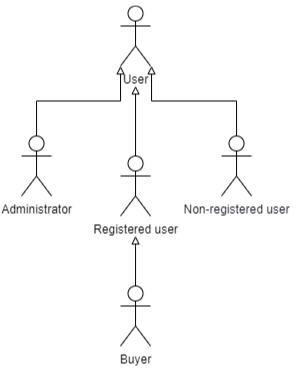
*Figure 1: Actors*

| Identifier | Description | Examples|
| -----------|-------------|---------|
| User       |Common user; Has access to public information and can execute tasks such as search with filters, view items, read reviews. | n/a |
| Administrator| Supervise products, users, users reviews that go against the company policy; Treatment orders | n/a |
| Non-registered User | Can either register or authenticate in the system. | n/a |
| Registered User | Can perform tasks such as, making purchases, add items to the wish list, manage their profile. | n/a |
| Buyer | Authenticated user that has at least one purchase; Can make reviews on a purchased item. | n/a |

# **A2: Actors and User Stories**

This artifact contains the specification of the actors and their user stories, serving as agile documentation of project requirements.

## **A2.1 Actors**

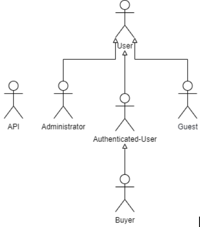

*Figure 1: Actors*

| Identifier | Description | Examples|
| -----------|-------------|---------|
| User       |Common user; Has access to public information and can execute tasks such as search with filters, view items, read reviews. | n/a |
| Administrator| Supervise products, users, users reviews that go against the company policy; Treatment orders | n/a |
| Non-registered User | Can either register or authenticate in the system. | n/a |
| Registered User | Can perform tasks such as, making purchases, add items to the wish list, manage their profile. | n/a |
| Buyer | Authenticated user that has at least one purchase; Can make reviews on a purchased item. | n/a |
| API | External APIs that can be used to register or to authenticate into the website | Google Sign-In API |

*Table 1: Actors*

## **A2.2 User stories**

**A2.2.1 User**

| Identifier | Name | Priority | Description |
| -----------|-------------|---------|-------|
| US01 | Homepage | High | As a User, I want to access the homepage of the website, so that I can see the page recommendations, top sellers and the most recently added books.|
| US02 | Preview Product| High | As a User, I want to be able to preview a product, just by positioning my cursor above the product picture.|
| US03 | View Specific Product | High |As a User, I want to be able to access a single product page, so that I can see the specific details about the product.|
| US04 | View Product Reviews | High |As a User, I want to view specific product reviews that can influence my purchase. |
| US05 | View Products by tags or categories | High |As a User, I want to be able to view products from a single category or tags, so that I can search products by categories or tags. |
|US06 |View WebPage reviews | High |As a User, I want to read reviews, from other buyers, regarding their experience with a purchase on the website (shipping, return policy/treatment, availability). |
| US07 | FAQ Page | High | As a User, I want to access the FAQ page, so that the user can clarify frequent questions easily. |
| US08 | Search Products by name on the Search Bar | High | As a User, I want to search products on the website on the search bar, with autocomplete suggestions to ease the search. |
| US09 | Search Products by applying filters or tags | High | As a User, I want to be able to narrow my search for books, given certain preferences. |
| US10 | Add item to Shopping Cart | High | As a User, I want to add items to my shopping cart, so that I can eventually purchase them. |
| US11 | View Shopping Cart | High | As a User, I want to view the items in my cart, so that I can see all the items I’m considering buying. |
| US12 | Remove Item from Shopping Cart | High | As a User, I want to remove items from my cart, so that I only buy the items I want. |
| US13 | About Us Page | Low | As a User, I want to access an About Us page, so that the user can see a complete website’s description. |
| US14 | Product Sort | Low | As a User, I want to be able to sort products by their ratings, price, name. So that it can make the book choice easier. |
| US15 | Author Page | Low | As a User, I want to access author information and get his published products. |
| US16 | Contact Us | Low | As a User, I want to access a Contact us page. |

*Table 2: User' User stories*

**A2.2.2 Administrator**

| Identifier | Name | Priority | Description |
| -----------|-------------|---------|-------|
| US17 | Sign/Log out | High |As an Administrator, I want to sign out of the website, so that I can safely close my account. |
| US18 | Block User Account | High | As an Administrator, I want to block user accounts, so that they can no longer access restricted contents of the site. |
| US19 | Unblock User Account | High | As an Administrator, I want to unblock user accounts, so that they can once again access restricted contents of the site. |
| US20 | Administer User Accounts (search, view, edit, create, delete) | High | As an Administrator, I want to administer user accounts, so that I can ‘control’ all the users with an account on my website. |
| US21 | Add Product | High | As an Administrator, I want to add a product to the system, so that users can purchase it. |
| US22 | Edit Product Information | High | As an Administrator, I want to edit product information, so that it is always correct. |
| US23 | Edit Product Stock | High | As an Administrator, I want to edit product stock, so that I can update it. |
| US24 | Manage Product Categories | Medium | As an Administrator, I want to add/remove genres of books, so that the offer of the website can be suitable for updates. |
| US25 | View Users’ Purchase History | Medium | As an Administrator, I want to view users’ purchase history, so that I can have a record of all the products a certain user buys. |
| US26 | Manage Order Status | Medium | As an Administrator, I want to manage order status, so that buyers can always know the updated status of their orders. |
| US27 | Add FAQ | Low | As an Administrator, I want to add a Frequently Asked Question and its answer, so that it can clarify frequent user doubts. |
| US28 | Edit FAQ | Low | As an Administrator, I want to edit a FAQ, so that the users can always read the most updated version of the answer. |
| US29 | Archive Product | Low | As an Administrator, I want to archive a product, so that it cannot be purchased by users anymore. |
| US30 | Un-Archive Product | Low | As an Administrator, I want to unarchive a product, so that it can be purchased by users once again. |
| US31 | Manage Product Discounts | Low | As an Administrator, I want to manage product discounts, so that they can be updated according to the sales season. |
| US32 | Manage Review Reports | Low | As an Administrator, I want to manage Review Reports, so that I can eventually block any abusive users and remove their offensive reviews. |

*Table 3: Administrator user stories*

**A2.2.3 Guest**

| Identifier | Name | Priority | Description |
| -----------|-------------|---------|-------|
| US33 | Sign In | High | As a Guest, I want to sign in to my previously created account, so that I can access privileged information. |
| US34 | Sign up | High | As a Guest, I want to create an account on the website, so that I can later authenticate myself and enter the system. |
| US35 | Sign In to Checkout Shopping Cart Items | Medium | As a Guest, I want to sign into my account on checkout, so that I can later continue my purchase.|

*Table 4: Guest user stories*

**A2.2.4 Authenticated User**

| Identifier | Name | Priority | Description |
| -----------|-------------|---------|-------|
| US36 | View Profile | High | As an Authenticated user, I want to view my profile to check if my information is right. |
| US37 | Edit Profile | High | As an Authenticated user, I want to be able to change my profile if I want to. |
| US38 | Delete Account | High | As an Authenticated user, I want to be able to delete my account to erase my information. |
| US39 | Checkout Shopping Cart Items | High | As an Authenticated user, I want to order the items in my Shopping Cart. |
| US40 | View Wishlist | High | As an Authenticated user, I want to view my Wishlist to remember the items I liked. |
| US41 | Add Items to Wishlist | High | As an Authenticated user, I want to add items to my wishlist so I can remember later the items I have an interest in. |
| US42 | Delete Item from Wishlist | High | As an Authenticated user, I want to delete the items that I don't have an interest in anymore from my Wishlist. |
| US43 | Sign Out | High | As an Authenticated user, I want to be able to sign out of the website. |
| US44 | Item Recommendation | Medium | As an Authenticated user, I want to get an item recommendation based on my purchase history. |
| US45 | View personalized suggestions on the product page | Low |As an Authenticated user, I want to view suggested items, suitable to the users' preferences. |

*Table 4: Authenticated user' user stories*

**A2.2.5 Buyer**

| Identifier | Name | Priority | Description |
| -----------|-------------|---------|-------|
| US46 | Item Review | High | As a buyer, I want to review an item that I bought|
| US47 | Edit Review | High | As a buyer, I want to be able to edit my review on an item to improve it. |
| US48 | Delete Review | High | As a buyer, I want to delete my review on an item. |
| US49| View purchase history | High | As a buyer, I want to view the items that I purchased. |

*Table 5: Buyer User stories*

## **A2.3 Supplementary Requirements**

### **A2.3.1 Business Rules**

| Identifier | Name  | Description |
| -----------|-------------|-------|
| BR01 | Account Deletion | In case an account is deleted (by its owner or by an administrator), all the shared user data is kept but made anonymous so that all the relevant information regarding reviews and purchases is maintained (i.e. for statistics). |
| BR02 | Administrators | Administrator accounts cannot buy products, as they are the ones that manage them. | 
| BR03 | Write Review  | Only buyers that have bought a product can write a review for that specific product. |
| BR04 | Unique Review | A buyer can only make a single review per product. |
| BR05 | Edit and Delete Review | Only the author of a review can edit and/or delete that specific review. |
| BR06 | Admin Delete Review | Admins have permission to delete any review. |
| BR07 | Review Star Rating | All written reviews must include a Star Rating (integer from 0 to 5) to classify the product. |
| BR08 | Product Star Rating | All Products must include a Star Rating (integer from 0 to 5) obtained by the average of all its review ratings. |
| BR09 | Stock Available | A registered user can only purchase a product if it is available in stock. |
| BR10 | Stock Update | After every purchase, the stocks of the products affected must be updated (decreasing accordingly). |
| BR11 | Shipping Date | The shipping date has to be the same as the order date or on a later date, not before. |
| BR12 | Delivery date | The expected delivery date has to be at least one day later than the date of purchase (not on the same day neither before). |
| BR13 | Cancel order | A buyer can only cancel its order if it hasn't already been shipped. (i.e. on the day of the purchase only, not after, not before). | 
| BR14 | Return Order | A buyer can return a placed order that has been already delivered. |
| BR15 | Logout | The logout should only be possible if the user is currently logged in. | 

*Table 6: Business Rules*

### **A2.3.2 Technical Requirements**

| Identifier | Name  | Description |
| -----------|-------------|-------|
| TR01 | Availability * | ‘The Last Chapter’ Online Book Shop must be available at all times (24/7). |
| TR02 | Accessibility | The system must ensure that everyone can access the pages, regardless of whether they have any handicap or not, or the web browser or device they use. |
| TR03 | Usability * | The system should be simple and easy to use, to allow the purchase of books by people of all ages and backgrounds. |
| TR04 | Performance | The system should have response times shorter than 2s to ensure the user's attention. |
| TR05 | Web application | The online shop should be implemented as a web application with dynamic pages with standard web technologies, such as HTML5, JavaScript, CSS3 and PHP. |
| TR06 | Portability | The server-side system should work across multiple platforms (Windows, Linux, Mac OS, Android, etc.).| 
| TR07 | Database | The PostgreSQL database management system must be used. | 
| TR08 | Security * | The system must protect information from unauthorized access through the use of an authentication and verification system. | 
| TR09 | Robustness | The system must be prepared to handle and continue operating when runtime errors occur. | 
| TR10 | Scalability | The system must be prepared to deal with the growth in the number of users and their actions. |
| TR11 | Ethics | The website must respect the ethical principles in software development (for example, personal user details like passwords, payment credentials and addresses, should be stored encrypted and only shared with the permission of their owner). | 

*Table 7: Technical Requirements*

 *- As Technical requirements assinaladas com asterisco são as que consideramos mais críticas.

### **A2.3.3 Restrictions**

| Identifier | Name  | Description |
| -----------|-------------|-------|
| C01 | Deadline | ‘The Last Chapter’ online shop should be ready to use at the end of the semester. |

# **A3 Information Architecture**

The main goal to be achieved with this artifact is to preview the product user interface to be developed, so that it can be easily discussed with the clients, enabling quick, powerful interactions regarding the design of the user interface. 
 
In this artifact we approach two elements:
* An overview of the information system from the perspective of a normal user ( sitemap ). 
* An overview of the interface elements, common features to all pages, and interaction with the system.

## **A3.1 Sitemap**

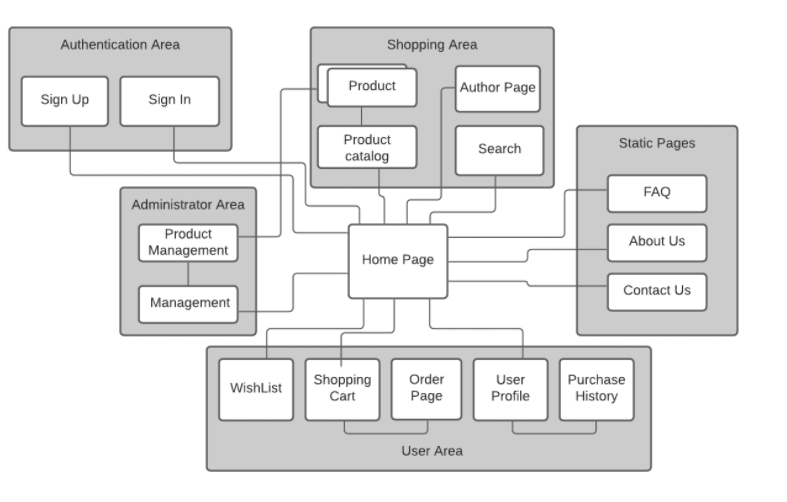

*Figure 2: Sitemap*

## **A3.2 Wireframes**

---
### **UI01 Homepage not logged in**

| Desktop | Mobile |
|:-------:|:------:|
| 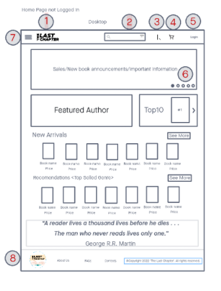 |  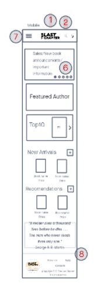 |

*Table 8: Homepage not logged in Wireframe*

|ID| Description | Desktop | Mobile |
|:--:|-------------|:-------:|:------:|
| 1 | The online shop logo | n/a | n/a |
| 2 | Search bar with filters applicable | 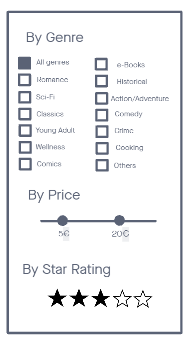 |  |
| 3 | Upon clicking, the website redirects the user to the wishlist page|  n/a |  n/a  |
| 4 | View shopping cart|  | n/a |
| 5 | Upon clicking, the website redirects the user to the login page|  n/a |  n/a  |
| 6 | Website promos/sales catalog| n/a |  n/a |
| 7 | Website vertical menu | 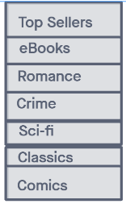 | 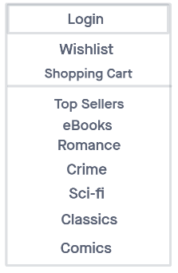 |
| 8 | Footer |  n/a |  n/a |

*Table 9: Homepage not logged in features*

---
### **UI02 Homepage Logged In**

| Desktop | Mobile |
|:-------:|:------:|
| 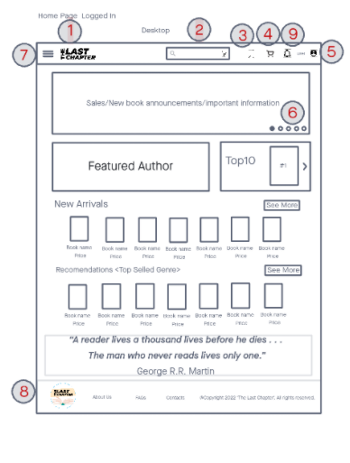 |  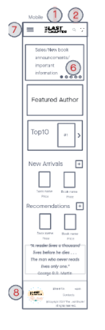 |

*Table 10: Homepage logged in Wireframe*

|ID| Description | Desktop | Mobile |
|:--:|-------------|:-------:|:------:|
| 1 | The online shop logo | n/a | n/a |
| 2 | Search bar with filters applicable |  |  |
| 3 | Upon clicking, the website redirects the user to the wishlist page|  n/a |  n/a  |
| 4 | View shopping cart|  | n/a |
| 5 | Upon clicking, the website redirects the user to the login page|  n/a |  n/a  |
| 6 | Website promos/sales catalog| n/a |  n/a |
| 7 | Website vertical menu |  |  |
| 7(1) | Website vertical Menu (Admin) | 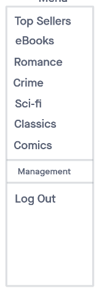 | 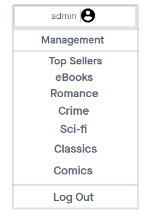 |
| 8 | Footer |  n/a |  n/a |
| 9 | Notification system | 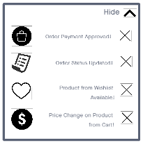 | 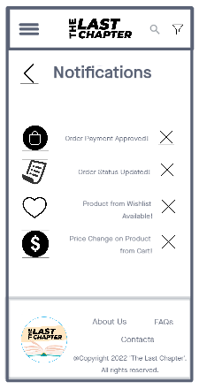 |

*Table 11: Homepage logged in features*

---
### **UI03 Login Page**

| Desktop | Mobile |
|:-------:|:------:|
| 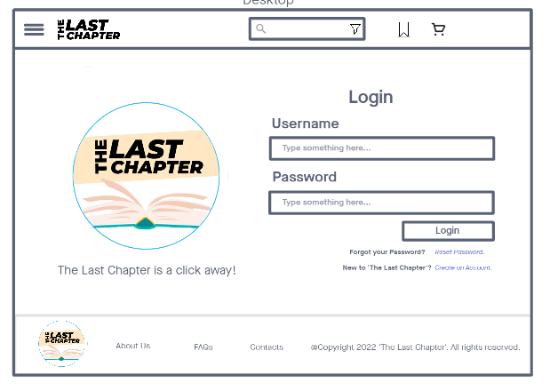 |  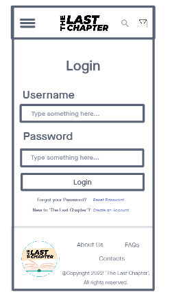 |

*Table 12: Log in Wireframe*

---
### **UI04 Sign up**

| Desktop | Mobile |
|:-------:|:------:|
| 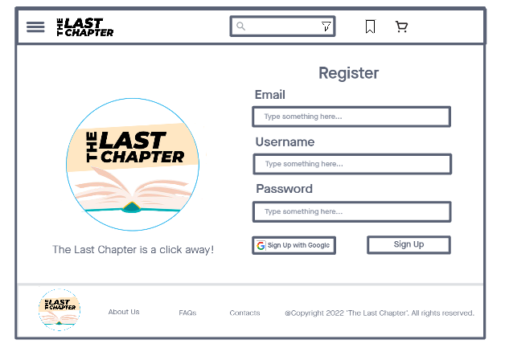 |  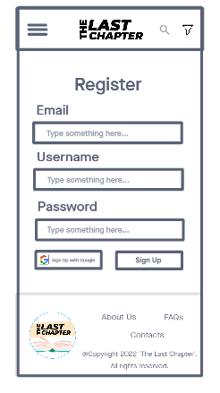 |

*Table 13: Sign up Wireframe*

---
### **UI05 Author Page**

| Desktop | Mobile |
|:-------:|:------:|
| 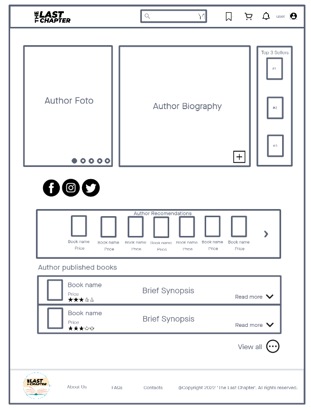 |  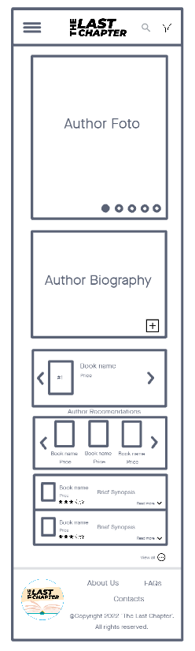 |

*Table 14: Author Page Wireframe*

---
### **UI06 Author Published Books**

| Desktop | Mobile |
|:-------:|:------:|
| 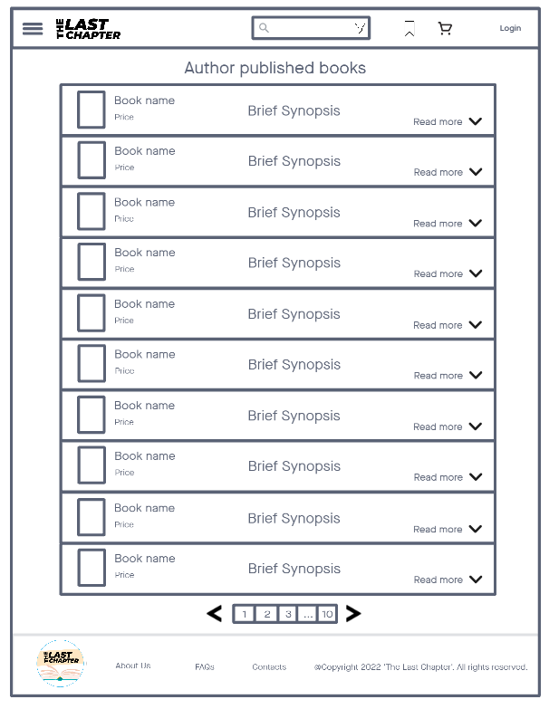 |   |

*Table 15: Author Published books Wireframe*

---
### **UI07 Product Catalog**

| Desktop | Mobile |
|:-------:|:------:|
| 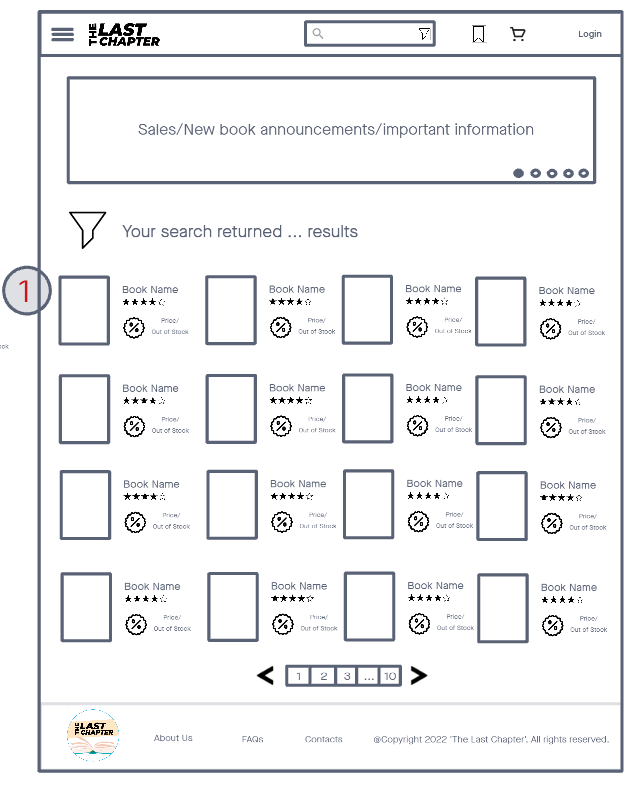 |  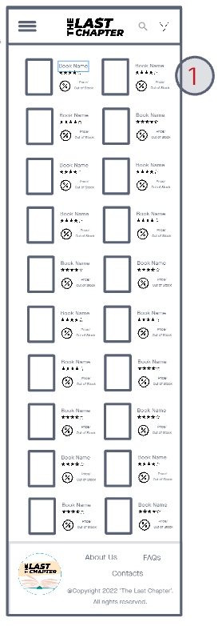 |

*Table 16: Procuct catalog Wireframe*

|ID| Description | Desktop | Mobile |
|:--:|-------------|:-------:|:------:|
| 1 |When hovering options add to cart and to wishlist appear ( on desktop ). Double-tap to add the item to the wishlist ( on mobile ) | 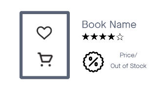 | 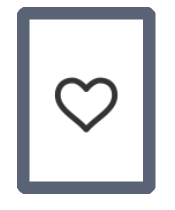

*Table 17: Procuct catalog features*

---
### **UI08 Product Catalog with filter bar open**

| Desktop | Mobile |
|:-------:|:------:|
| 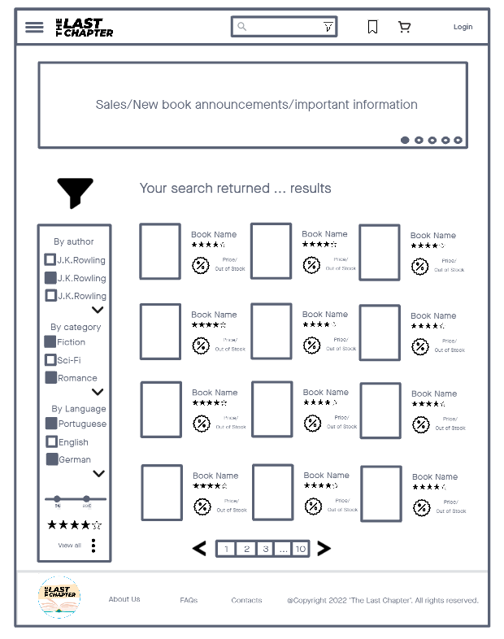 |  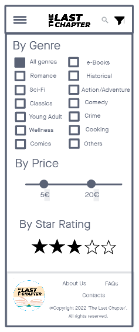 |

*Table 18: Procuct catalog with filter Wireframe*

---
### **UI10 Product Page**

| Desktop | Mobile |
|:-------:|:------:|
| 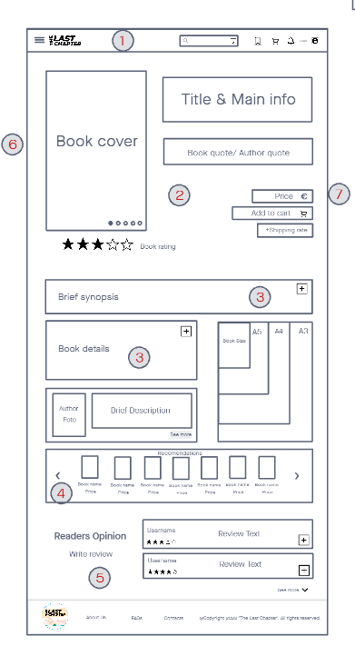 |  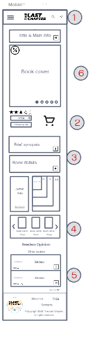 |

*Table 18: Procuct Wireframe*

|ID| Description | Desktop | Mobile |
|:--:|-------------|:-------:|:------:|
| 1 | NavBar | n/a | n/a |
| 2 | Upon clicking, the item is added to the shopping cart. | n/a | n/a |
| 3 | Upon clicking, more product details/synopsis are shown. | n/a | n/a |
| 4 | Upon clicking, recommended books will be shown based on the page’s product. | n/a | n/a |
| 5 | Users can read reviews that buyers have done on this product.If a user bought this product, he can also write a review. | n/a | n/a |
| 6 | When hovering options add to cart and to wishlist appear (on desktop)Double-tap to add the item to the wishlist (on mobile) | 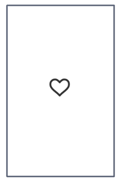 | 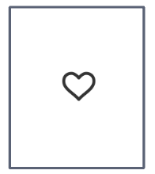 |
| 7 | Upon click, redirect the user to the author page | n/a | n/a |

*Table 19: Procuct features*

---
### **UI11 Admin Dashboard Page (Management)**

| Desktop | Mobile |
|:-------:|:------:|
|  |   |

*Table 20: Admin management page Wireframe*

|ID| Description | Desktop | Mobile |
|:--:|-------------|:-------:|:-------:|
| 1 | “Page Links” Bar | n/a | n/a |
| 2 | Order Search Filters | 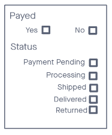 |   |
| 3 | Order See More Button - upon clicking the order details pop-up will appear. ProductId with a link - upon clicking the admin will be redirected to the Product Page. | 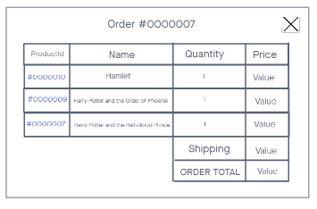 |  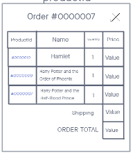 | 
| 4 | User Search Filters | 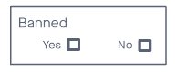 |   |
| 5 | Create User Button - upon clicking the create user pop-up will appear | 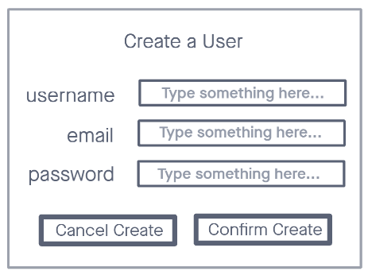 |  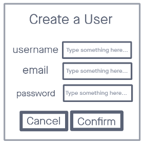 |
| 5 (1) | Edit User Button - upon clicking the edit user pop-up will appear | 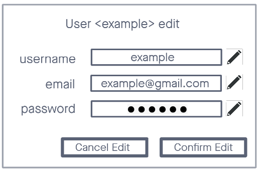 |  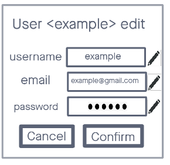 |
| 5 (2) | Ban User Button - upon clicking the ban user pop-up will appear | 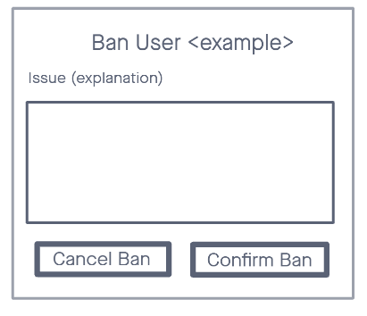 |  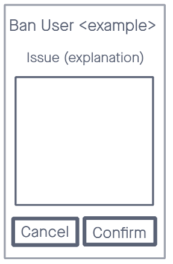 |
| 5 (3) | UnBan User Button - upon clicking the unban user pop-up will appear |  |   |
| 5 (4) | Delete User Button - upon clicking the delete user pop-up will appear | 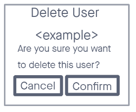 |   |
| 6 | Create a new Product Button - upon clicking, the admin will be redirected to the Product Create Page | n/a | n/a |
| 7 | Apply Discount to all in Search button - upon clicking, the admin will be able to apply a discount to all the products resulting of the previous search or filters applied. | 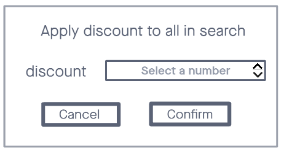 |  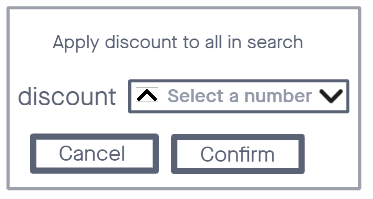 |
| 8 | Product Search Filters | 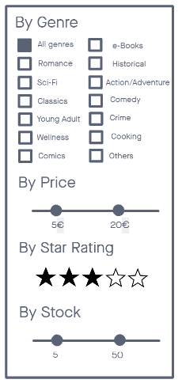 |   |
| 9 | Edit Product Button - upon clicking the admin will be redirected to the Product Edit Page | n/a | n/a |
| 9 (1) | Archive Product Button - upon clicking the Archive Product pop-up will appear | 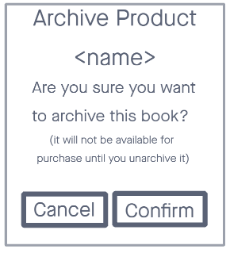 |   |
| 9 (2) | UnArchive Product Button - upon clicking the Archive Product pop-up will appear |  |   |
| 10 | AuthorId with a link - upon clicking the admin will be redirected to the Author Page | n/a | n/a |
| 11 | Delete FAQ Button - upon clicking the Delete FAQ pop-up will appear | 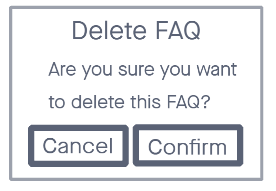 |   |
| 12 | Horizontal Scroll Bar in Mobile Management Tables - allows the admin to view the full extent of the table on their mobile phone. | n/a | n/a |

*Table 21: Admin Page features*

---
### **UI12 Product Edit Page**

| Desktop | Mobile |
|:-------:|:------:|
| 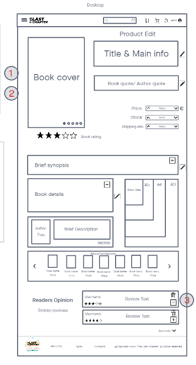 |  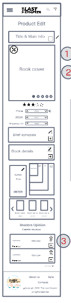 |

*Table 22: Admin Procuct edit Wireframe*

|ID| Description | Desktop | Mobile |
|:--:|-------------|:-------:|:------:|
| 1 | Hover the book cover to be able to edit the cover pictures (desktop).  Double tap the screen in the book cover region to able to edit the cover pictures | 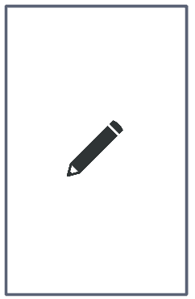 |   |
| 2 | Book cover pictures edition area |  |   |
| 3 | Delete a user review, with an optional comment |  |   |

*Table 23: Admin Procuct edit features*

---
### **UI13 Product Create Page**

| Desktop | Mobile |
|:-------:|:------:|
|  |   |

*Table 24: Admin Procuct create Wireframe*

|ID| Description | Desktop | Mobile |
|:--:|-------------|:-------:|:------:|
| 1 | Hover above the book cover to add a picture (desktop). Double tap the book  cover to add a picture (mobile). |  |   |
| 2 | Open book cover picture edition area. |  |   |
| 3 | If the author doesn’t exist in the database, create one. |  |   |

*Table 25: Admin Procuct create features*

---
### **UI14 Checkout Order Page (Shopping Cart)**

| Desktop | Mobile |
|:-------:|:------:|
|  |   |

*Table 26: Checkout page (Shopping Cart) Wireframe*

---
### **UI15 Checkout Order Page 2 (Delivery Address)**

| Desktop | Mobile |
|:-------:|:------:|
|  |   |

*Table 27: Checkout page (Delivery Address) features*

|ID| Description | Desktop | Mobile |
|:--:|-------------|:-------:|:------:|
| 1 | Insert new address information, when proceeding to checkout |  |   | 

*Table 28: Checkout page (Delivery Address) features*

---
### **UI16 Checkout Order Page 3 (Payment)**

| Desktop | Mobile |
|:-------:|:------:|
|  |   |

*Table 29: Checkout page (Payment) Wireframe*

|ID| Description | Desktop | Mobile |
|:--:|-------------|:-------:|:------:|
| 1 | Insert new address information, when proceeding to checkout |  |   | 

*Table 30: Checkout page (Payment) features*

---
### **UI17 Checkout Order Page 4 (Confirmation)**

| Desktop | Mobile |
|:-------:|:------:|
|  |   |

*Table 31: Checkout page (Final) Wireframe*

---
### **UI18 User Profile Page**

| Desktop | Mobile |
|:-------:|:------:|
|  |   |

*Table 32: User Profile Wireframe*

| Desktop | Mobile |
|:-------:|:------:|
|  |   |

*Table 33: User Profile Address Wireframe*

| Desktop | Mobile |
|:-------:|:------:|
|  |   |

*Table 34: User Profile Address Wireframe*

---
### **UI19 Wishlist**

| Desktop | Mobile |
|:-------:|:------:|
|  |   |

*Table 35: WishList Wireframe*

---
### **UI20 Purchase History**

| Desktop | Mobile |
|:-------:|:------:|
|  |   |

*Table 36: Purchase History Wireframe*

|ID| Description | Desktop | Mobile |
|:--:|-------------|:-------:|:------:|
| 1 | Return the order |  |  |

*Table 37: Purchase History features*

---
### **UI21 About us Page**

| Desktop | Mobile |
|:-------:|:------:|
|  |   |

*Table 38: About us Wireframe*

---
### **UI22 FAQ Page**

| Desktop | Mobile |
|:-------:|:------:|
|  |   |

*Table 39: FAQ Wireframe*

---
### **UI23 Contact us Page**

| Desktop | Mobile |
|:-------:|:------:|
|  |   |

*Table 40: Contact us Wireframe*

---

## **Change Log**:

* Week from 25th Oct to Oct 31st, 2021 - Added A1 text and Actors;
* Week from Nov 1st to Nov 7th, 2021 - Added all User Stories, Business Rules, Technical Requirements and Restrictions.
* Week from Nov 8th to Nov 12th, 2021 - (until ER delivery on Nov 11th) - Added Wireframes and Sitemap on A3, revision on A1 text, added BR05 and 06 on A2, removed shopping cart-related user stories from Guest to User.

---

## **Authors** :

* Ana Matilde Guedes Perez da Silva Barra 	up201904795
* José Pedro Abreu Silva	up201904775
* Renato Dangel Fortes Leite 	up201908633
* Rui Pedro Mendes Moreira 	up201906355

---

## **Editor** :

* Ana Matilde Guedes Perez da Silva Barra up201904795

 

