# **LPOO_66 - CLASH ROYALE**
---
## **DESCRIPTION**
> This real-time strategy game combines elements from collectible card games,
> tower defense, and multiplayer battle arena.\
> This is a Tower Rush game that puts 2 players into play (1v1) in which the
> objective is to destroy the most opposing towers, with the destruction of the
> opponent's *King Tower* being a win.\
> Each player has 3 towers (two *Princess Towers* on the sides, and a *King Tower*
> in the middle).\
> Each card causes a certain amount of damage to the opponent
> and costs a certain amount of elixir to play. Players start the battle with
> five elixir points, and one elixir point is replenished every iteration,
> with a maximum of ten elixir points. Once a card is played, a new card is
> automatically drawn from the player's card deck.\
> This project was developed by José Silva(*up201904775@up.pt*), Margarida
> Ferreira (*up201905046@up.pt*) and Rui Moreira (*up201906355@up.pt*) for
> LPOO 2020⁄21.
## **IMPLEMENTED FEATURES**

### TroopCharacter Movement
> When a Troop card is played, the corresponding character moves to the nearest opponent Tower.
### TroopCharacter Attack
> A Troop Character attacks any Tower that is in is range.
### SpellCharacter Movement
> When a Spell card is played, the corresponding character moves its target.
### SpellCharacter Attack
> A Spell Character attacks any Tower that is in the same position.
### Character Display
> Troop characters are represented on the screen using its corresponding char.
### Tower Display
> Each player has 3 towers in his side of the field ,two *Princess Towers* on the sides, and a *King Tower* in the middle.
### Boundaries  Display
> Boundaries are represented on the screen using the char "#".
### Bridge Display
> Bridges are represented on the screen in brown.
### River Display
> The River is represented on the screen in light blue.
### Card Display
> The available Cards for the user to play are displayed on the bottom part of screen.
### Card Selection Using Mouse
> The user can select a card to play by dragging it on the arena using the mouse.
### Select Random Card from Deck
> Once a card is played, a new card is automatically drawn from the player's card deck.
### Creation of a Customized Font
> We created a font using SVGs to better represent the elements of our game.
### Load Arena form Text File
> The arena is loaded from a text file (including, width, height, towers, bridges and the river).
### Each Player has is Color
> Each player has a color (blue or red) and its characters and elixir will be displayed on the screen using that same color.
### Game Over
> When a King tower is destroyed, the game ends and the player that destroyed it wins.
### Menus
> We added 2 Menus (Menu and  Game Over), that give the user the options of playing the game or exiting it.
### Quit Game
> When a user is playing, he can quit the game by pressing 'q' on the keyboard. He will be redirected to the initial Menu.
### User vs Computer
> The user plays against another player controlled by the program.
### Screenshots
> Here are some screenshots that illustrate the most important features of our game:
>
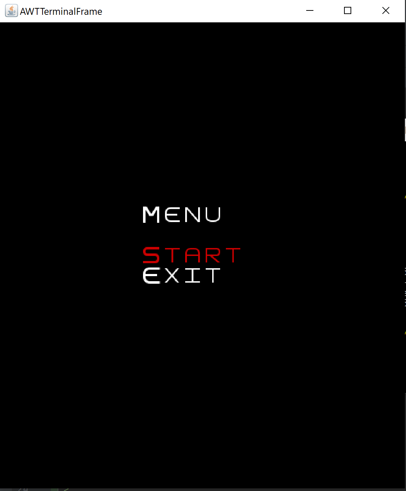
>
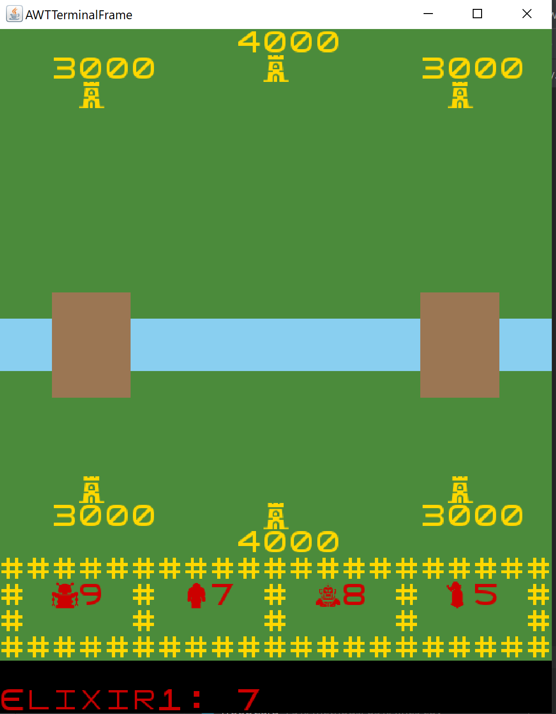
>
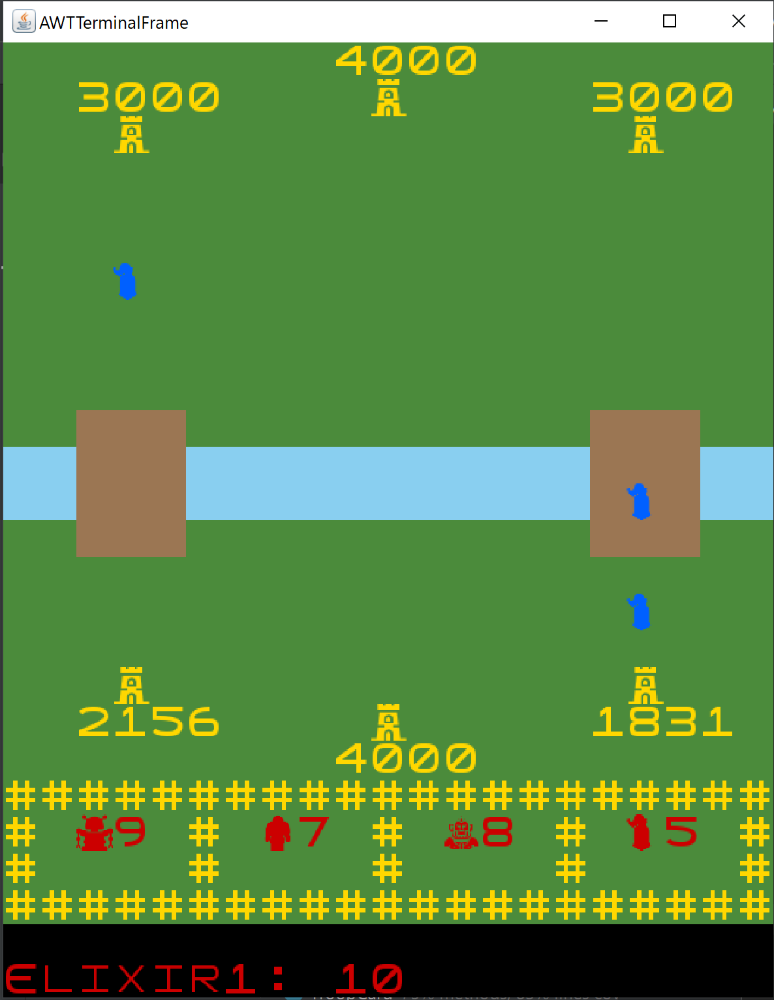
>
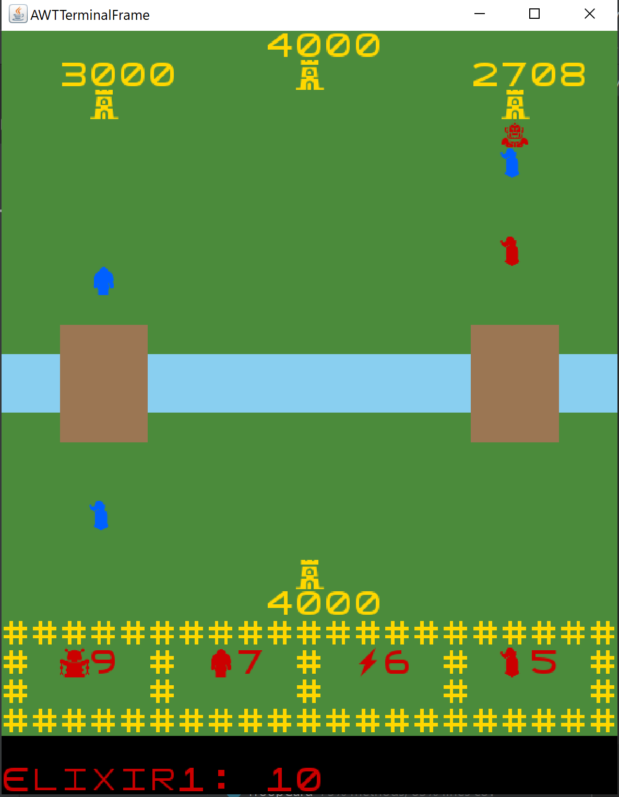
>
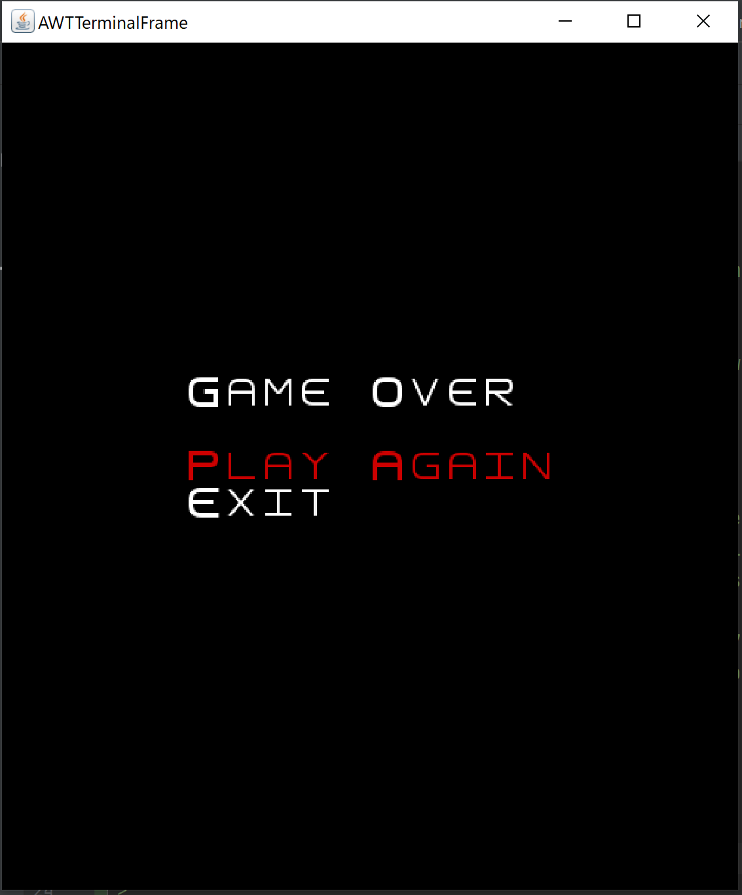
## **PLANNED FEATURES**
> Considering that the main focus of the project is the code structure
> and use of design patterns, rather than its complexity and playability,
> we are happy with the features we have implemented. 
> However, if we had more time, we could've implemented the 
> following feature:
### Straight Movement of Characters
> Instead of having only horizontal or vertical movement, we could make the
> characters move to the target in a straight line, using some line drawing
> algorithm.
## **DESIGN**
### 1. Separating Modules
#### 1.1 Problem in Context
> The first problem that we came across with was to find a strategy to separate, in an effective
> way, the different modules of the game: **the logic module**, that would be in charge of the
> mechanics of the game (declaring the fundamental objects of the game, and it's attributes);
> **the drawing module**, that would be responsible for transmitting the game's
> current state onto the screen, allowing the user to visualize it; and finally
> **the controller module**, that would update the state of the model, according to the
> fundamental rules of the game and consequently update the corresponding view.
> This would avoid the violation of the *Single Responsibility Principle*, making it a lot
> easier to change a component of the game, such as the display method, since we would only need to
> change the drawing module and not the other modules, if they were correctly separated.
#### 1.2 The Pattern
> In order to achieve this correct separation of the modules, we elected the
> ***MVC*** (Model - View - Controller) ***architectural pattern***. In our project, we have three
> different MVC structures: one for the game, another for the main menu, and other
> for the game over.\
> For each *MVC* implementation we have, the Model containing all the information about the
> corresponding model (game, menu or game over),  its current state, and also some methods
> to modify it (to be called by other modules); the Controller receives the Model and
> updates it correctly; finally, the View, that also receives the Model, draws its current
> state onto the screen.
#### 1.3 The Implementation
> Here's how we decided to implement the pattern:
>
> **Game MVC:**
> 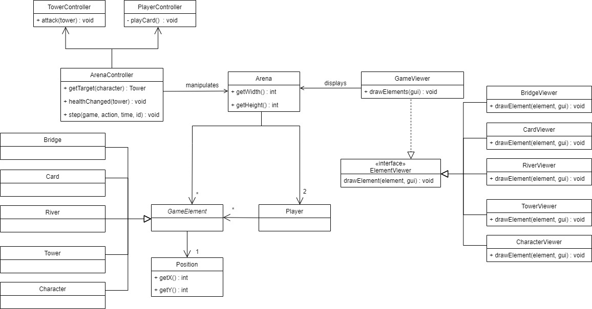 \
> The classes can be found in the following files:\
> [ArenaController](../src/main/java/clash_royale/controller/game/ArenaController.java)\
> [TowerController](../src/main/java/clash_royale/controller/game/TowerController.java)\
> [PlayerController](../src/main/java/clash_royale/controller/game/PlayerController.java)\
> [GameViewer](../src/main/java/clash_royale/view/game/GameViewer.java)\
> [CardViewer](../src/main/java/clash_royale/view/game/CardViewer.java)\
> [CharacterViewer](../src/main/java/clash_royale/view/game/CharacterViewer.java)\
> [TowerViewer](../src/main/java/clash_royale/view/game/TowerViewer.java)\
> [Bridge](../src/main/java/clash_royale/view/game/BridgeViewer.java)\
> [River](../src/main/java/clash_royale/view/game/RiverViewer.java)\
> [Arena](../src/main/java/clash_royale/model/game/arena/Arena.java)\
> [Player](../src/main/java/clash_royale/model/Player.java)\
> [GameElement](../src/main/java/clash_royale/model/game/elemets/GameElement.java)\
> [Bridge](../src/main/java/clash_royale/model/game/elemets/Bridge.java)\
> [River](../src/main/java/clash_royale/model/game/elemets/River.java)\
> [Character](../src/main/java/clash_royale/model/game/elemets/character/Character.java)\
> [Card](../src/main/java/clash_royale/model/game/elemets/card/Card.java)\
> [Tower](../src/main/java/clash_royale/model/game/elemets/tower/Tower.java)\
> [Position](../src/main/java/clash_royale/model/Position.java)
> 
> **Menu MVC:**\
> 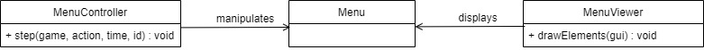 \
> The classes can be found in the following files:\
> [Menu](../src/main/java/clash_royale/model/menu/Menu.java)\
> [MenuController](../src/main/java/clash_royale/controller/menu/MenuController.java)\
> [MenuViewer](../src/main/java/clash_royale/view/menu/MenuViewer.java)
> 
> **Game Over MVC:**\
> 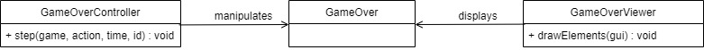 \
> The classes can be found in the following files:\
> [GameOver](../src/main/java/clash_royale/model/gameover/GameOver.java)\
> [GameOverController](../src/main/java/clash_royale/controller/gameover/GameOverController.java)\
> [GameOverViewer](../src/main/java/clash_royale/view/gameover/GameOverViewer.java)\
> It is important to notice that, in order to simplify even more our code, and especially
> on the game *MVC* model, we sometimes subdivided the modules (for example, each class has
> its viewer, that will be called by the "main" game viewer afterwards);
#### 1.4 Consequences
> As previously mentioned, using the *MVC* pattern increases the code modularity .
> Making it easier to change only one component of the game, with no need to adjust the
> others. 
> This indicates that our
> code architecture respects the *Open-Closed Principle*. As said before, our code
> also satisfies the demands of the *Single Responsibility Principle*: since each module
> has responsibility over only a single part of the program's functionality.
### 2. Changing Between Different MVC Models
#### 2.1 Problem in Context
> We, then, needed to find a way to implement and join these different parts of the game,
> and to properly switch from one to another, without excessively using conditional
> statements, which could lead to a violation of the *Open-Closed Principle*.
#### 2.2 The Pattern
> The pattern chosen to solve this issue was the ***State Pattern***. We created an abstract
> class for a generic State. Each of its concrete subclasses represents a
> different state, so we have a different class for the Game State, the Main
> Menu State, and the Game Over State. Each one of them has the necessary information
> to function, i.e. each state has its *MVC*, so it can update the game accordingly, e.g. when
> calling the drawElements method of a state, it would call the draw method of the viewer that
> is defined inside it.
> Each *MVC* model has some actions that trigger a change of State, e.g. If the "Start" option
> is selected on the Menu, the menu controller will make a function call to change the current
> state to a Game State.
> Later, to complement this design, we also added the ***Factory Method***, in order to allow
> each State subclass to create its own Viewer and Controller, e.g. the Game Over State creates a Game Over
> Controller and Viewer.
#### 2.3 The Implementation
> Here's how we decided to implement the pattern: \
> 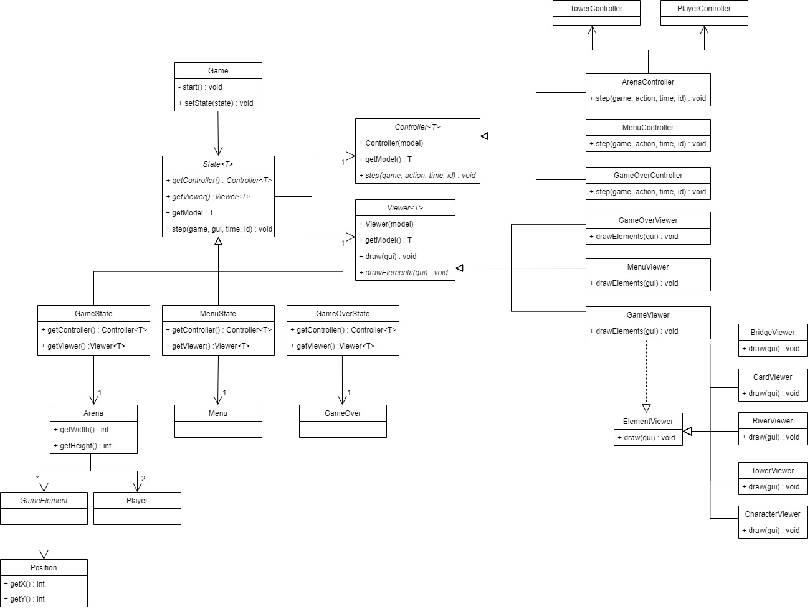 \
> The classes can be found in the following files:\
> [Game](../src/main/java/clash_royale/Game.java)\
> [State](../src/main/java/clash_royale/states/State.java)\
> [GameState](../src/main/java/clash_royale/states/GameState.java)\
> [GameOverState](../src/main/java/clash_royale/states/GameOverState.java)\
> [MenuState](../src/main/java/clash_royale/states/MenuState.java)\
> [Arena](../src/main/java/clash_royale/model/game/arena/Arena.java)\
> [GameOver](../src/main/java/clash_royale/model/gameover/GameOver.java)\
> [Menu](../src/main/java/clash_royale/model/menu/Menu.java)\
> [Controller](../src/main/java/clash_royale/controller/Controller.java)\
> [ArenaController](../src/main/java/clash_royale/controller/game/ArenaController.java)\
> [GameOverController](../src/main/java/clash_royale/controller/gameover/GameOverController.java)\
> [MenuController](../src/main/java/clash_royale/controller/menu/MenuController.java)\
> [Viewer](../src/main/java/clash_royale/view/Viewer.java)\
> [GameViewer](../src/main/java/clash_royale/view/game/GameViewer.java)\
> [GameOverViewer](../src/main/java/clash_royale/view/gameover/GameOverViewer.java)\
> [MenuViewer](../src/main/java/clash_royale/view/menu/MenuViewer.java)
#### 2.4 Consequences
> A big benefit of using this pattern is, as referred before, the reduction of the need of using
> conditional logic in the main class, i.e. rather than performing actions according to
> the current state, it simply passes on that work to the actual state.
> It is also a lot easier to add a new state: we just need to create another
> State subclass, that overrides and implements the necessary methods to function (*Factory Method*),
> and in addiction we need to incorporate it to the State Diagram, that specifies when to
> enter a State and when to leave it.
> It shows that the *Open-Closed Principle* is not violated.
### 3. Different Attacks and Movements for Different Characters
#### 3.1 Problem in Context
> We wanted to add some variety in the way characters moved and attacked, instead of having
> the same move and attack strategy for every one of them.
> Troop Characters would have a health and would look for the nearest Enemy element
> and attack it according to its own damage and range; Spell Characters, however, should have a
> predefined target and perform a linear movement to reach it.
> So, we needed to come up with a way to structure our code in order to implement
> these features.
#### 3.2 The Pattern
> To solve this problem, we thought the ***Strategy Pattern*** would be the most appropriate.
> While we have subclasses representing the two different types of characters, we also have
> subclasses representing the two different types of movement and two different types of attack strategies.
> Each character would have a movement strategy, and an attack associated to it. When
> that character would need to move to a different position in the arena, or it would be
> able to attack, it would just delegate those actions to the corresponding movement and
> attack strategies.
#### 3.3 The Implementation
> Here's how we decided to implement the pattern:\
> 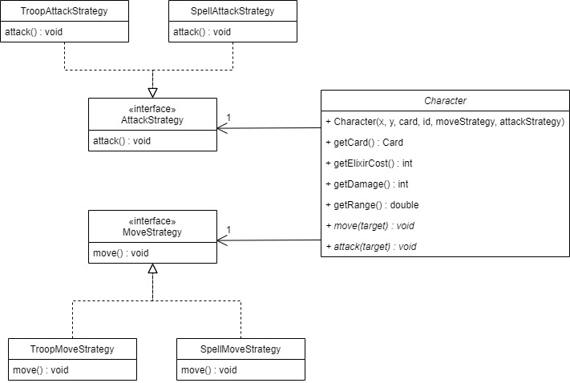 \
> The classes can be found in the following files:\
> [Character](../src/main/java/clash_royale/model/game/elemets/character/Character.java)\
> [AttackStrategy](../src/main/java/clash_royale/model/game/elemets/character/strategy/AttackStrategy.java)\
> [SpellAttackStrategy](../src/main/java/clash_royale/model/game/elemets/character/strategy/SpellAttackStrategy.java)\
> [TroopAttackStrategy](../src/main/java/clash_royale/model/game/elemets/character/strategy/TroopAttackStrategy.java)
> [MoveStrategy](../src/main/java/clash_royale/model/game/elemets/character/strategy/MoveStrategy.java)\
> [SpellMoveStrategy](../src/main/java/clash_royale/model/game/elemets/character/strategy/SpellMoveStrategy.java)\
> [TroopMoveStrategy](../src/main/java/clash_royale/model/game/elemets/character/strategy/TroopMoveStrategy.java)
#### 3.4 Consequences
> The Character class and its subclasses do not need to know anything about the way they are
> supposed to move or attack.
> As we previously referred, it simply delegates those actions to the corresponding
> implementation of MoveStrategy and AttackStrategy.
> It also makes adding another type of character with a different movement or attack strategy a lot
> easier. We would just need to create the new Strategy and associate it with the new
> Character.
> Conditional statements are also avoided by using this pattern, respecting the
> *Open-Closed Principle*.
### 4. Create Character According to the Card Chosen
#### 4.1 Problem in Context
> When a Card is played, its corresponding Character needs to be created and put into the
> game. We needed to find an efficient way to do this, so that a Spell Card would create
> the corresponding Spell Character, and a Troop Card would create the corresponding Troop
> Character.
#### 4.2 The Pattern
> In order to solve this issue, we decided to use the ***Factory Method***.
> For this, we created an abstract method, createCharacter(), on the Card class to be
> overridden and implemented by its subclasses. Each one of them is responsible for
> creating its corresponding Character, i.e. the SpellCard createCharacter() method would
> call the SpellCharacter constructor, while, on the other and, the TroopCard implementation
> of the createCharacter() method would call the TroopCharacter constructor.
#### 4.3 The Implementation
> Here's how we decided to implement the pattern:\
> 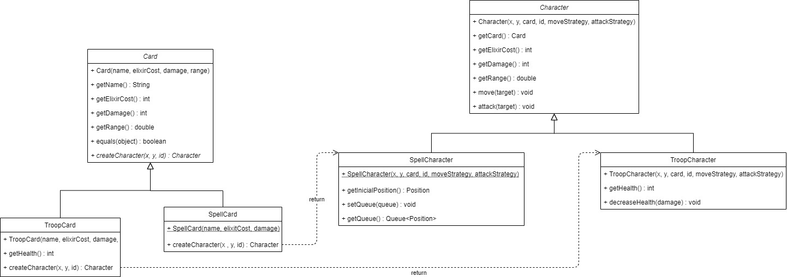 \
> The classes can be found in the following files:\
> [Card](../src/main/java/clash_royale/model/game/elemets/card/Card.java)\
> [SpellCard](../src/main/java/clash_royale/model/game/elemets/card/SpellCard.java)\
> [TroopCard](../src/main/java/clash_royale/model/game/elemets/card/TroopCard.java)\
> [Character](../src/main/java/clash_royale/model/game/elemets/character/Character.java)\
> [SpellCharacter](../src/main/java/clash_royale/model/game/elemets/character/SpellCharacter.java)\
> [TroopCharacter](../src/main/java/clash_royale/model/game/elemets/character/TroopCharacter.java)
#### 4.4 Consequences
> With the use of this pattern we avoid unnecessary casts and conditional statements,
> respecting the *Open-Closed Principle*.
### 5. Check If a Tower is Dead
#### 5.1 Problem in Context
> As referred in the description, our game ends when a Player destroys the opponent's main
> Tower. Therefore, our game needs to be aware of the death of the players' towers, so that it can
> perform the necessary actions, e.g. change the State to a Game Over State when a main tower dies.
#### 5.2 The Pattern
> To achieve this, we elected the ***Observer Pattern***. Each tower would have the Game State main
> controller as their Observer, so that, when a tower has a decrease of health it would notify it.
> The Observer, in return, would evaluate if the tower is dead and perform the corresponding actions.
#### 5.3 The Implementation
> Here's how we decided to implement the pattern:\
> 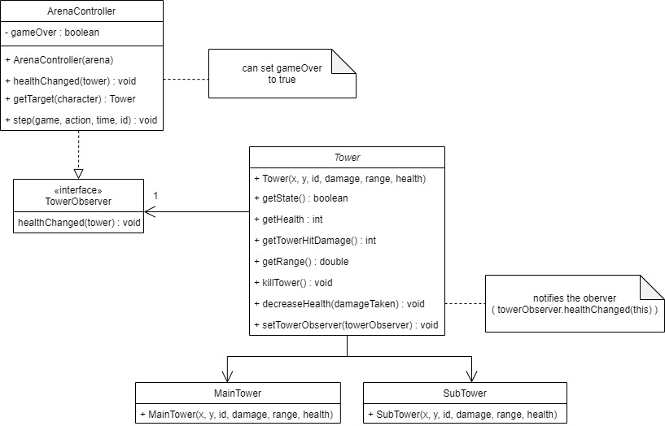 \
> The classes can be found in the following files:\
> [Tower](../src/main/java/clash_royale/model/game/elemets/tower/Tower.java)\
> [MainTower](../src/main/java/clash_royale/model/game/elemets/tower/MainTower.java)\
> [SubTower](../src/main/java/clash_royale/model/game/elemets/tower/SubTower.java)\
> [TowerObserver](../src/main/java/clash_royale/model/game/TowerObserver.java)\
> [ArenaController](../src/main/java/clash_royale/controller/game/ArenaController.java)
#### 5.4 Consequences
> Encapsulation and separation of the code is promoted: the Tower class does not know anything
> about the Game Controller class; actually, it only knows about TowerObservers and that it needs to
> notify them, but does not know what or how they preform once it happens.
## KNOWN CODE SMELLS AND REFACTORING SUGGESTIONS
### 1.Parallel Inheritance Hierarchies
#### 1.1 Code Smell
> This code smell was made so that we could implement the MVC architectural pattern in order to prevent more code smells like code duplication.
#### 1.2 Refactoring
> We could avoid this smell by not using the MVC architectural pattern. However, this would result in a bigger number of code smells and bad practices.
### 2. Similarities between the Menu and GameOver
#### 2.1 Code Smell
> If one looks at the classes Menu and GameOver, they could very quickly notice that they 
> require a few common methods.
#### 2.2 Refactoring
> This smell could be eliminated by creating an abstract class, containing the referred methods, 
> and making the mentioned classes extend it.
### 3. Duplicate Code
#### 3.1 Code Smell
> In the ArenaController class we use 2 loops that are identical.
#### 3.2 Refactoring
> This smell could be avoided by creating a method and calling it twice.
## **TESTING**
Screenshot of the coverage report:
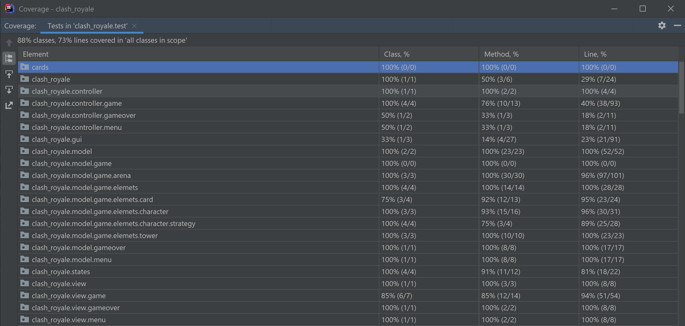\
Screenshot of the mutation testing report:
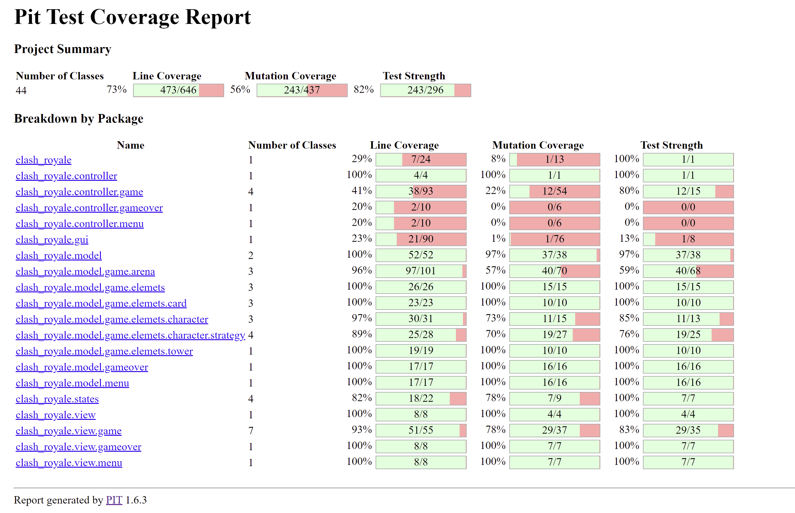\
[Link to the mutation testing report](../build/reports/pitest/202105310149/index.html)
## **SELF-EVALUATION**
* **José Silva: 1/3**
* **Margarida Ferreira: 1/3**
* **Rui Moreira: 1/3**
