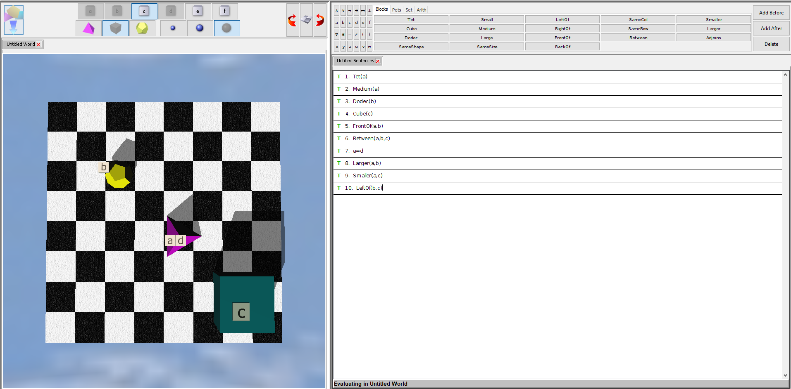
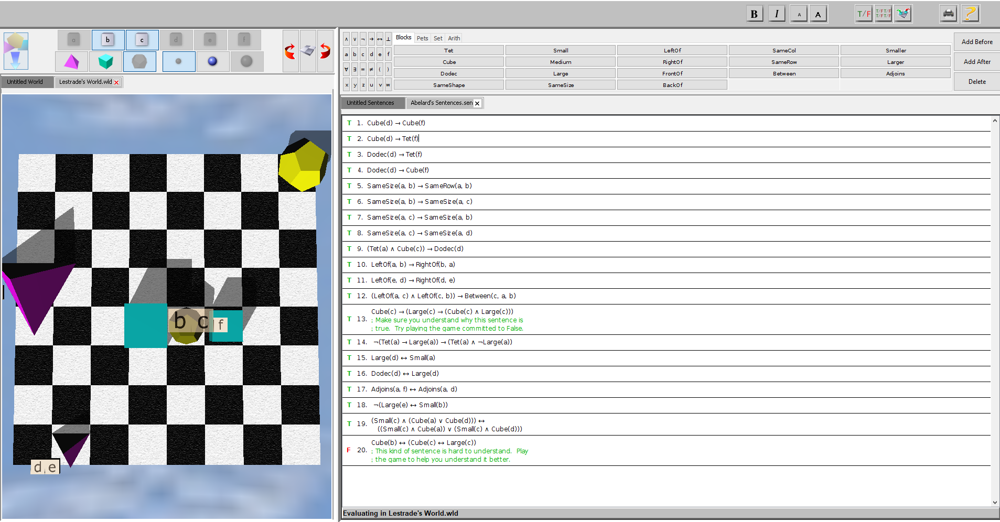

## **Exercises to do in class** - 5,7,1,2,3,8 (Last four -> Tarski's World)

**Exercise 5** - {1.19} Linguagem da teoria dos conjuntos. O domínio da teoria dos conjuntos, para este exercício, é constituído por objetos, conjuntos de objetos, conjuntos de conjuntos
de objetos, etc.. Chamando **a** a 2, **b** a {2,4,6}, **c** a 6 e **d** a {2,7,{2,4,6}}, qual o valor de
verdade das seguintes frases:
1. a ∈ c
2. a ∈ d
3. b ∈ c
4. b ∈ d
5. c ∈ d
6. c ∈ b

**Answer** - 1) False 2) True 3) False 4) True 5) False 6) True

**Exercise 7** - {1.9} Tradução para FOL. Relativamente à tabela 1, traduza as frases seguintes para FOL. Os instantes são todos do mesmo dia. Tabela no ficheiro!

1. Claire era a dona de Folly às 2H00.
2. Claire deu Pris a Max às 2H05.
3. Max é um estudante.
4. Claire alimentou Carl às 2H00.
5. Folly pertencia a Max às 3H05.
6. 2H00 é mais cedo do que 2H05.

**Answer**

1. Owned(Claired,Folly,2)
2. Gave(Claire,Pris,Max,2:05)
3. Student(Max)
4. Fed(Claire,Carl,2:00)
5. Owned(Max,Folly,3:05)
6. 2:00 < 2:05

**Exercise 1** -{1.1} Compreender frases atómicas. Abrir o mundo Wittgenstein’s World e as
frases Wittgenstein’s Sentences (encontra-os no diretório TW Exercise Files) e
percorrer a lista de frases. Atribuir mentalmente um valor de verdade a cada uma delas,
relativamente àquele mundo. Verificar o resultado com o botão Verify. Alterar as
posições dos objetos e verificar de novo as frases. O objetivo é perceber a interpretação
de cada predicado da linguagem FOL usada no programa Tarski’s World. Por exemplo,
no mundo original nenhuma das frases com Adjoins é verdadeira; verifique porquê. 

**Answer** - The exercise is just to understand the meaning of the Tarksi's World predicates

**Exercise 2** - {1.2-3} Construir um mundo. Abra um ficheiro de frases novo e copie para lá as frases seguintes na linguagem FOL, verificando que todas são fórmulas bem formadas (Evaluable) e frases (sentences):

1. Tet(a)
2. Medium(a)
3. Dodec(b)
4. Cube(c)
5. FrontOf(a,b)
6. Between(a,b,c)
7. a=d
8. Larger(a,b)
9. Smaller(a,c)
10. LeftOf(b,c)

Construa um mundo novo em que as frases acima sejam simultaneamente verdadeiras.
Guarde os resultados nos ficheiros Sentences 1.2.sen e World 1.3.wld.

**Answer** - Tarski's World File (Images will be associated)

 

**Exercise 3** - {1.5} Nomear objectos. Abra Lestrade’s Sentences e Lestrade’s world. Atribua
nomes aos objetos existentes no mundo de forma a que todas as frases na lista se
tornem verdadeiras e guarde o resultado em World 1.5.wld com Save As. Obtenha uma
segunda solução diferente da primeira e guarde o resultado como World 1.6.wld.

**Answer** 
- → -> Means that A → B, is a false implication is A is true and B is false, true otherwise
- ⟷ -> Means that A ⟷ B, is true when A && B have the same boolean value
- Add image with the solution, last one not solved, **TO DO**

**Exercise 8** 

|    |Leibniz's| Bolzano |  Boole | Witgenstein  |
|--- |---------|---------|--------|--------------|
|  1 |  False  |  True   |  False |  False       |
|  2 |  True   |  True   |  True  |  True        |
|  3 |  False  |  False  |  False |  True        |
|  4 |  True   |  True   |  False |  True        |
|  5 |  False  |  False  |  False |  False       |
|  6 |  True   |  True   |  True  |  True        |
|  7 |  True   |  True   |  True  |  True        |
|  8 |  True   |  False  |  False |  False       |
|  9 |  False  |  False  |  True  |  False       |
| 10 |  True   |  True   |  False |  True        |

> TO DO Exercises 11 && 13 and 

