```markdown
Exercícios propostos:
  [F.24BooleModelos-ex] - 2, 3, 5, 7
  [F.28BooleProva-ex.] - 1, 2, 4, 5, 8, 10, 12 
```

## **Exercicio 2 F.24**

>Playing with Tarski's World

## **Exercicio 3 F.24**
> 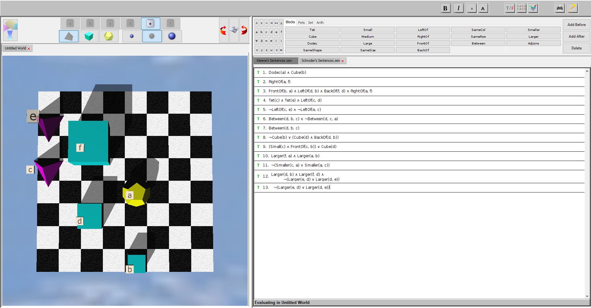

## **Exercicio 5 F.24**

1. Small(a) ∨ Large(c) ∨ Large(d)
2. BackOf(d,b) ∧ BackOf(e,b)
3. BackOf(d,b) ∧ BackOf(e,b) ∧ ¬Small(d) ∧ ¬Small(e)
4. Cube(d) ∧ Cube(c) ∧ ¬Small(d) ∧ ¬Small(c)
5. ¬RightOf(e,c) ∧ ¬RightOf(a,c) ∧ ¬LeftOf(e,b) ∧ ¬LeftOf(a,b)
5.  ¬(RightOf(e,c) ∧ RightOf(a,c) ) ∧ ¬(LeftOf(e,b) ∧ LeftOf(a,b) )
6. ¬Large(e) ∨ BackOf(e,a)
7. ¬(Between(c,a,b)) ∧ ¬(FrontOf(c,a) ∧ FrontOf(c,b) )
8. ( Tet(a) ∧ Tet(b) ) ∨ ( Tet(a) ∧ Tet(f) ) || Tet(a) ∧ ( Tet(b) ∨ Tet(f) )
9. ¬( FrontOf(d,c) ∨ FrontOf(d,b) ) ∧ ¬( FrontOf(c,c) ∨ FrontOf(c,b) )
10. Between(c,d,f) ∨ ( Smaller(c,d) ∧ Smaller(c,f) )
11. ¬SameRow(b,c)
12. SameCol(b,e) ∧ SameRow(e,d) ∧ SameCol(d,a)

> 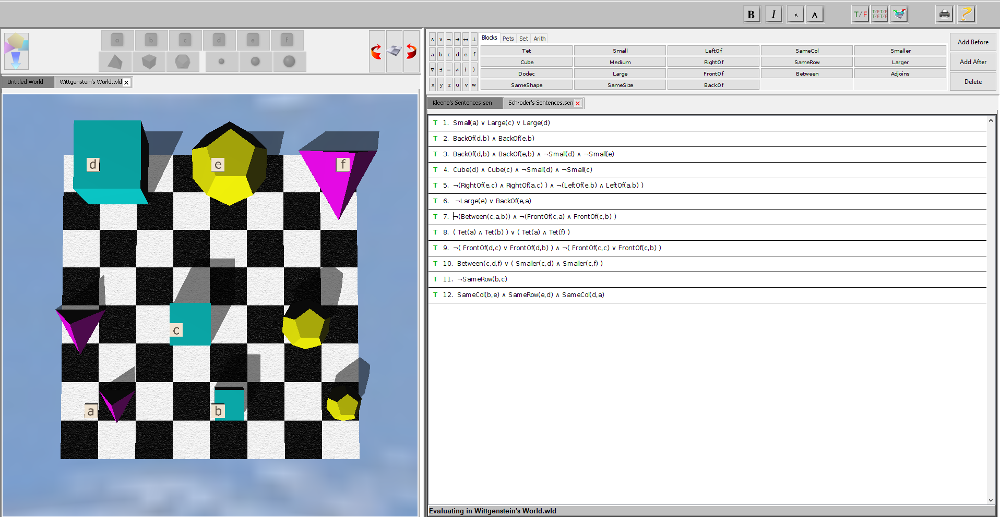


## **Exercicio 7 F24**

### Transform into DNF (A ∧ B)  ∨ (A ∧ B)
1. (Cube(a)  ∧ LeftOf(a,b) )  ∨ (Cube(a)  ∧ BackOf(a,b) )
2. ( Larger(a,b)  ∧ Cube(a) )  ∨ ( Larger(a,b)  ∧ Tet(a) ) ∨ ( Larger(a,b)  ∨ a=b ) 
3. ( Dodec(c)  ∧ Between(a,b,c) )  ∨ ( Dodec(c)  ∧ Tet(a) )  ∨ ( Dodec(c)  ∧ ¬Tet(b))
4. ¬Cube(a)  ∨ ¬Cube(b)  ∨ (Small(a)  ∧ Small(b) )
5. (Small(a)   ∧  Cube(a) )  ∨ (Medium(a)  ∧ Cube(a))  ∨ ( Small(a)  ∧ ¬Dodec(a) )  ∨ ( Medium(a) ∧ ¬Dodec(a))

## **Exercicio 1 F28**
> Tautologia
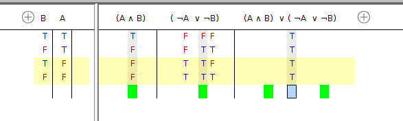
> Não é tautologia
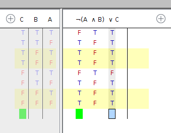
> É tautologia
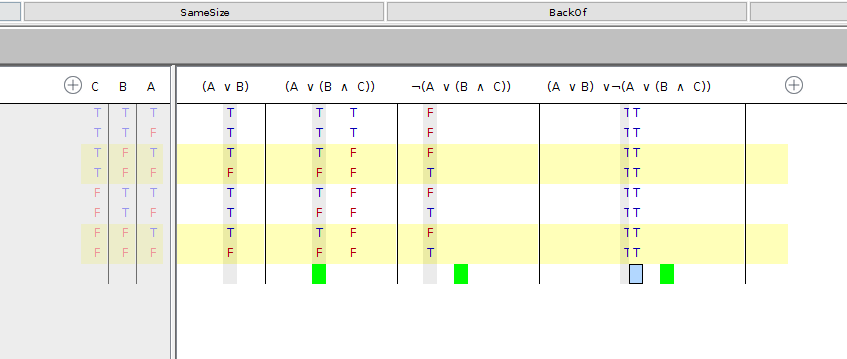


## **Exercicio 2 F28**
1.  **1** Logicamente verdadeira, **3** Satisfazivel, **4** Logicamente Verdadeira
2. **1** Logicamente verdadeira, **3** Logicamente verdadeira,
**4** Logicamente verdadeira
3. **4** Logicamente verdadeira

## **Exercicio 4 F28**

1. Não é consequência tautologica 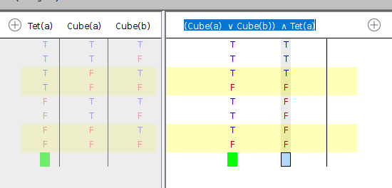

2. É consequência lógica 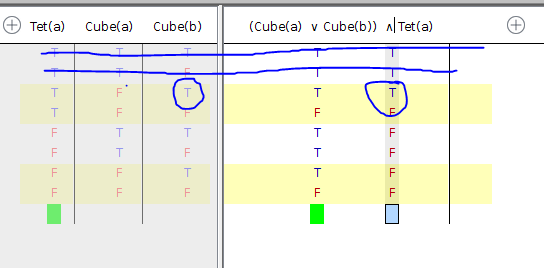

3. É consequência tautológica 

4.  É consequência lógica 

5. É consequência tautológica 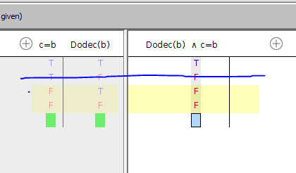

6. É consequência lógica 

7. 

## **Exercício 5 F28**

1. 

2. 

3. 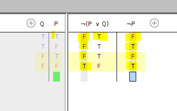

4. 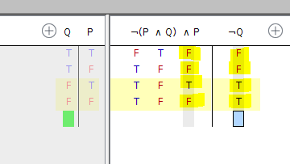

5. 

6. 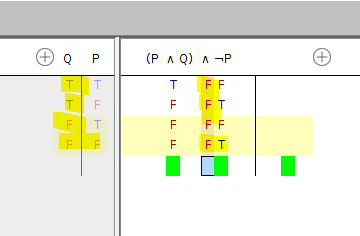

## **Exercicio 10 F28**

1. 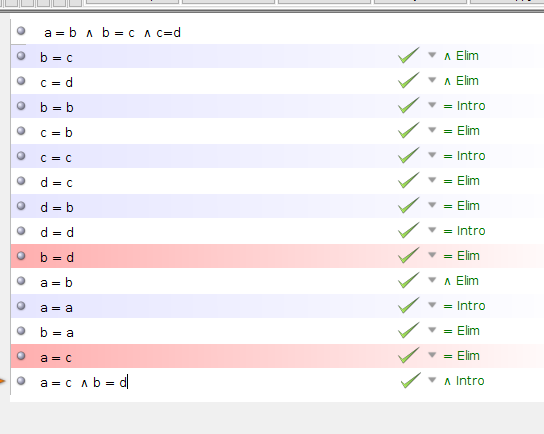
2. 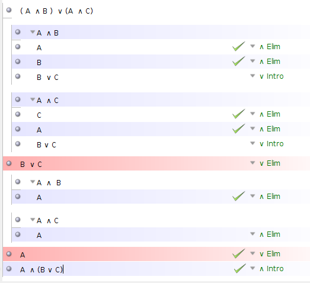