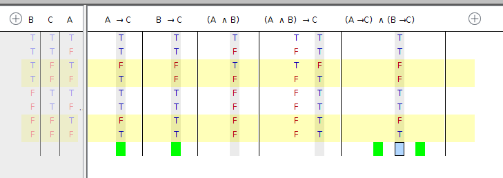
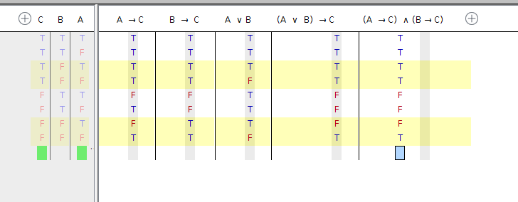
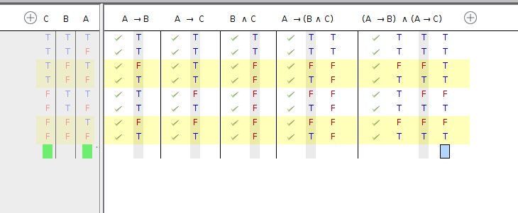
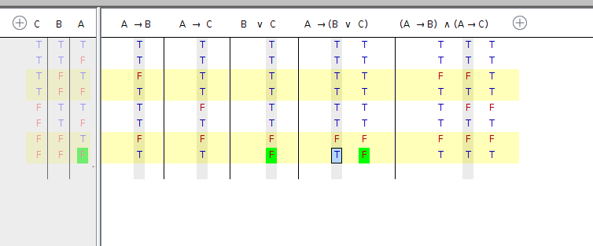
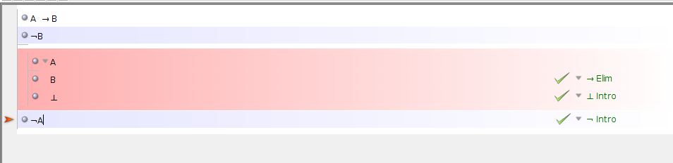
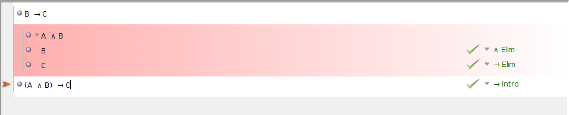
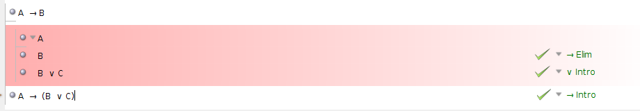
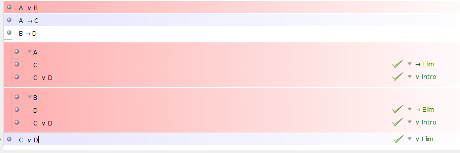
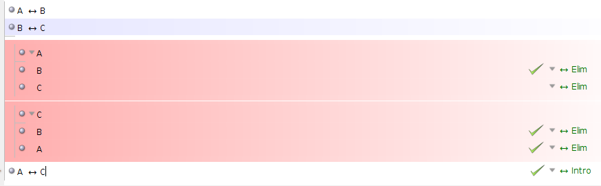
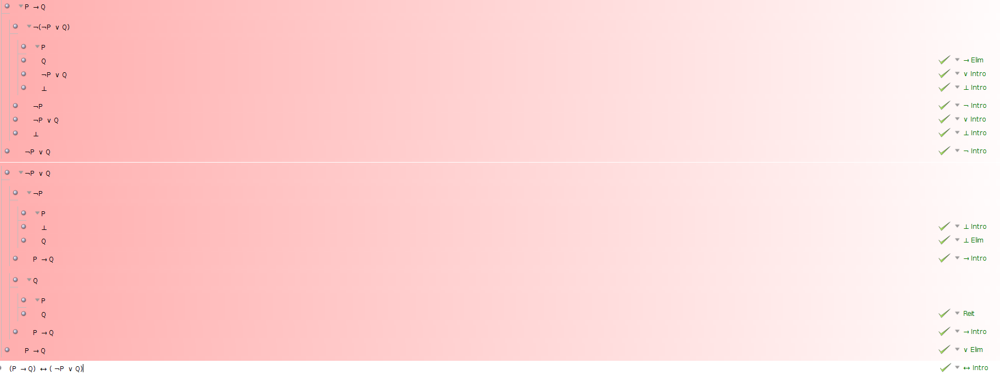

# **Logbook for week#4 Exercises**

**Exercise 2**

 * Not equivalent 

 * Equivalent 

 * Equivalent 
 
 * Not equivalent 

**Exercise 3**

**Exercise 4**
 → ↔ ∧ ∨ 
1. Tet(a) → Tet(b)
2. Tet(b) → Tet(c)
3. (Tet(a)  ∧ Tet(c)) → ( Large(a) ∨ Large(c))
4. Tet(a) ∧ ~Large(c)
5. (Small(c) ∧ Dodec(d) ) → (Medium(d))
6. (Medium(c)) → ~(Cube(b) ∧ Cube(f) ∧ Cube(e) )
7.  ~Small(a)  → Dodec(d)
8. Large(e) → (Large(d) ↔ Large(f) )
9. SameSize(d,e)
10. SameShape(d,e)
11. (Cube(f) ∨ Dodec(f) ) → Large(f)
12. Larger(c,e) → Larger(b,c)

**Exercise 6**

1. 
2. 
3. 
4. 
5. 

**Exercise 9**

1. 

2.